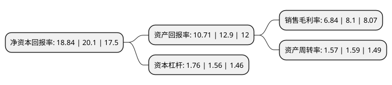

> 本页面由自动化程序生成于 2022年5月20日 01:33
> 内容可能存在错误，如有bug请提交issue至：https://github.com/Eroleice/doc-pi/issues
{.is-warning}

# 上市公司基本情况

## 基本资料

杭叉集团股份有限公司（以下简称“杭叉集团”）成立于2003年05月06日，杭州市。于2016年12月27日在上交所主板上市。

杭叉集团注册资本86,639.658万元，主营业务为叉车等工业车辆的研发，生产和销售，主要产品包括内燃叉车，电动叉车及其他工业车辆。以下是详细信息：

- 公司名称: 杭叉集团股份有限公司
- 股票代码: 603298.SH
- 所在地: 浙江 - 杭州市
- 成立日期: 2003年05月06日
- 注册资本: 86,639.658万元
- 法定代表人: 赵礼敏
- 主营业务: 主营业务为叉车等工业车辆的研发，生产和销售，主要产品包括内燃叉车，电动叉车及其他工业车辆
- 公司官网: www.zjhc.cn
- 公司介绍: 公司主营业务为叉车等工业车辆的研发、生产和销售，主要产品包括内燃叉车、电动叉车及其他工业车辆。公司凭借多年在叉车及其他工业车辆领域的专业化经营，现已具备1～45吨内燃叉车、0.75～8.5吨电动叉车、1～8吨内燃牵引车、2～25吨电动牵引车等多系列、多品种工业车辆的生产能力。公司是高新技术企业、浙江省装备制造业重点培育企业、博士后科研工作站试点单位，拥有国家认定企业技术中心和国家认可实验室。公司现已成为中国叉车行业的龙头企业。公司产品畅销国内，并远销俄罗斯、巴西、波兰、法国、土耳其、美国等全球130多个国家和地区。

## 股东及高管情况

上市公司第一大股东为浙江杭叉控股股份有限公司，持股386,744,960股，占比44.64%，为上市公司实际控制人。

截至2022年05月11日，上市公司的前十大股东中，共有4名自然人股东，4名机构股东，1个产品账户，1个海外主体，其中5%以上大股东共有4名。上市公司前十大股东明细如下：

> 截至2022年05月11日，上市公司前十大股东信息如下：

| 股东名称 | 持股数量（股） | 持股比例 |
| --- | --- | --- |
| 浙江杭叉控股股份有限公司 | 386,744,960 | 44.64% |
| 浙江杭叉控股股份有限公司 | 386,744,960 | 44.64% |
| 杭州市实业投资集团有限公司 | 183,286,875 | 21.1551% |
| 杭州市实业投资集团有限公司 | 174,128,780 | 20.1% |
| 中国建设银行股份有限公司-东方红启东三年持有期混合型证券投资基金 | 27,480,705 | 3.17% |
| 香港中央结算有限公司(陆股通) | 8,724,242 | 1.01% |
| 王益平 | 8,250,000 | 0.95% |
| 戴晶晶 | 7,600,000 | 0.88% |
| 章亚英 | 5,917,100 | 0.68% |
| 徐利达 | 5,465,470 | 0.63% |

## 利润表分析

上市公司2021年总收入为144.89亿元，净利润为9.91亿元，实现盈利。

## 杜邦分析

> 数据列示周期：2021年 | 2020年 | 2019年
{.is-info}

上市公司的净资产收益率在近一年有所下降，下降幅度为-6.27%，其变化情况分解如下：
- 上市公司的销售毛利率在近一年下降了-15.56%，可能是生产效率的下降、商品原材料价格上涨或商品价格的下跌所致。
- 上市公司的资产周转率在近一年下降了-1.26%，可能是源自于更慢的销售回款或库存管理效果下降。
- 上市公司的财务杠杆比率在近一年上升了12.82%，可能是增加负债扩大生产规模。

