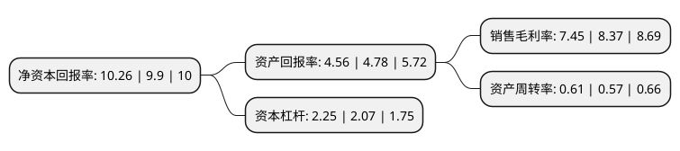

> 本页面由自动化程序生成于 2022年5月20日 01:33
> 内容可能存在错误，如有bug请提交issue至：https://github.com/Eroleice/doc-pi/issues
{.is-warning}

# 上市公司基本情况

## 基本资料

浙江百达精工股份有限公司（以下简称“百达精工”）成立于2000年08月07日，台州市。于2017年07月05日在上交所主板上市。

百达精工注册资本17,815.992万元，主要产品:压缩机核心零部件——叶片，平衡块，十字环连接器等，以及汽车零部件——发电机爪极，制动卡钳活塞，起动机零部件等。主营业务:各类压缩机零部件，汽车零部件的研发，制造，加工和销售业务。以下是详细信息：

- 公司名称: 浙江百达精工股份有限公司
- 股票代码: 603331.SH
- 所在地: 浙江 - 台州市
- 成立日期: 2000年08月07日
- 注册资本: 17,815.992万元
- 法定代表人: 施小友
- 主营业务: 主要产品:压缩机核心零部件——叶片，平衡块，十字环连接器等，以及汽车零部件——发电机爪极，制动卡钳活塞，起动机零部件等主营业务:各类压缩机零部件，汽车零部件的研发，制造，加工和销售业务
- 公司官网: www.baidapm.com
- 公司介绍: 公司是一家以制造业为中心，集科、工、贸为一体的上市公司，股票代码603331。公司下设3家全资子公司，1家合资公司。公司主要生产空调压缩机、汽车等核心零部件，产品远销欧美和东南亚等10多个国家和地区，与美芝、凌达、三菱、松下、海立、三洋、大金、三星、LG、瑞智、丹佛斯、艾默生、法雷奥、万向、TRW、TKP、博世等国内外知名企业建立了良好的长期合作关系。公司以金属成型、精密加工、表面处理和模具制造为核心技术，拥有多项发明专利，被评为“国家高新技术企业”和“省级高新技术企业研究开发中心”。公司建立完善的质量和环境管理体系，通过了ISO9001、ISO/TS16949及ISO14001体系认证。公司以技术创新、管理创新，为顾客创造价值，争做全球最优秀的压缩机零部件和汽车零部件供应商。

## 股东及高管情况

上市公司第一大股东为百达控股集团有限公司，持股51,896,051股，占比29.13%，**疑似为**上市公司实际控制人。

截至2022年03月31日，上市公司的前十大股东中，共有8名自然人股东，2名机构股东，其中5%以上大股东共有5名。上市公司前十大股东明细如下：

> 未能通过持股比例判定出上市公司实际控制人（持股30%以上）
> 可能存在通过间接持股、联合持股、协议控制等方式拥有实际控制权的主体，具体请参考上市公司定期公告！
{.is-warning}

> 截至2022年03月31日，上市公司前十大股东信息如下：

| 股东名称 | 持股数量（股） | 持股比例 |
| --- | --- | --- |
| 百达控股集团有限公司 | 51,896,051 | 29.13% |
| 台州市创立新材料科技有限公司 | 15,303,949 | 8.59% |
| 施小友 | 12,593,700 | 7.07% |
| 方东晖 | 10,350,000 | 5.81% |
| 张启春 | 9,995,000 | 5.61% |
| 阮吉林 | 7,773,700 | 4.36% |
| 阮卢安 | 4,820,000 | 2.71% |
| 张启斌 | 4,818,300 | 2.7% |
| 魏成刚 | 4,280,024 | 2.4% |
| 邵伯明 | 2,220,000 | 1.25% |

## 利润表分析

上市公司2021年总收入为12.18亿元，净利润为0.9亿元，实现盈利。

## 杜邦分析

> 数据列示周期：2021年 | 2020年 | 2019年
{.is-info}

上市公司的净资产收益率在近一年有所上升，上升幅度为3.64%，其变化情况分解如下：
- 上市公司的销售毛利率在近一年下降了-10.99%，可能是生产效率的下降、商品原材料价格上涨或商品价格的下跌所致。
- 上市公司的资产周转率在近一年上升了7.02%，可能是源自于更快的销售回款或库存管理效果提升。
- 上市公司的财务杠杆比率在近一年上升了8.7%，可能是增加负债扩大生产规模。

