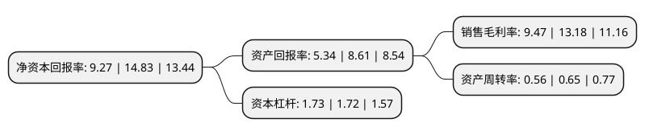

> 本页面由自动化程序生成于 2022年5月20日 01:34
> 内容可能存在错误，如有bug请提交issue至：https://github.com/Eroleice/doc-pi/issues
{.is-warning}

# 上市公司基本情况

## 基本资料

君禾泵业股份有限公司（以下简称“君禾股份”）成立于2003年04月30日，宁波市。于2017年07月03日在上交所主板上市。

君禾股份注册资本25,930.104万元，主要产品:潜水泵，花园泵，喷泉泵及深井泵等四大系列;主营业务:潜水泵，花园泵，深井泵，喷泉泵等家用水泵产品及其配件的研发，设计，制造和销售。以下是详细信息：

- 公司名称: 君禾泵业股份有限公司
- 股票代码: 603617.SH
- 所在地: 浙江 - 宁波市
- 成立日期: 2003年04月30日
- 注册资本: 25,930.104万元
- 法定代表人: 张阿华
- 主营业务: 主要产品:潜水泵，花园泵，喷泉泵及深井泵等四大系列;主营业务:潜水泵，花园泵，深井泵，喷泉泵等家用水泵产品及其配件的研发，设计，制造和销售
- 公司官网: www.junhepumps.com
- 公司介绍: 公司是一家以研发制造家用水泵为主的高新技术企业，是全球家用水泵产业优秀的制造商。公司秉承“君子以德、禾生天下”的经营理念，不断拓展国际市场，产品远销欧洲、美洲、澳洲等地区。近年来，在中国倡导的“一带一路”建设的推进下，公司进一步深化国际市场，以其合理的价格、可靠的质量和优良的服务深受客户的好评。“品质、服务、信誉”是公司企业文化的基础，“务实、创新、卓越”是企业长期追求的目标，公司先后通过了CE、GS、EMC、UL、CSA等国际产品认证和ISO9001、ISO14001等管理体系认证。作为家用泵行业的知名企业，公司不断加强产学研合作，提高企业科研实力和人才竞争力，并创建了省级研发中心，促进公司在家用泵行业的技术进步、节能降耗和可持续发展。近年来，公司已形成包括发明专利在内的自主知识产权核心竞争能力，并逐渐掌握国际高端家用泵市场信息和销售渠道，与欧美多家国际知名企业建立战略合作伙伴关系，已形成在国际市场上较高的美誉度和较强的竞争力。

## 股东及高管情况

上市公司第一大股东为宁波君禾投资控股有限公司，持股105,061,468股，占比40.29%，为上市公司实际控制人。

截至2022年03月31日，上市公司的前十大股东中，共有6名自然人股东，2名机构股东，2个产品账户，其中5%以上大股东共有2名。上市公司前十大股东明细如下：

> 截至2022年03月31日，上市公司前十大股东信息如下：

| 股东名称 | 持股数量（股） | 持股比例 |
| --- | --- | --- |
| 宁波君禾投资控股有限公司 | 105,061,468 | 40.29% |
| 上海君璋企业管理咨询合伙企业(有限合伙) | 19,455,828 | 7.46% |
| 杨国芬 | 11,560,693 | 4.43% |
| 陈惠菊 | 9,338,562 | 3.58% |
| 张君波 | 8,267,969 | 3.17% |
| 邵昌成 | 8,099,285 | 3.11% |
| 宁波宗信投资管理有限公司-宗信投资稳新2号私募证券投资基金 | 8,092,485 | 3.1% |
| 大有财富(北京)资产管理有限公司-大有尊享1号结构化私募股权投资基金 | 8,092,485 | 3.1% |
| 罗志岳 | 6,543,268 | 2.51% |
| 何浩杰 | 5,914,819 | 2.2685% |

## 利润表分析

上市公司2021年总收入为9.75亿元，净利润为0.92亿元，实现盈利。

## 杜邦分析

> 数据列示周期：2021年 | 2020年 | 2019年
{.is-info}

上市公司的净资产收益率在近一年有所下降，下降幅度为-37.49%，其变化情况分解如下：
- 上市公司的销售毛利率在近一年下降了-28.15%，可能是生产效率的下降、商品原材料价格上涨或商品价格的下跌所致。
- 上市公司的资产周转率在近一年下降了-13.85%，可能是源自于更慢的销售回款或库存管理效果下降。
- 上市公司的财务杠杆比率在近一年上升了0.58%，可能是增加负债扩大生产规模。

