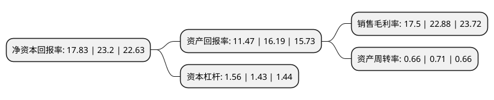

> 本页面由自动化程序生成于 2022年5月20日 01:34
> 内容可能存在错误，如有bug请提交issue至：https://github.com/Eroleice/doc-pi/issues
{.is-warning}

# 上市公司基本情况

## 基本资料

烟台艾迪精密机械股份有限公司（以下简称“艾迪精密”）成立于2003年08月06日，烟台市。于2017年01月20日在上交所主板上市。

艾迪精密注册资本84,155.85万元，主要产品:液压破拆属具和液压件等液压产品。主要业务:液压技术的研究及液压产品的开发，生产和销售。以下是详细信息：

- 公司名称: 烟台艾迪精密机械股份有限公司
- 股票代码: 603638.SH
- 所在地: 山东 - 烟台市
- 成立日期: 2003年08月06日
- 注册资本: 84,155.85万元
- 法定代表人: 宋飞
- 主营业务: 主要产品:液压破拆属具和液压件等液压产品液压技术的研究及液压产品的开发，生产和销售
- 公司官网: www.cceddie.com
- 公司介绍: 公司是国内液压破碎锤行业的领军企业，主要从事液压破碎锤、快速连接器、震动夯、液压剪、液压钳、抓石器、抓木器等工程机械属具的研发、生产与销售。经过多年研发投入，公司现已形成了以热处理技术、高压液压件铸造技术、先进机加工工艺、高压密封技术、测试技术为核心的具有自主知识产权的技术体系，成功研发的液压泵、行走及回转马达、多路控制阀等产品实现了上述高端液压件的国产化，打破了国外品牌长期垄断的局面。公司在同行业中拥有较高的知名度，并凭借过硬的产品质量、全方位的零配件供应以及快速的客户需求响应，获得国内外客户的好评与认可。公司先后顺利通过了ISO9001:2008国际质量管理体系认证，欧盟CE安全认证，美国设备制造商协会，山东省高新技术企业，“履行社会责任优秀企业”荣誉称号。

## 股东及高管情况

上市公司第一大股东为FENG XIAO HONG(冯晓鸿)，持股195,632,833股，占比23.25%，**疑似为**上市公司实际控制人。

截至2022年03月31日，上市公司的前十大股东中，共有5名自然人股东，3名机构股东，2个海外主体，其中5%以上大股东共有3名。上市公司前十大股东明细如下：

> 未能通过持股比例判定出上市公司实际控制人（持股30%以上）
> 可能存在通过间接持股、联合持股、协议控制等方式拥有实际控制权的主体，具体请参考上市公司定期公告！
{.is-warning}

> 截至2022年03月31日，上市公司前十大股东信息如下：

| 股东名称 | 持股数量（股） | 持股比例 |
| --- | --- | --- |
| FENG XIAO HONG(冯晓鸿) | 195,632,833 | 23.25% |
| SONG YU XUAN(宋宇轩) | 146,741,743 | 17.44% |
| 烟台翔宇投资有限公司 | 146,741,743 | 17.44% |
| 温雷 | 37,659,417 | 4.47% |
| 烟台浩银投资中心(有限合伙) | 36,243,528 | 4.31% |
| 中融(香港)投資有限公司 | 17,119,071 | 2.03% |
| 刁书枝 | 9,960,187 | 1.18% |
| 于耀华 | 9,228,911 | 1.1% |
| 温晓雨 | 8,762,634 | 1.04% |
| 姜美玉 | 8,389,867 | 1% |

## 利润表分析

上市公司2021年总收入为26.83亿元，净利润为4.69亿元，实现盈利。

## 杜邦分析

> 数据列示周期：2021年 | 2020年 | 2019年
{.is-info}

上市公司的净资产收益率在近一年有所下降，下降幅度为-23.15%，其变化情况分解如下：
- 上市公司的销售毛利率在近一年下降了-23.51%，可能是生产效率的下降、商品原材料价格上涨或商品价格的下跌所致。
- 上市公司的资产周转率在近一年下降了-7.04%，可能是源自于更慢的销售回款或库存管理效果下降。
- 上市公司的财务杠杆比率在近一年上升了9.09%，可能是增加负债扩大生产规模。

