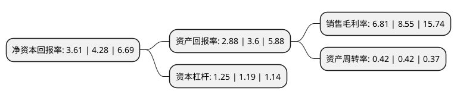

> 本页面由自动化程序生成于 2022年5月20日 01:34
> 内容可能存在错误，如有bug请提交issue至：https://github.com/Eroleice/doc-pi/issues
{.is-warning}

# 上市公司基本情况

## 基本资料

合肥泰禾智能科技集团股份有限公司（以下简称“泰禾智能”）成立于2004年12月10日，合肥市。于2017年03月21日在上交所主板上市。

泰禾智能注册资本15,345.66万元，主要产品:智能检测设备以及工业机器人及自动化成套设备。主营业务:于智能检测设备以及工业机器人及自动化成套设备的研发，生产以及销售。以下是详细信息：

- 公司名称: 合肥泰禾智能科技集团股份有限公司
- 股票代码: 603656.SH
- 所在地: 安徽 - 合肥市
- 成立日期: 2004年12月10日
- 注册资本: 15,345.66万元
- 法定代表人: 许大红
- 主营业务: 主要产品:智能检测设备以及工业机器人及自动化成套设备主营业务:于智能检测设备以及工业机器人及自动化成套设备的研发，生产以及销售
- 公司官网: www.chinataiho.com
- 公司介绍: 公司是一家专业从事基于人工智能、控制技术、机器人系统的研发、生产、销售、安装和技术服务的国家级高新技术企业、省重点软件企业、创新型试点企业、安徽省民企进出口创汇百强企业，连续多年进入安徽省软件二十强企业榜单，年产值数亿元。经过10余年的发展，公司已发展为国内规模较大、产品种类丰富、应用领域广的基于高速高分辨CCD技术的智能分选设备和工业机器人及成套装备制造商。先后开发出了大米、杂粮、茶叶等各类用途的农产品智能分选设备和塑料、工业盐等工业智能分选设备以及码垛机器人、冲压机器人、AGV、立库等智能装备产品。凭借良好的性能，产品遍布全国各区域及亚洲、北美洲、欧洲、非洲、大洋洲等众多国家和地区。公司组建设立了市级、省级工程技术中心以及省级博士后科研工作站，企业研发中心还先后分别被认定为市级、省级企业技术中心、工业设计中心。公司先后荣获“安徽名牌产品”、“安徽省著名商标”、“安徽省质量奖”、国家级“守合同重信用”单位、中国驰名商标。

## 股东及高管情况

上市公司第一大股东为许大红，持股56,603,232股，占比36.89%，为上市公司实际控制人。

截至2022年03月31日，上市公司的前十大股东中，共有7名自然人股东，2名机构股东，1个产品账户，其中5%以上大股东共有4名。上市公司前十大股东明细如下：

> 截至2022年03月31日，上市公司前十大股东信息如下：

| 股东名称 | 持股数量（股） | 持股比例 |
| --- | --- | --- |
| 许大红 | 56,603,232 | 36.89% |
| 葛苏徽 | 9,035,200 | 5.89% |
| 颜天信 | 8,923,680 | 5.82% |
| 唐麟 | 8,096,800 | 5.28% |
| 天津海达创业投资管理有限公司 | 3,818,644 | 2.49% |
| 郭芃 | 3,173,200 | 2.07% |
| 上海万钲祥金属材料有限公司 | 1,751,900 | 1.14% |
| 上海君翼投资管理有限公司-君翼量化2号基金 | 1,490,620 | 0.97% |
| 吴建同 | 997,056 | 0.65% |
| 黄慧丽 | 839,000 | 0.55% |

## 利润表分析

上市公司2021年总收入为5.18亿元，净利润为0.35亿元，实现盈利。

## 杜邦分析

> 数据列示周期：2021年 | 2020年 | 2019年
{.is-info}

上市公司的净资产收益率在近一年有所下降，下降幅度为-15.65%，其变化情况分解如下：
- 上市公司的销售毛利率在近一年下降了-20.35%，可能是生产效率的下降、商品原材料价格上涨或商品价格的下跌所致。
- 上市公司的资产周转率在近一年下降了0%，可能是源自于更慢的销售回款或库存管理效果下降。
- 上市公司的财务杠杆比率在近一年上升了5.04%，可能是增加负债扩大生产规模。

