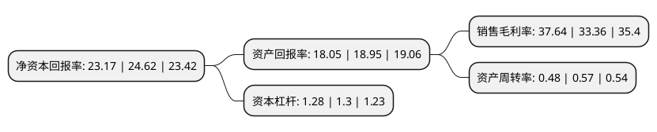

> 本页面由自动化程序生成于 2022年5月20日 01:34
> 内容可能存在错误，如有bug请提交issue至：https://github.com/Eroleice/doc-pi/issues
{.is-warning}

# 上市公司基本情况

## 基本资料

亿嘉和科技股份有限公司（以下简称“亿嘉和”）成立于1999年04月06日，南京市。于2018年06月12日在上交所主板上市。

亿嘉和注册资本20,655.04万元，主要业务:以数据采集处理为核心的巡检机器人产品和智能化服务。以下是详细信息：

- 公司名称: 亿嘉和科技股份有限公司
- 股票代码: 603666.SH
- 所在地: 江苏 - 南京市
- 成立日期: 1999年04月06日
- 注册资本: 20,655.04万元
- 法定代表人: 姜杰
- 主营业务: 以数据采集处理为核心的巡检机器人产品和智能化服务
- 公司官网: www.yijiahe.com
- 公司介绍: 公司是机器人领域的高新技术企业，公司致力于电力、石化、市政、能源、医疗、社区、制造等行业智能机器人的研发、制造和推广应用，拥有一系列智能机器人技术和产品，可为各行业提供多样化的智能产品和服务。公司主要为电力系统提供以数据采集处理为核心的智能巡检机器人产品和智能化服务，通过对电力设备、设施的基本信息、运行状态的数据采集、自动化监测和故障预警，实现“输电、变电、配电”各环节、“天上、地面、地下”全范围运检覆盖，从而维护电力设备、设施的安全稳定运行，提升供电效率。公司具有质量管理体系认证证书(ISO9001)、环境管理体系认证证书(ISO14001)、信息安全管理体系认证(ISO27000)等多项资质，是中国机器人产业联盟理事单位，拥有江苏省首台套重大装备产品证书。

## 股东及高管情况

上市公司第一大股东为朱付云，持股61,328,400股，占比29.6917%，**疑似为**上市公司实际控制人。

截至2022年04月11日，上市公司的前十大股东中，共有4名自然人股东，2名机构股东，3个产品账户，1个海外主体，其中5%以上大股东共有4名。上市公司前十大股东明细如下：

> 未能通过持股比例判定出上市公司实际控制人（持股30%以上）
> 可能存在通过间接持股、联合持股、协议控制等方式拥有实际控制权的主体，具体请参考上市公司定期公告！
{.is-warning}

> 截至2022年04月11日，上市公司前十大股东信息如下：

| 股东名称 | 持股数量（股） | 持股比例 |
| --- | --- | --- |
| 朱付云 | 61,328,400 | 29.6917% |
| 朱付云 | 61,328,400 | 29.69% |
| 南京瑞蓓创业投资管理中心(有限合伙) | 25,500,700 | 12.346% |
| 南京瑞蓓创业投资管理中心(有限合伙) | 25,500,700 | 12.35% |
| 张静 | 8,976,000 | 4.35% |
| 香港中央结算有限公司(陆股通) | 7,533,943 | 3.65% |
| 兰新力 | 6,900,015 | 3.34% |
| 江苏华泰战略新兴产业投资基金(有限合伙) | 6,623,214 | 3.21% |
| 兴业银行股份有限公司-兴全趋势投资混合型证券投资基金 | 6,274,657 | 3.04% |
| 上海浦东发展银行股份有限公司-易方达裕祥回报债券型证券投资基金 | 3,926,971 | 1.9% |

## 利润表分析

上市公司2021年总收入为12.84亿元，净利润为4.83亿元，实现盈利。

## 杜邦分析

> 数据列示周期：2021年 | 2020年 | 2019年
{.is-info}

上市公司的净资产收益率在近一年有所下降，下降幅度为-5.89%，其变化情况分解如下：
- 上市公司的销售毛利率在近一年上升了12.83%，可能是生产效率的提升、商品原材料价格下跌或商品价格的上涨所致。
- 上市公司的资产周转率在近一年下降了-15.79%，可能是源自于更慢的销售回款或库存管理效果下降。
- 上市公司的财务杠杆比率在近一年下降了-1.54%，可能是减少负债降低财务费用。

