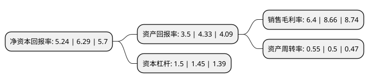

> 本页面由自动化程序生成于 2022年5月20日 01:35
> 内容可能存在错误，如有bug请提交issue至：https://github.com/Eroleice/doc-pi/issues
{.is-warning}

# 上市公司基本情况

## 基本资料

航天长征化学工程股份有限公司（以下简称“航天工程”）成立于2007年06月22日，北京市。于2015年01月28日在上交所主板上市。

航天工程注册资本53,599万元，主营业务是以航天粉煤加压气化技术为核心，专业从事煤气化技术及关键设备的研发，工程设计，技术服务，设备成套供应及工程总承包。以下是详细信息：

- 公司名称: 航天长征化学工程股份有限公司
- 股票代码: 603698.SH
- 所在地: 北京 - 北京市
- 成立日期: 2007年06月22日
- 注册资本: 53,599万元
- 法定代表人: 姜从斌
- 主营业务: 主营业务是以航天粉煤加压气化技术为核心，专业从事煤气化技术及关键设备的研发，工程设计，技术服务，设备成套供应及工程总承包
- 公司官网: www.china-ceco.com
- 公司介绍: 公司主营业务是以航天粉煤加压气化技术为核心，专业从事煤气化技术及关键设备的研发、工程设计、技术服务、设备成套供应及工程总承包。公司航天粉煤加压气化技术具有自主知识产权，是国家重点推广的洁净煤利用技术，已成功应用于多个工业化项目。该技术可广泛应用于煤制合成氨、煤制甲醇、煤制烯烃、煤制乙二醇、煤制天然气、煤制油、煤制氢、IGCC发电等领域，被国家工业和信息化部列入《重点行业清洁生产技术推行方案》，被中国石油和化学工业联合会、中国化工环保协会评为“石油和化工行业环境保护与清洁生产重点支撑技术”。公司先后被评为“北京市高新技术企业”、“中关村高新技术企业”，并成为全国石油和化工行业粉煤气化技术工程研究中心。

## 股东及高管情况

上市公司第一大股东为中国运载火箭技术研究院，持股246,425,829股，占比45.98%，为上市公司实际控制人。

截至2022年03月31日，上市公司的前十大股东中，共有5名自然人股东，1名机构股东，2个产品账户，2名其他股东，其中5%以上大股东共有4名。上市公司前十大股东明细如下：

> 截至2022年03月31日，上市公司前十大股东信息如下：

| 股东名称 | 持股数量（股） | 持股比例 |
| --- | --- | --- |
| 中国运载火箭技术研究院 | 246,425,829 | 45.98% |
| 航天投资控股有限公司 | 60,411,675 | 11.27% |
| 国创基金管理有限公司-国创投资引导基金(有限合伙) | 52,778,523 | 9.85% |
| 北京航天动力研究所 | 30,160,046 | 5.63% |
| 国创(北京)新能源汽车投资基金管理有限公司-北京国创新能源汽车股权投资基金合伙企业(有限合伙) | 21,420,000 | 4% |
| 张留宽 | 1,467,900 | 0.27% |
| 李国华 | 1,138,410 | 0.21% |
| 刘从好 | 1,105,118 | 0.21% |
| 刘朗浪 | 920,490 | 0.17% |
| 蒋月芳 | 821,200 | 0.15% |

## 利润表分析

上市公司2021年总收入为24.31亿元，净利润为1.55亿元，实现盈利。

## 杜邦分析

> 数据列示周期：2021年 | 2020年 | 2019年
{.is-info}

上市公司的净资产收益率在近一年有所下降，下降幅度为-16.69%，其变化情况分解如下：
- 上市公司的销售毛利率在近一年下降了-26.1%，可能是生产效率的下降、商品原材料价格上涨或商品价格的下跌所致。
- 上市公司的资产周转率在近一年上升了10%，可能是源自于更快的销售回款或库存管理效果提升。
- 上市公司的财务杠杆比率在近一年上升了3.45%，可能是增加负债扩大生产规模。

