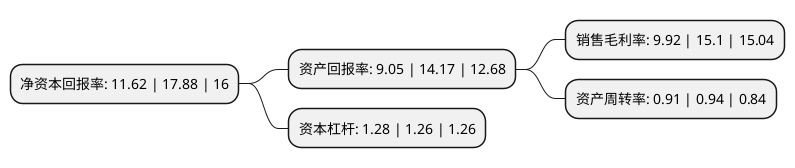

> 本页面由自动化程序生成于 2022年5月20日 01:35
> 内容可能存在错误，如有bug请提交issue至：https://github.com/Eroleice/doc-pi/issues
{.is-warning}

# 上市公司基本情况

## 基本资料

浙江大元泵业股份有限公司（以下简称“大元泵业”）成立于1998年01月07日，台州市。于2017年07月11日在上交所主板上市。

大元泵业注册资本16,821.9万元，主要产品:小型潜水电泵，井用潜水电泵，陆上泵等农用水泵和应用于热水循环，制冷，化工等领域的屏蔽泵;主营业务:各类泵的研发，生产和销售。以下是详细信息：

- 公司名称: 浙江大元泵业股份有限公司
- 股票代码: 603757.SH
- 所在地: 浙江 - 台州市
- 成立日期: 1998年01月07日
- 注册资本: 16,821.9万元
- 法定代表人: 韩元富
- 主营业务: 主要产品:小型潜水电泵，井用潜水电泵，陆上泵等农用水泵和应用于热水循环，制冷，化工等领域的屏蔽泵;主营业务:各类泵的研发，生产和销售
- 公司官网: www.dayuan.com
- 公司介绍: 公司专业致力各类农用、家用、以及工程建筑用、化工用、船用等多领域的电泵、太阳能泵的研发、制造和销售。公司是高新技术企业、省级企业技术中心、水泵国家标准起草单位、中国农机行业甲壹级单位、同时，产品获专利多项，并已通过KS、CE、CB、GS、UL、TUV、ROHS、FFU、ETL、EMC、EMF等国际知名认证。“大元商标”获得了“中国驰名商标”、“浙江省消费者信得过单位”、“浙江名牌产品”称号。主导的“大元”牌、“新沪”牌水泵已有多个销售服务网点遍布全国，并出口欧美、东南亚、中东等国家和地区。

## 股东及高管情况

上市公司第一大股东为王国良，持股21,089,600股，占比12.54%，**疑似为**上市公司实际控制人。

截至2022年03月31日，上市公司的前十大股东中，共有9名自然人股东，1名其他股东，其中5%以上大股东共有5名。上市公司前十大股东明细如下：

> 未能通过持股比例判定出上市公司实际控制人（持股30%以上）
> 可能存在通过间接持股、联合持股、协议控制等方式拥有实际控制权的主体，具体请参考上市公司定期公告！
{.is-warning}

> 截至2022年03月31日，上市公司前十大股东信息如下：

| 股东名称 | 持股数量（股） | 持股比例 |
| --- | --- | --- |
| 王国良 | 21,089,600 | 12.54% |
| 韩元再 | 21,089,600 | 12.54% |
| 韩元平 | 21,089,600 | 12.54% |
| 徐伟建 | 21,089,600 | 12.54% |
| 韩元富 | 21,089,600 | 12.54% |
| 胡小军 | 1,985,000 | 1.18% |
| 常熟市千斤顶厂 | 1,950,000 | 1.16% |
| 崔朴乐 | 1,656,400 | 0.98% |
| 杨德正 | 1,547,200 | 0.92% |
| 张东 | 988,254 | 0.59% |

## 利润表分析

上市公司2021年总收入为14.84亿元，净利润为1.47亿元，实现盈利。

## 杜邦分析

> 数据列示周期：2021年 | 2020年 | 2019年
{.is-info}

上市公司的净资产收益率在近一年有所下降，下降幅度为-35.01%，其变化情况分解如下：
- 上市公司的销售毛利率在近一年下降了-34.3%，可能是生产效率的下降、商品原材料价格上涨或商品价格的下跌所致。
- 上市公司的资产周转率在近一年下降了-3.19%，可能是源自于更慢的销售回款或库存管理效果下降。
- 上市公司的财务杠杆比率在近一年上升了1.59%，可能是增加负债扩大生产规模。

