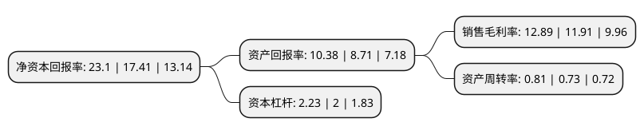

> 本页面由自动化程序生成于 2022年5月20日 01:35
> 内容可能存在错误，如有bug请提交issue至：https://github.com/Eroleice/doc-pi/issues
{.is-warning}

# 上市公司基本情况

## 基本资料

华荣科技股份有限公司（以下简称“华荣股份”）成立于2010年12月15日，上海市。于2017年05月24日在上交所主板上市。

华荣股份注册资本33,759.8万元，主要产品:厂用防爆电器，矿用防爆电器和专业照明设备。主要业务:防爆电器，专业照明设备等的研发，生产和销售。以下是详细信息：

- 公司名称: 华荣科技股份有限公司
- 股票代码: 603855.SH
- 所在地: 上海 - 上海市
- 成立日期: 2010年12月15日
- 注册资本: 33,759.8万元
- 法定代表人: 胡志荣
- 主营业务: 主要产品:厂用防爆电器，矿用防爆电器和专业照明设备防爆电器，专业照明设备等的研发，生产和销售
- 公司官网: www.warom.com
- 公司介绍: 公司是国内领先的防爆电器、专业照明设备供应商，主要从事防爆电器、专业照明设备等的研发、生产和销售。依托多年积累形成的研发设计能力、生产制造能力，公司能够为客户提供全面的产品配套、个性化的定制设计以及全方位的防爆电器、专业照明整体解决方案，产品广泛应用于石油、化工、天然气、海洋平台、煤矿、部队、公安、消防、铁路、公路、港口、场馆等领域，在业内享有良好的口碑和较高的声誉。公司管理全面与国际先进水平接轨，率先通过IS09001质量管理体系、ISO14001环境管理体系、ISO10012测量管理体系及OHSAS18001职业健康安全管理体系认证，同时获得美国FM/UL、欧盟ATEX、国际IECEx、俄罗斯CU TR、巴西INMETRO认证等国际质量标准认证，并担任中国电器工业协会常务理事单位、中国防爆电器协会副理事长单位、上海照明电器协会副会长单位。公司先后荣获“上海市文明单位”、“上海市著名商标”、“上海市名牌产品”、“上海市级企业技术中心”、“上海市高新技术企业”、“上海市创新型企业”、“标准化良好行为AAAA级企业”、“上海市平安示范单位”、连续10年荣膺“嘉定先进制造业综合实力金奖”等荣誉称号，被国家质检总局授予“中国出口产品质量安全示范企业”。

## 股东及高管情况

上市公司第一大股东为胡志荣，持股118,670,000股，占比35.15%，为上市公司实际控制人。

截至2022年03月31日，上市公司的前十大股东中，共有5名自然人股东，1名机构股东，2个产品账户，2个海外主体，其中5%以上大股东共有3名。上市公司前十大股东明细如下：

> 截至2022年03月31日，上市公司前十大股东信息如下：

| 股东名称 | 持股数量（股） | 持股比例 |
| --- | --- | --- |
| 胡志荣 | 118,670,000 | 35.15% |
| 李妙华 | 25,700,000 | 7.61% |
| 李江 | 18,350,000 | 5.44% |
| 林献忠 | 15,400,000 | 4.56% |
| 普信投资公司-客户资金 | 14,122,918 | 4.18% |
| MORGAN STANLEY & CO. INTERNATIONAL PLC. | 10,602,367 | 3.14% |
| MERRILL LYNCH INTERNATIONAL | 7,113,017 | 2.11% |
| 陈建芬 | 6,160,000 | 1.82% |
| 中国人民人寿保险股份有限公司-传统-普通保险产品 | 3,310,617 | 0.98% |
| 上海瓴仁私募基金管理合伙企业(有限合伙)-瓴仁致远长青一期私募证券投资基金 | 3,000,061 | 0.89% |

## 利润表分析

上市公司2021年总收入为30.27亿元，净利润为3.9亿元，实现盈利。

## 杜邦分析

> 数据列示周期：2021年 | 2020年 | 2019年
{.is-info}

上市公司的净资产收益率在近一年有所上升，上升幅度为32.68%，其变化情况分解如下：
- 上市公司的销售毛利率在近一年上升了8.23%，可能是生产效率的提升、商品原材料价格下跌或商品价格的上涨所致。
- 上市公司的资产周转率在近一年上升了10.96%，可能是源自于更快的销售回款或库存管理效果提升。
- 上市公司的财务杠杆比率在近一年上升了11.5%，可能是增加负债扩大生产规模。

