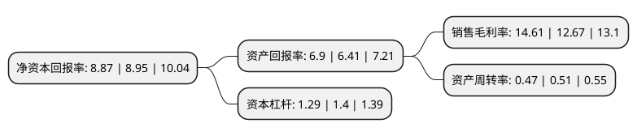

> 本页面由自动化程序生成于 2022年5月20日 01:35
> 内容可能存在错误，如有bug请提交issue至：https://github.com/Eroleice/doc-pi/issues
{.is-warning}

# 上市公司基本情况

## 基本资料

能科科技股份有限公司（以下简称“能科科技”）成立于2006年12月26日，北京市。于2016年10月21日在上交所主板上市。

能科科技注册资本16,656.833万元，主营业务:为工业企业提供软硬件一体化的系统集成解决方案。主要产品为工业能效管理解决方案，根据能效管理层级的不同，公司产品分为工业电气节能系统解决方案，能源管理系统平台解决方案两大类。以下是详细信息：

- 公司名称: 能科科技股份有限公司
- 股票代码: 603859.SH
- 所在地: 北京 - 北京市
- 成立日期: 2006年12月26日
- 注册资本: 16,656.833万元
- 法定代表人: 祖军
- 主营业务: 主营业务:为工业企业提供软硬件一体化的系统集成解决方案主要产品为工业能效管理解决方案，根据能效管理层级的不同，公司产品分为工业电气节能系统解决方案，能源管理系统平台解决方案两大类
- 公司官网: www.nancal.com
- 公司介绍: 公司成立于2006年12月，2016年10月在上交所上市，公司主要业务包括智能制造、智能电气两个板块。智能制造业务基于数字孪生理念，整合业内先进工业软件和数字化IOT设备，虚拟世界内定义生产力中台并为客户开发个性化的工业微应用，物理世界内建立数字化、智能化的生产线和测试台，满足制造业企业产品全生命周期的数据与业务协同需求，帮助企业实现其自主创新、运营成本、生产效率、不良品率和客户满意度等业务目标。公司经过多年的积累和耕耘，形成了自有的围绕企业数字化业务的咨询、规划和设计能力、围绕工业软件的产品实施和服务能力和围绕工艺的数字化产线建设能力，业务类型形成了咨询服务、企业管理系统解决方案、产品全生命周期管理、仿真与测试服务、工艺自动化、可视化生产运营管理系统以及测试台产品七个专业方向。同时，公司业务深度聚焦四大行业，即国防军工、高科技电子与5G、汽车及交通运输和装备制造，能够梳理出针对行业的可复制性解决措施，并形成行业标准解决方案。基于行业发展需求，公司未来将着力打造建设基于云原生的生产力中台、服务中小企业的工业创新服务云以及面向工业大数据应用的数据资产平台。

## 股东及高管情况

上市公司第一大股东为祖军，持股25,168,000股，占比15.11%，**疑似为**上市公司实际控制人。

截至2022年04月21日，上市公司的前十大股东中，共有7名自然人股东，1名机构股东，2个产品账户，其中5%以上大股东共有4名。上市公司前十大股东明细如下：

> 未能通过持股比例判定出上市公司实际控制人（持股30%以上）
> 可能存在通过间接持股、联合持股、协议控制等方式拥有实际控制权的主体，具体请参考上市公司定期公告！
{.is-warning}

> 截至2022年04月21日，上市公司前十大股东信息如下：

| 股东名称 | 持股数量（股） | 持股比例 |
| --- | --- | --- |
| 祖军 | 25,168,000 | 15.11% |
| 祖军 | 25,168,000 | 15.11% |
| 赵岚 | 19,064,000 | 11.45% |
| 赵岚 | 19,064,000 | 11.45% |
| 产业投资基金有限责任公司 | 7,539,410 | 4.53% |
| 于胜涛 | 5,114,900 | 3.07% |
| 林汉 | 4,469,547 | 2.68% |
| 新余深岩投资合伙企业(有限合伙) | 3,175,074 | 1.91% |
| 韩美娟 | 3,038,223 | 1.82% |
| 中国建设银行股份有限公司-宝盈新兴产业灵活配置混合型证券投资基金 | 2,429,700 | 1.46% |

## 利润表分析

上市公司2021年总收入为11.4亿元，净利润为1.66亿元，实现盈利。

## 杜邦分析

> 数据列示周期：2021年 | 2020年 | 2019年
{.is-info}

上市公司的净资产收益率在近一年有所下降，下降幅度为-0.89%，其变化情况分解如下：
- 上市公司的销售毛利率在近一年上升了15.31%，可能是生产效率的提升、商品原材料价格下跌或商品价格的上涨所致。
- 上市公司的资产周转率在近一年下降了-7.84%，可能是源自于更慢的销售回款或库存管理效果下降。
- 上市公司的财务杠杆比率在近一年下降了-7.86%，可能是减少负债降低财务费用。

