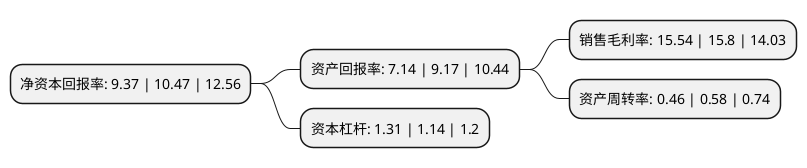

> 本页面由自动化程序生成于 2022年5月20日 01:37
> 内容可能存在错误，如有bug请提交issue至：https://github.com/Eroleice/doc-pi/issues
{.is-warning}

# 上市公司基本情况

## 基本资料

苏州华兴源创科技股份有限公司（以下简称“华兴源创”）成立于2005年06月15日，苏州市。于2019年07月22日在上交所科创板上市。

华兴源创注册资本43,938.652万元，公司是国内领先的检测设备与整线检测系统解决方案提供商，主要从事平板显示及集成电路的检测设备研发，生产和销售，公司主要产品应用于LCD与OLED平板显示，集成电路，汽车电子等行业。以下是详细信息：

- 公司名称: 苏州华兴源创科技股份有限公司
- 股票代码: 688001.SH
- 所在地: 江苏 - 苏州市
- 成立日期: 2005年06月15日
- 注册资本: 43,938.652万元
- 法定代表人: 陈文源
- 主营业务: 公司是国内领先的检测设备与整线检测系统解决方案提供商，主要从事平板显示及集成电路的检测设备研发，生产和销售，公司主要产品应用于LCD与OLED平板显示，集成电路，汽车电子等行业
- 公司官网: www.hyc.cn
- 公司介绍: 公司是国内领先的检测设备与整线检测系统解决方案提供商，主要从事平板显示及集成电路的检测设备研发、生产和销售，公司主要产品分为检测设备、检测治具。公司主要产品应用于LCD与OLED平板显示、集成电路、汽车电子等行业。公司在各类数字及模拟信号高速检测板卡、基于平板显示检测的机器视觉图像算法，以及配套各类高精度自动化与精密连接组件的设计制造能力等方面，具备较强的竞争优势和自主创新能力，在信号和图像算法领域具有多项自主研发的核心技术成果。

## 股东及高管情况

上市公司第一大股东为苏州源华创兴投资管理有限公司，持股230,976,000股，占比52.57%，为上市公司实际控制人。

截至2022年03月31日，上市公司的前十大股东中，共有4名自然人股东，4名机构股东，2个产品账户，其中5%以上大股东共有4名。上市公司前十大股东明细如下：

> 截至2022年03月31日，上市公司前十大股东信息如下：

| 股东名称 | 持股数量（股） | 持股比例 |
| --- | --- | --- |
| 苏州源华创兴投资管理有限公司 | 230,976,000 | 52.57% |
| 陈文源 | 56,516,940 | 12.86% |
| 苏州源奋企业管理合伙企业(有限合伙) | 32,481,000 | 7.39% |
| 苏州源客企业管理合伙企业(有限合伙) | 32,481,000 | 7.39% |
| 李齐花 | 18,256,172 | 4.15% |
| 陆国初 | 9,830,246 | 2.24% |
| 张茜 | 8,445,060 | 1.92% |
| 福建省创新创业投资管理有限公司-厦门创新兴科股权投资合伙企业(有限合伙) | 1,063,462 | 0.24% |
| 厦门金恒宇投资管理有限公司-金恒宇荣华一号私募基金 | 493,244 | 0.11% |
| 浙江银万斯特投资管理有限公司-银万丰泽精选2号私募证券投资基金 | 410,000 | 0.09% |

## 利润表分析

上市公司2021年总收入为20.2亿元，净利润为3.13亿元，实现盈利。

## 杜邦分析

> 数据列示周期：2021年 | 2020年 | 2019年
{.is-info}

上市公司的净资产收益率在近一年有所下降，下降幅度为-10.51%，其变化情况分解如下：
- 上市公司的销售毛利率在近一年下降了-1.65%，可能是生产效率的下降、商品原材料价格上涨或商品价格的下跌所致。
- 上市公司的资产周转率在近一年下降了-20.69%，可能是源自于更慢的销售回款或库存管理效果下降。
- 上市公司的财务杠杆比率在近一年上升了14.91%，可能是增加负债扩大生产规模。

