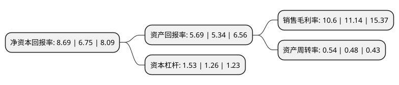

> 本页面由自动化程序生成于 2022年5月20日 01:37
> 内容可能存在错误，如有bug请提交issue至：https://github.com/Eroleice/doc-pi/issues
{.is-warning}

# 上市公司基本情况

## 基本资料

苏州天准科技股份有限公司（以下简称“天准科技”）成立于2009年08月20日，苏州市。于2019年07月22日在上交所科创板上市。

天准科技注册资本19,360万元，以领先的人工智能技术推动工业转型升级。以机器视觉为核心技术，专注服务于工业领域客户，主要产品为工业视觉装备，包括精密测量仪器，智能检测装备，智能制造系统，无人物流车等，产品功能涵盖尺寸与缺陷检测，自动化生产装配，智能仓储物流等工业领域多个环节。以下是详细信息：

- 公司名称: 苏州天准科技股份有限公司
- 股票代码: 688003.SH
- 所在地: 江苏 - 苏州市
- 成立日期: 2009年08月20日
- 注册资本: 19,360万元
- 法定代表人: 徐一华
- 主营业务: 以领先的人工智能技术推动工业转型升级以机器视觉为核心技术，专注服务于工业领域客户，主要产品为工业视觉装备，包括精密测量仪器，智能检测装备，智能制造系统，无人物流车等，产品功能涵盖尺寸与缺陷检测，自动化生产装配，智能仓储物流等工业领域多个环节
- 公司官网: www.tztek.com
- 公司介绍: 公司自成立以来，始终致力于以领先的人工智能技术推动工业转型升级，以成为“全球工业视觉产业领导者”为目标，并将在未来长期坚持。公司将机器视觉核心技术应用于工业领域，在机器视觉算法、工业数据平台、先进视觉传感器、精密驱控技术等前沿科技领域不断投入研发，构筑和强化技术壁垒。公司作为牵头单位承担了国家重大科学仪器设备开发专项，检测精度达到0.3微米的国际先进水平。公司拥有自主知识产权，累计申请了117项专利，其中已授权65项，软件著作权68项；起草制定了5项国家与行业标准及规范，在行业中处于领导地位。公司专注服务于工业领域客户，通过领先产品帮助工业企业实现数字化、智能化发展。公司主要产品为工业视觉装备，包括精密测量仪器、智能检测装备、智能制造系统、无人物流车等，产品功能涵盖尺寸与缺陷检测、自动化生产装配、智能仓储物流等工业领域多个环节。公司主要产品的关键性能指标均达到或超过国际优秀同行，实现进口替代，并不断开拓海外市场。

## 股东及高管情况

上市公司第一大股东为苏州青一投资有限公司，持股80,000,000股，占比41.32%，为上市公司实际控制人。

截至2022年03月31日，上市公司的前十大股东中，共有3名自然人股东，4名机构股东，3个产品账户，其中5%以上大股东共有2名。上市公司前十大股东明细如下：

> 截至2022年03月31日，上市公司前十大股东信息如下：

| 股东名称 | 持股数量（股） | 持股比例 |
| --- | --- | --- |
| 苏州青一投资有限公司 | 80,000,000 | 41.32% |
| 宁波天准合智投资管理合伙企业(有限合伙) | 40,298,000 | 20.82% |
| 苏州天准科技股份有限公司-第一期员工持股计划 | 3,500,000 | 1.81% |
| 韩军 | 2,906,421 | 1.5% |
| 东吴证券股份有限公司 | 2,000,000 | 1.03% |
| 曹晖 | 805,299 | 0.42% |
| 华润深国投信托有限公司-博颐精选2期证券投资集合资金信托计划 | 794,976 | 0.41% |
| 中国建设银行股份有限公司-南方信息创新混合型证券投资基金 | 768,013 | 0.4% |
| 华润深国投信托有限公司-博颐精选证券投资集合资金信托 | 713,047 | 0.37% |
| 张益滔 | 697,952 | 0.36% |

## 利润表分析

上市公司2021年总收入为12.65亿元，净利润为1.34亿元，实现盈利。

## 杜邦分析

> 数据列示周期：2021年 | 2020年 | 2019年
{.is-info}

上市公司的净资产收益率在近一年有所上升，上升幅度为28.74%，其变化情况分解如下：
- 上市公司的销售毛利率在近一年下降了-4.85%，可能是生产效率的下降、商品原材料价格上涨或商品价格的下跌所致。
- 上市公司的资产周转率在近一年上升了12.5%，可能是源自于更快的销售回款或库存管理效果提升。
- 上市公司的财务杠杆比率在近一年上升了21.43%，可能是增加负债扩大生产规模。

