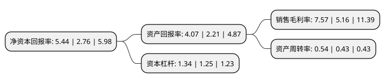

> 本页面由自动化程序生成于 2022年5月20日 01:37
> 内容可能存在错误，如有bug请提交issue至：https://github.com/Eroleice/doc-pi/issues
{.is-warning}

# 上市公司基本情况

## 基本资料

深圳市杰普特光电股份有限公司（以下简称“杰普特”）成立于2006年04月18日，深圳市。于2019年10月31日在上交所科创板上市。

杰普特注册资本9,286.558万元，主营业务为研发，生产和销售激光器以及主要用于集成电路和半导体光电相关器件精密检测及微加工的智能装备。公司的激光器产品包括脉冲光纤激光器，连续光纤激光器和固体激光器等。以下是详细信息：

- 公司名称: 深圳市杰普特光电股份有限公司
- 股票代码: 688025.SH
- 所在地: 广东 - 深圳市
- 成立日期: 2006年04月18日
- 注册资本: 9,286.558万元
- 法定代表人: 黄治家
- 主营业务: 主营业务为研发，生产和销售激光器以及主要用于集成电路和半导体光电相关器件精密检测及微加工的智能装备公司的激光器产品包括脉冲光纤激光器，连续光纤激光器和固体激光器等
- 公司官网: www.jptoe.com
- 公司介绍: 公司是中国首家商用“脉宽可调高功率脉冲光纤激光器(MOPA脉冲光纤激光器)”生产制造商和领先的光电精密检测及激光加工智能装备提供商。公司采用支持成就战略合作客户的业务模式。即利用公司在激光光源及光学检测方面的优势，对客户项目进行早期合作扶持，中后期提供帮助以获取业务订单。公司的主营业务为研发，生产和销售激光器以及主要用于集成电路和半导体光电相关器件精密检测及微加工的智能装备。自主开发了智能光谱检测机，VCSEL激光模组检测系统、硅光晶圆测试系统等多款激光/光学智能装备。专业人才储备，技术研发积累，满足多样化需求的产品结构以及优质的客户资源均是公司在行业竞争中的优势所在。

## 股东及高管情况

上市公司第一大股东为黄治家，持股19,853,220股，占比21.38%，**疑似为**上市公司实际控制人。

截至2022年03月31日，上市公司的前十大股东中，共有3名自然人股东，1名机构股东，6个产品账户，其中5%以上大股东共有2名。上市公司前十大股东明细如下：

> 未能通过持股比例判定出上市公司实际控制人（持股30%以上）
> 可能存在通过间接持股、联合持股、协议控制等方式拥有实际控制权的主体，具体请参考上市公司定期公告！
{.is-warning}

> 截至2022年03月31日，上市公司前十大股东信息如下：

| 股东名称 | 持股数量（股） | 持股比例 |
| --- | --- | --- |
| 黄治家 | 19,853,220 | 21.38% |
| 深圳市同聚咨询管理企业(普通合伙) | 15,646,860 | 16.85% |
| 全国社保基金五零三组合 | 4,300,000 | 4.63% |
| 刘健 | 3,730,260 | 4.02% |
| 黄淮 | 3,191,390 | 3.44% |
| 中国工商银行股份有限公司-诺安先锋混合型证券投资基金 | 2,062,436 | 2.22% |
| 中电中金(厦门)智能产业股权投资基金合伙企业(有限合伙) | 1,603,880 | 1.73% |
| 招商银行股份有限公司-南方科创板3年定期开放混合型证券投资基金 | 1,176,114 | 1.27% |
| 广东红土创业投资管理有限公司-深圳市人才创新创业一号股权投资基金(有限合伙) | 1,088,983 | 1.17% |
| 中国工商银行股份有限公司-博时科创板三年定期开放混合型证券投资基金 | 1,080,215 | 1.16% |

## 利润表分析

上市公司2021年总收入为11.99亿元，净利润为0.9亿元，实现盈利。

## 杜邦分析

> 数据列示周期：2021年 | 2020年 | 2019年
{.is-info}

上市公司的净资产收益率在近一年有所上升，上升幅度为97.1%，其变化情况分解如下：
- 上市公司的销售毛利率在近一年上升了46.71%，可能是生产效率的提升、商品原材料价格下跌或商品价格的上涨所致。
- 上市公司的资产周转率在近一年上升了25.58%，可能是源自于更快的销售回款或库存管理效果提升。
- 上市公司的财务杠杆比率在近一年上升了7.2%，可能是增加负债扩大生产规模。

