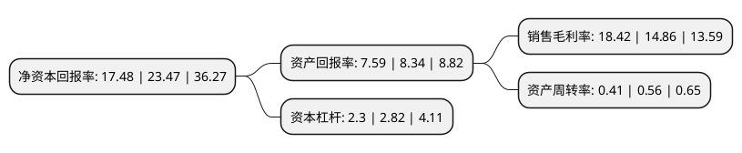

> 本页面由自动化程序生成于 2022年5月20日 01:37
> 内容可能存在错误，如有bug请提交issue至：https://github.com/Eroleice/doc-pi/issues
{.is-warning}

# 上市公司基本情况

## 基本资料

上海华依科技集团股份有限公司（以下简称“华依科技”）成立于1998年11月28日，上海市。于2021年07月29日在上交所科创板上市。

华依科技注册资本7,284.477万元，主要从事汽车动力总成智能测试设备的研发，设计，制造，销售及提供相关测试服务，致力于以业界领先的测试设备和测试服务为汽车动力总成产品的品质保障及改进，工程试验和开发设计提供数据依据和智能分析，进而支撑和推动汽车产业动力总成领域的智能转型升级。以下是详细信息：

- 公司名称: 上海华依科技集团股份有限公司
- 股票代码: 688071.SH
- 所在地: 上海 - 上海市
- 成立日期: 1998年11月28日
- 注册资本: 7,284.477万元
- 法定代表人: 励寅
- 主营业务: 主要从事汽车动力总成智能测试设备的研发，设计，制造，销售及提供相关测试服务，致力于以业界领先的测试设备和测试服务为汽车动力总成产品的品质保障及改进，工程试验和开发设计提供数据依据和智能分析，进而支撑和推动汽车产业动力总成领域的智能转型升级
- 公司官网: www.w-ibeda.com
- 公司介绍: 公司是一家专注于汽车动力总成智能测试技术开发的高新技术企业，主要从事汽车动力总成智能测试设备的研发、设计、制造、销售及提供相关测试服务，致力于以业界领先的测试设备和测试服务为汽车动力总成产品的品质保障及改进、工程试验和开发设计提供数据依据和智能分析，进而支撑和推动汽车产业动力总成领域的智能转型升级。公司专注服务于汽车领域知名客户，深入了解客户和行业的需求，不断改进自身技术水平，提供定制化的解决方案，积累了大量的行业经验，获得了行业内主流客户的广泛认可，公司主要客户包括上汽通用、广汽本田、长安福特、长安马自达、上汽集团、一汽集团、东风集团、福田汽车、江淮汽车、奇瑞汽车、潍柴集团、广西玉柴、蔚来汽车、博格华纳、洋马、石川岛、电产、西门子、卡特彼勒、湖南机油泵、格特拉克、皮尔博格、舍弗勒、采埃孚等国内外知名品牌车企及汽车零部件供应商。公司通过优秀的产品性能、可靠的产品质量、完善的服务支持积累了良好的市场口碑，在业内的知名度不断提升，公司被授予了“国家高新技术企业”、“工业企业知识产权运用试点企业”等多项荣誉资质。

## 股东及高管情况

上市公司第一大股东为励寅，持股17,844,546股，占比24.5%，**疑似为**上市公司实际控制人。

截至2022年03月31日，上市公司的前十大股东中，共有6名自然人股东，1名机构股东，3个产品账户，其中5%以上大股东共有5名。上市公司前十大股东明细如下：

> 未能通过持股比例判定出上市公司实际控制人（持股30%以上）
> 可能存在通过间接持股、联合持股、协议控制等方式拥有实际控制权的主体，具体请参考上市公司定期公告！
{.is-warning}

> 截至2022年03月31日，上市公司前十大股东信息如下：

| 股东名称 | 持股数量（股） | 持股比例 |
| --- | --- | --- |
| 励寅 | 17,844,546 | 24.5% |
| 黄大庆 | 7,840,998 | 10.76% |
| 秦立罡 | 5,495,850 | 7.54% |
| 申洪淳 | 5,093,580 | 6.99% |
| 王锋 | 4,993,580 | 6.86% |
| 栾玉光 | 2,569,725 | 3.53% |
| 安徽国富产业投资基金管理有限公司 | 2,379,379 | 3.27% |
| 上海润昆投资管理合伙企业(有限合伙) | 2,160,000 | 2.97% |
| 中信证券-中信银行-中信证券华依科技员工参与科创板战略配售集合资产管理计划 | 1,802,200 | 2.47% |
| 中国工商银行股份有限公司-易方达新经济灵活配置混合型证券投资基金 | 1,475,486 | 2.03% |

## 利润表分析

上市公司2021年总收入为3.2亿元，净利润为0.59亿元，实现盈利。

## 杜邦分析

> 数据列示周期：2021年 | 2020年 | 2019年
{.is-info}

上市公司的净资产收益率在近一年有所下降，下降幅度为-25.52%，其变化情况分解如下：
- 上市公司的销售毛利率在近一年上升了23.96%，可能是生产效率的提升、商品原材料价格下跌或商品价格的上涨所致。
- 上市公司的资产周转率在近一年下降了-26.79%，可能是源自于更慢的销售回款或库存管理效果下降。
- 上市公司的财务杠杆比率在近一年下降了-18.44%，可能是减少负债降低财务费用。

