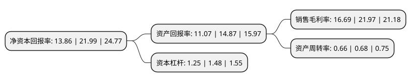

> 本页面由自动化程序生成于 2022年5月20日 01:37
> 内容可能存在错误，如有bug请提交issue至：https://github.com/Eroleice/doc-pi/issues
{.is-warning}

# 上市公司基本情况

## 基本资料

杭州爱科科技股份有限公司（以下简称“爱科科技”）成立于2005年03月11日，杭州市。于2021年03月19日在上交所科创板上市。

爱科科技注册资本5,915.839万元，以智能切割设备为产品载体，为客户提供稳定高效，定制化，一体化的智能切割解决方案，公司主要产品品种包括:基础性智能切割解决方案，可扩展智能切割解决方案，高速大幅面智能切割解决方案，真皮裁剪流水线解决方案，多层智能切割解决方案和微型智能切割解决方案。以下是详细信息：

- 公司名称: 杭州爱科科技股份有限公司
- 股票代码: 688092.SH
- 所在地: 浙江 - 杭州市
- 成立日期: 2005年03月11日
- 注册资本: 5,915.839万元
- 法定代表人: 方云科
- 主营业务: 以智能切割设备为产品载体，为客户提供稳定高效，定制化，一体化的智能切割解决方案，公司主要产品品种包括:基础性智能切割解决方案，可扩展智能切割解决方案，高速大幅面智能切割解决方案，真皮裁剪流水线解决方案，多层智能切割解决方案和微型智能切割解决方案
- 公司官网: www.iechosoft.com
- 公司介绍: 公司是一家以智能切割设备为产品载体，为客户提供稳定高效、定制化、一体化的智能切割解决方案的高新技术企业。公司致力于以高端智能装备核心技术推动我国工业转型升级，能够助力复合材料、广告文印、汽车内饰、家居家纺、纺织服装、办公自动化、鞋业、箱包等多种行业客户实现自动化、智能化、工业化生产。公司主要产品品种包括：基础性智能切割解决方案、可扩展智能切割解决方案、高速大幅面智能切割解决方案、真皮裁剪流水线解决方案、多层智能切割解决方案和微型智能切割解决方案。经过十多年的深耕与积累，公司累计服务超过一万家客户，积累了丰富的行业经验，树立了良好的行业口碑，客户涵盖光威复材、中材科技、双一科技、海源复材、喜临门、顾家家居、东丽先端材料研究开发(中国)有限公司、北京航空航天大学、南京航空航天大学、航天材料及工艺研究所、中国航天空气动力技术研究院、西安空间无线电技术研究所等多家上市公司、大型企业、高等院校和研究机构。

## 股东及高管情况

上市公司第一大股东为杭州爱科电脑技术有限公司，持股21,892,000股，占比37.01%，为上市公司实际控制人。

截至2022年05月06日，上市公司的前十大股东中，共有2名自然人股东，7名机构股东，1个产品账户，其中5%以上大股东共有5名。上市公司前十大股东明细如下：

> 截至2022年05月06日，上市公司前十大股东信息如下：

| 股东名称 | 持股数量（股） | 持股比例 |
| --- | --- | --- |
| 杭州爱科电脑技术有限公司 | 21,892,000 | 37.01% |
| 方云科 | 4,724,000 | 7.99% |
| 华软创业投资无锡合伙企业(有限合伙) | 3,500,000 | 5.92% |
| 杭州瑞步投资管理合伙企业(有限合伙) | 3,152,000 | 5.33% |
| 苏州麒麟股权投资中心(有限合伙) | 3,000,000 | 5.07% |
| 杭州瑞松投资管理合伙企业(有限合伙) | 2,553,192 | 4.32% |
| 白燕 | 1,732,000 | 2.93% |
| 华软创新创业投资无锡合伙企业(有限合伙) | 1,500,000 | 2.54% |
| 富诚海富资管-海通证券-富诚海富通爱科科技员工参与科创板战略配售集合资产管理计划 | 1,478,959 | 2.5% |
| 浙江浙大友创投资管理有限公司-杭州文辰友创投资合伙企业(有限合伙) | 907,801 | 1.53% |

## 利润表分析

上市公司2021年总收入为3.18亿元，净利润为0.53亿元，实现盈利。

## 杜邦分析

> 数据列示周期：2021年 | 2020年 | 2019年
{.is-info}

上市公司的净资产收益率在近一年有所下降，下降幅度为-36.97%，其变化情况分解如下：
- 上市公司的销售毛利率在近一年下降了-24.03%，可能是生产效率的下降、商品原材料价格上涨或商品价格的下跌所致。
- 上市公司的资产周转率在近一年下降了-2.94%，可能是源自于更慢的销售回款或库存管理效果下降。
- 上市公司的财务杠杆比率在近一年下降了-15.54%，可能是减少负债降低财务费用。

