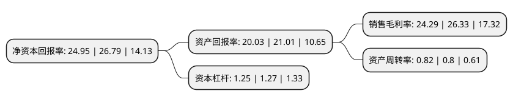

> 本页面由自动化程序生成于 2022年5月20日 01:38
> 内容可能存在错误，如有bug请提交issue至：https://github.com/Eroleice/doc-pi/issues
{.is-warning}

## 股东及高管情况

上市公司第一大股东为东莞市盛晟实业投资有限公司，持股42,628,800股，占比52.7531%，为上市公司实际控制人。

截至2022年04月15日，上市公司的前十大股东中，共有3名自然人股东，6名机构股东，1个产品账户，其中5%以上大股东共有3名。上市公司前十大股东明细如下：

> 截至2022年04月15日，上市公司前十大股东信息如下：

| 股东名称 | 持股数量（股） | 持股比例 |
| --- | --- | --- |
| 东莞市盛晟实业投资有限公司 | 42,628,800 | 52.7531% |
| 东莞市易指通实业投资合伙企业(有限合伙) | 9,001,260 | 11.1391% |
| 刘飞 | 4,800,000 | 5.94% |
| 何玉姣 | 2,549,940 | 3.1556% |
| 中金安达智能1号员工参与科创板战略配售集合资产管理计划 | 1,659,908 | 2.0541% |
| 张继军 | 1,020,000 | 1.2623% |
| 中国中金财富证券有限公司 | 808,080 | 1% |
| 中国国际金融股份有限公司 | 429,973 | 0.5321% |
| 东莞市寮步镇产城融合投资合伙企业(有限合伙) | 303,030 | 0.375% |
| 东莞市科创资本创业投资有限公司 | 303,030 | 0.375% |

## 利润表分析

上市公司2021年总收入为6.28亿元，净利润为1.52亿元，实现盈利。

## 杜邦分析

> 数据列示周期：2021年 | 2020年 | 2019年
{.is-info}

上市公司的净资产收益率在近一年有所下降，下降幅度为-6.87%，其变化情况分解如下：
- 上市公司的销售毛利率在近一年下降了-7.75%，可能是生产效率的下降、商品原材料价格上涨或商品价格的下跌所致。
- 上市公司的资产周转率在近一年上升了2.5%，可能是源自于更快的销售回款或库存管理效果提升。
- 上市公司的财务杠杆比率在近一年下降了-1.57%，可能是减少负债降低财务费用。

