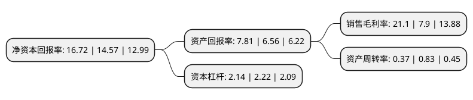

> 本页面由自动化程序生成于 2022年5月20日 01:38
> 内容可能存在错误，如有bug请提交issue至：https://github.com/Eroleice/doc-pi/issues
{.is-warning}

# 上市公司基本情况

## 基本资料

湖北华强科技股份有限公司（以下简称“华强科技”）成立于2001年11月12日，宜昌市。于2021年12月06日在上交所科创板上市。

华强科技注册资本34,450万元，主要生产个体防护装备，集体防护装备，主营业务为特种防护装备和医药包装及医疗器械产品的研发，生产与销售。以下是详细信息：

- 公司名称: 湖北华强科技股份有限公司
- 股票代码: 688151.SH
- 所在地: 湖北 - 宜昌市
- 成立日期: 2001年11月12日
- 注册资本: 34,450万元
- 法定代表人: 孙光幸
- 主营业务: 主要生产个体防护装备，集体防护装备，主营业务为特种防护装备和医药包装及医疗器械产品的研发，生产与销售
- 公司官网: www.hqtc.com
- 公司介绍: 公司是国内专业的防化军工企业，以特种防护领域为主，主要生产个体防护装备、集体防护装备，以提升我国各军兵种在核生化威胁条件下的生存和作战能力；同时依托技术优势，积极开拓医药包装、医疗器械等民品市场。公司是国家高新技术企业和国家技术创新示范企业，理化计量中心通过了中国合格评定国家认可委员会实验室认可，拥有国家级企业技术中心，曾获得军队科技进步一等奖、军队科技进步二等奖、军队科技进步三等奖、新疆维吾尔自治区科技进步一等奖、湖北省人民政府三等奖等科技奖项。作为防化军工企业，公司积极为社会公共安全作出突出贡献，先后为抗击SARS、汶川地震救援、天津“8.12”爆炸救援、奥运安保、国庆阅兵、抗击新冠疫情及俄罗斯军事比武等重大活动提供特种防护的专项保障任务。

## 股东及高管情况

上市公司第一大股东为中国兵器装备集团有限公司，持股156,812,800股，占比45.52%，为上市公司实际控制人。

截至2022年03月31日，上市公司的前十大股东中，共有9名机构股东，1个产品账户，其中5%以上大股东共有2名。上市公司前十大股东明细如下：

> 截至2022年03月31日，上市公司前十大股东信息如下：

| 股东名称 | 持股数量（股） | 持股比例 |
| --- | --- | --- |
| 中国兵器装备集团有限公司 | 156,812,800 | 45.52% |
| 南方工业资产管理有限责任公司 | 85,534,000 | 24.83% |
| 宜昌民强企业管理合伙企业(有限合伙) | 8,365,200 | 2.43% |
| 宜昌华军企业管理合伙企业(有限合伙) | 7,581,800 | 2.2% |
| 国家军民融合产业投资基金有限责任公司 | 2,835,565 | 0.82% |
| 广州凯得投资控股有限公司 | 2,835,565 | 0.82% |
| 华泰创新投资有限公司 | 2,586,186 | 0.75% |
| 中电科投资控股有限公司 | 2,268,452 | 0.66% |
| 宜昌中企投资有限公司 | 2,137,361 | 0.62% |
| 中航产业投资有限公司 | 854,944 | 0.25% |

## 利润表分析

上市公司2021年总收入为12.75亿元，净利润为3.2亿元，实现盈利。

## 杜邦分析

> 数据列示周期：2020年 | 2019年 | 2018年
{.is-info}

上市公司的净资产收益率在近一年有所上升，上升幅度为14.76%，其变化情况分解如下：
- 上市公司的销售毛利率在近一年上升了167.09%，可能是生产效率的提升、商品原材料价格下跌或商品价格的上涨所致。
- 上市公司的资产周转率在近一年下降了-55.42%，可能是源自于更慢的销售回款或库存管理效果下降。
- 上市公司的财务杠杆比率在近一年下降了-3.6%，可能是减少负债降低财务费用。

