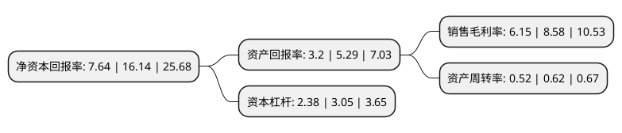

> 本页面由自动化程序生成于 2022年5月20日 01:38
> 内容可能存在错误，如有bug请提交issue至：https://github.com/Eroleice/doc-pi/issues
{.is-warning}

# 上市公司基本情况

## 基本资料

安徽巨一科技股份有限公司（以下简称“巨一科技”）成立于2005年01月18日，合肥市。于2021年11月10日在上交所科创板上市。

巨一科技注册资本13,700万元，汽车等先进制造领域，具备智能装备和新能源汽车核心部件整体解决方案能力的主流供应商，并致力于围绕汽车行业的智能化，电动化，网联化把公司打造成为业内具有国际竞争力的领军企业。公司产品主要包括智能装备整体解决方案和新能源汽车电驱动系统产品。以下是详细信息：

- 公司名称: 安徽巨一科技股份有限公司
- 股票代码: 688162.SH
- 所在地: 安徽 - 合肥市
- 成立日期: 2005年01月18日
- 注册资本: 13,700万元
- 法定代表人: 林巨广
- 主营业务: 汽车等先进制造领域，具备智能装备和新能源汽车核心部件整体解决方案能力的主流供应商，并致力于围绕汽车行业的智能化，电动化，网联化把公司打造成为业内具有国际竞争力的领军企业公司产品主要包括智能装备整体解决方案和新能源汽车电驱动系统产品
- 公司官网: www.jee-cn.com
- 公司介绍: 公司是国内专注于汽车等先进制造领域，具备智能装备和新能源汽车核心部件整体解决方案能力的主流供应商，并致力于围绕汽车行业的智能化、电动化、网联化把公司打造成为业内具有国际竞争力的领军企业。公司产品主要包括智能装备整体解决方案和新能源汽车电驱动系统产品。公司智能装备整体解决方案主要包括汽车白车身智能连接生产线、汽车动力总成智能装测生产线、动力电池智能装测生产线，融合了公司自主研发的数字化运营管理系统，为汽车整车和零部件、动力电池等领域的客户实现生产过程的自动化、柔性化和智能化提供解决方案。公司智能装备整体解决方案主要涉及生产制造过程中的零部件测量、装配及测试、信息采集与管理、生产运营管理，涵盖了设备执行层面的自动化生产线、工业控制层面的逻辑控制和数据采集、生产过程执行系统(MES软件)，是构成数字化车间、智能工厂的重要组成部分。

## 股东及高管情况

上市公司第一大股东为刘蕾，持股60,030,000股，占比43.82%，为上市公司实际控制人。

截至2022年03月31日，上市公司的前十大股东中，共有6名自然人股东，2名机构股东，1个产品账户，1名其他股东，其中5%以上大股东共有2名。上市公司前十大股东明细如下：

> 截至2022年03月31日，上市公司前十大股东信息如下：

| 股东名称 | 持股数量（股） | 持股比例 |
| --- | --- | --- |
| 刘蕾 | 60,030,000 | 43.82% |
| 合肥工业大学资产经营有限公司 | 7,560,000 | 5.52% |
| 林巨广 | 6,300,000 | 4.6% |
| 合肥道同股权投资合伙企业(有限合伙) | 6,000,000 | 4.38% |
| 广东美的智能科技产业投资基金管理中心(有限合伙) | 3,540,000 | 2.58% |
| 杨连华 | 2,700,000 | 1.97% |
| 马振飞 | 2,700,000 | 1.97% |
| 阿布达比投资局 | 2,372,950 | 1.73% |
| 王淑旺 | 2,250,000 | 1.64% |
| 王健强 | 1,890,000 | 1.38% |

## 利润表分析

上市公司2021年总收入为21.22亿元，净利润为1.3亿元，实现盈利。

## 杜邦分析

> 数据列示周期：2021年 | 2020年 | 2019年
{.is-info}

上市公司的净资产收益率在近一年有所下降，下降幅度为-52.66%，其变化情况分解如下：
- 上市公司的销售毛利率在近一年下降了-28.32%，可能是生产效率的下降、商品原材料价格上涨或商品价格的下跌所致。
- 上市公司的资产周转率在近一年下降了-16.13%，可能是源自于更慢的销售回款或库存管理效果下降。
- 上市公司的财务杠杆比率在近一年下降了-21.97%，可能是减少负债降低财务费用。

