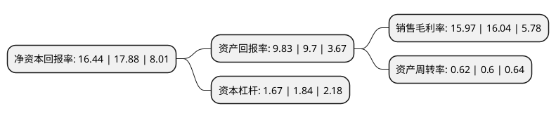

> 本页面由自动化程序生成于 2022年5月20日 01:38
> 内容可能存在错误，如有bug请提交issue至：https://github.com/Eroleice/doc-pi/issues
{.is-warning}

## 股东及高管情况

上市公司第一大股东为ZHAO YUXING，持股23,745,000股，占比22.97%，**疑似为**上市公司实际控制人。

截至2022年04月29日，上市公司的前十大股东中，共有1名自然人股东，6名机构股东，2个产品账户，1个海外主体，其中5%以上大股东共有3名。上市公司前十大股东明细如下：

> 未能通过持股比例判定出上市公司实际控制人（持股30%以上）
> 可能存在通过间接持股、联合持股、协议控制等方式拥有实际控制权的主体，具体请参考上市公司定期公告！
{.is-warning}

> 截至2022年04月29日，上市公司前十大股东信息如下：

| 股东名称 | 持股数量（股） | 持股比例 |
| --- | --- | --- |
| ZHAO YUXING | 23,745,000 | 22.97% |
| 北京沃衍投资中心(有限合伙) | 10,326,800 | 9.99% |
| 江阴天龙重工机械有限公司 | 6,470,000 | 6.26% |
| 江苏中煤矿山设备有限公司 | 4,850,000 | 4.69% |
| 苏州德展投资管理中心(有限合伙) | 3,980,000 | 3.85% |
| 上海尚理投资有限公司 | 3,870,000 | 3.74% |
| 无锡冠赢投资有限公司 | 3,690,000 | 3.57% |
| 中电科(珠海)产业投资基金合伙企业(有限合伙) | 2,860,000 | 2.77% |
| 中信建投基金-共赢5号员工参与战略配售集合资产管理计划 | 2,584,000 | 2.5% |
| 章军 | 2,500,000 | 2.42% |

## 利润表分析

上市公司2021年总收入为5.49亿元，净利润为0.87亿元，实现盈利。

## 杜邦分析

> 数据列示周期：2021年 | 2020年 | 2019年
{.is-info}

上市公司的净资产收益率在近一年有所下降，下降幅度为-8.05%，其变化情况分解如下：
- 上市公司的销售毛利率在近一年下降了-0.44%，可能是生产效率的下降、商品原材料价格上涨或商品价格的下跌所致。
- 上市公司的资产周转率在近一年上升了3.33%，可能是源自于更快的销售回款或库存管理效果提升。
- 上市公司的财务杠杆比率在近一年下降了-9.24%，可能是减少负债降低财务费用。

