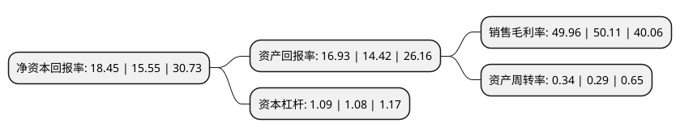

> 本页面由自动化程序生成于 2022年5月20日 01:38
> 内容可能存在错误，如有bug请提交issue至：https://github.com/Eroleice/doc-pi/issues
{.is-warning}

# 上市公司基本情况

## 基本资料

北京华峰测控技术股份有限公司（以下简称“华峰测控”）成立于1993年02月01日，北京市。于2020年02月18日在上交所科创板上市。

华峰测控注册资本6,132.875万元，半导体自动化测试系统的研发，生产和销售，主要产品为半导体自动化测试系统及测试系统配件。以下是详细信息：

- 公司名称: 北京华峰测控技术股份有限公司
- 股票代码: 688200.SH
- 所在地: 北京 - 北京市
- 成立日期: 1993年02月01日
- 注册资本: 6,132.875万元
- 法定代表人: 孙镪
- 主营业务: 半导体自动化测试系统的研发，生产和销售，主要产品为半导体自动化测试系统及测试系统配件
- 公司官网: www.hftc.com.cn
- 公司介绍: 公司是国内最大的半导体测试机本土供应商，也是为数不多进入国际封测市场供应商体系的中国半导体设备厂商,主营业务为半导体自动化测试系统的研发、生产和销售，产品主要用于模拟及混合信号类集成电路的测试，产品销售区域覆盖中国大陆、中国台湾、美国、欧洲、日本、韩国等全球半导体产业发达的国家和地区,自成立以来，公司始终专注于半导体自动化测试系统领域，以其自主研发的产品实现了模拟及混合信号类集成电路自动化测试系统的进口替代。在普遍被国外设备垄断的半导体测试业，公司的测试机已占国内同类产品市场份额的50%，被国外知名IC厂商如TI，STM，Fairchild等考核通过，用于其产品在国内的量产，并已开始进入台湾、东南亚、及美国市场。目前，公司已在模拟器件测试、分立器件测试，数模混合系统测试方面，与美日测试设备公司在更高端的产品领域实现竞争。

## 股东及高管情况

上市公司第一大股东为天津芯华投资控股有限公司，持股18,229,556股，占比29.72%，**疑似为**上市公司实际控制人。

截至2022年03月31日，上市公司的前十大股东中，共有3名自然人股东，3名机构股东，3个产品账户，1个海外主体，其中5%以上大股东共有3名。上市公司前十大股东明细如下：

> 未能通过持股比例判定出上市公司实际控制人（持股30%以上）
> 可能存在通过间接持股、联合持股、协议控制等方式拥有实际控制权的主体，具体请参考上市公司定期公告！
{.is-warning}

> 截至2022年03月31日，上市公司前十大股东信息如下：

| 股东名称 | 持股数量（股） | 持股比例 |
| --- | --- | --- |
| 天津芯华投资控股有限公司 | 18,229,556 | 29.72% |
| 中国时代远望科技有限公司 | 11,075,066 | 18.06% |
| 深圳芯瑞创业投资合伙企业(有限合伙) | 3,888,889 | 6.34% |
| 王皓 | 2,053,323 | 3.35% |
| 香港中央结算有限公司(陆股通) | 1,958,798 | 3.19% |
| 中国建设银行股份有限公司-易方达国防军工混合型证券投资基金 | 1,821,181 | 2.97% |
| 李寅 | 1,700,000 | 2.77% |
| 招商银行股份有限公司-易方达丰华债券型证券投资基金 | 1,158,796 | 1.89% |
| 唐桂琴 | 1,099,888 | 1.79% |
| 中国银行-易方达积极成长证券投资基金 | 788,671 | 1.29% |

## 利润表分析

上市公司2021年总收入为8.78亿元，净利润为4.38亿元，实现盈利。

## 杜邦分析

> 数据列示周期：2021年 | 2020年 | 2019年
{.is-info}

上市公司的净资产收益率在近一年有所上升，上升幅度为18.65%，其变化情况分解如下：
- 上市公司的销售毛利率在近一年下降了-0.3%，可能是生产效率的下降、商品原材料价格上涨或商品价格的下跌所致。
- 上市公司的资产周转率在近一年上升了17.24%，可能是源自于更快的销售回款或库存管理效果提升。
- 上市公司的财务杠杆比率在近一年上升了0.93%，可能是增加负债扩大生产规模。

