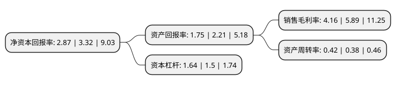

> 本页面由自动化程序生成于 2022年5月20日 01:38
> 内容可能存在错误，如有bug请提交issue至：https://github.com/Eroleice/doc-pi/issues
{.is-warning}

# 上市公司基本情况

## 基本资料

江苏北人智能制造科技股份有限公司（以下简称“江苏北人”）成立于2011年12月26日，苏州市。于2019年12月11日在上交所科创板上市。

江苏北人注册资本11,734万元，提供工业机器人自动化，智能化的系统集成整体解决方案，主要涉及柔性自动化，智能化的工作站和生产线的研发，设计，生产，装配及销售。以下是详细信息：

- 公司名称: 江苏北人智能制造科技股份有限公司
- 股票代码: 688218.SH
- 所在地: 江苏 - 苏州市
- 成立日期: 2011年12月26日
- 注册资本: 11,734万元
- 法定代表人: 朱振友
- 主营业务: 提供工业机器人自动化，智能化的系统集成整体解决方案，主要涉及柔性自动化，智能化的工作站和生产线的研发，设计，生产，装配及销售
- 公司官网: www.br-robot.com
- 公司介绍: 公司的主营业务为提供工业机器人自动化、智能化的系统集成整体解决方案，主要涉及柔性自动化、智能化的工作站和生产线的研发、设计、生产、装配及销售。主要产品包括柔性自动化焊接生产线、智能化焊接装备及生产线、激光加工系统、焊接数字化车间、柔性自动化装配生产线、冲压自动化生产线以及生产管理信息化系统。产品主要应用于汽车、航空航天、军工、船舶、重工等行业。公司核心技术包括柔性精益自动化产线设计、先进制造工艺集成应用、产线虚拟设计与仿真、工业控制与信息化、生产过程智能化。公司在汽车金属零部件柔性自动化焊接和高端装备制造业智能化焊接领域拥有突出的竞争优势。依靠工业机器人系统集成技术的不断进步和项目经验积累，公司在做大、做强汽车领域的同时，还在航空航天、军工、船舶、重工等高端装备制造领域拓展业务。

## 股东及高管情况

上市公司第一大股东为朱振友，持股26,774,294股，占比22.82%，**疑似为**上市公司实际控制人。

截至2022年05月11日，上市公司的前十大股东中，共有5名自然人股东，3名机构股东，2个产品账户，其中5%以上大股东共有2名。上市公司前十大股东明细如下：

> 未能通过持股比例判定出上市公司实际控制人（持股30%以上）
> 可能存在通过间接持股、联合持股、协议控制等方式拥有实际控制权的主体，具体请参考上市公司定期公告！
{.is-warning}

> 截至2022年05月11日，上市公司前十大股东信息如下：

| 股东名称 | 持股数量（股） | 持股比例 |
| --- | --- | --- |
| 朱振友 | 26,774,294 | 22.82% |
| 林涛 | 7,213,297 | 6.15% |
| 中新苏州工业园区创业投资有限公司 | 5,622,195 | 4.79% |
| 苏州工业园区元禾重元股权投资基金管理有限公司-苏州工业园区元禾重元贰号股权投资基金合伙企业(有限合伙) | 3,148,613 | 2.68% |
| 苏州工业园区原点正则贰号创业投资企业(有限合伙) | 3,126,800 | 2.66% |
| 上海联明机械股份有限公司 | 2,390,101 | 2.04% |
| 张仁福 | 2,293,752 | 1.95% |
| 陈斌 | 1,611,722 | 1.37% |
| 王庆 | 1,586,458 | 1.35% |
| 东吴证券-招商银行-东吴证券江苏北人员工参与科创板战略配售集合资产管理计划 | 1,558,635 | 1.33% |

## 利润表分析

上市公司2021年总收入为5.87亿元，净利润为0.24亿元，实现盈利。

## 杜邦分析

> 数据列示周期：2021年 | 2020年 | 2019年
{.is-info}

上市公司的净资产收益率在近一年有所下降，下降幅度为-13.55%，其变化情况分解如下：
- 上市公司的销售毛利率在近一年下降了-29.37%，可能是生产效率的下降、商品原材料价格上涨或商品价格的下跌所致。
- 上市公司的资产周转率在近一年上升了10.53%，可能是源自于更快的销售回款或库存管理效果提升。
- 上市公司的财务杠杆比率在近一年上升了9.33%，可能是增加负债扩大生产规模。

