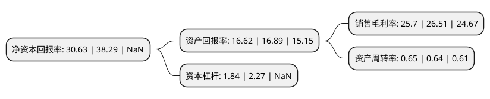

> 本页面由自动化程序生成于 2022年5月20日 01:39
> 内容可能存在错误，如有bug请提交issue至：https://github.com/Eroleice/doc-pi/issues
{.is-warning}

## 股东及高管情况

上市公司第一大股东为杭州行之远控股有限公司，持股23,884,931股，占比28.99%，**疑似为**上市公司实际控制人。

截至2022年04月29日，上市公司的前十大股东中，共有1名自然人股东，8名机构股东，1个产品账户，其中5%以上大股东共有7名。上市公司前十大股东明细如下：

> 未能通过持股比例判定出上市公司实际控制人（持股30%以上）
> 可能存在通过间接持股、联合持股、协议控制等方式拥有实际控制权的主体，具体请参考上市公司定期公告！
{.is-warning}

> 截至2022年04月29日，上市公司前十大股东信息如下：

| 股东名称 | 持股数量（股） | 持股比例 |
| --- | --- | --- |
| 杭州行之远控股有限公司 | 23,884,931 | 28.99% |
| 上海中核浦原有限公司 | 7,725,000 | 9.38% |
| 杭州一米投资合伙企业(有限合伙) | 7,397,460 | 8.98% |
| 杭州智航投资管理合伙企业(有限合伙) | 5,917,968 | 7.18% |
| 杭实资产管理(杭州)有限公司 | 5,407,500 | 6.56% |
| 杭州杭实赛谨投资合伙企业(有限合伙) | 5,101,439 | 6.19% |
| 来建良 | 4,666,669 | 5.66% |
| 中信证券景业智能员工参与科创板战略配售集合资产管理计划 | 2,060,000 | 2.5% |
| 嘉兴秘银晓风股权投资合伙企业(有限合伙) | 1,699,033 | 2.06% |
| 中信证券投资有限公司 | 1,030,000 | 1.25% |

## 利润表分析

上市公司2021年总收入为3.48亿元，净利润为0.76亿元，实现盈利。

## 杜邦分析

> 数据列示周期：2020年 | 2019年 | 2018年
{.is-info}

上市公司的净资产收益率在近一年有所下降，下降幅度为-20.01%，其变化情况分解如下：
- 上市公司的销售毛利率在近一年下降了-3.06%，可能是生产效率的下降、商品原材料价格上涨或商品价格的下跌所致。
- 上市公司的资产周转率在近一年上升了1.56%，可能是源自于更快的销售回款或库存管理效果提升。
- 上市公司的财务杠杆比率在近一年下降了-18.94%，可能是减少负债降低财务费用。

