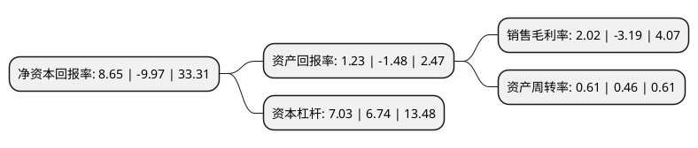

> 本页面由自动化程序生成于 2022年5月20日 01:39
> 内容可能存在错误，如有bug请提交issue至：https://github.com/Eroleice/doc-pi/issues
{.is-warning}

# 上市公司基本情况

## 基本资料

宁波均普智能制造股份有限公司（以下简称“均普智能”）成立于2017年01月10日，宁波市。于2022年03月22日在上交所科创板上市。

均普智能注册资本122,828.28万元，公司主要产品以定制化生产为主，在项目启动后，公司会陆续组织开展产品的设计研发及生产工作。公司根据客户的定制化要求，组织产品机械，电气设计，经过初步评审后，开展全面的成套智能装备设计和仿真模拟。公司借助新一代信息通信技术，通过工业软件，生产和业务管理系统，智能技术和装备等软硬件的系统集成，为客户提供智能制造整体解决方案。以下是详细信息：

- 公司名称: 宁波均普智能制造股份有限公司
- 股票代码: 688306.SH
- 所在地: 浙江 - 宁波市
- 成立日期: 2017年01月10日
- 注册资本: 122,828.28万元
- 法定代表人: 周兴宥
- 主营业务: 公司主要产品以定制化生产为主，在项目启动后，公司会陆续组织开展产品的设计研发及生产工作公司根据客户的定制化要求，组织产品机械，电气设计，经过初步评审后，开展全面的成套智能装备设计和仿真模拟公司借助新一代信息通信技术，通过工业软件，生产和业务管理系统，智能技术和装备等软硬件的系统集成，为客户提供智能制造整体解决方案
- 公司官网: piagroup.com.cn
- 公司介绍: 公司是一家全球化的智能制造装备供应商。主要产品和服务包括汽车工业、工业电机、消费品、医疗健康智能制造装备，以及工业4.0应用软件和数字化服务。公司借助新一代信息通信技术，通过工业软件、生产和业务管理系统、智能技术和装备等软硬件的系统集成，为客户提供智能制造整体解决方案。公司是国内极少数能够参与采埃孚等知名汽车一级零部件供应商后桥差速器装配与检测项目的供应商，公司生产的汽车动力总成中的后桥驱动单元处于行业领先水平。公司系美国车桥新能源汽车电驱动系统，采埃孚汽车ADAS成像系统，宝洁集团新一代电动剃须刀、电动牙刷，格雷斯海姆吸入器、胰岛素笔等智能制造装备的核心供应商。公司被认定为浙江省第一批疫情防控重点保障企业和宁波市应急物资生产重点企业。

## 股东及高管情况

上市公司第一大股东为均胜集团有限公司，持股560,200,000股，占比45.61%，为上市公司实际控制人。

截至2022年03月31日，上市公司的前十大股东中，共有8名机构股东，2个产品账户，其中5%以上大股东共有3名。上市公司前十大股东明细如下：

> 截至2022年03月31日，上市公司前十大股东信息如下：

| 股东名称 | 持股数量（股） | 持股比例 |
| --- | --- | --- |
| 均胜集团有限公司 | 560,200,000 | 45.61% |
| 宁波韦伯企业管理咨询合伙企业(有限合伙) | 160,000,000 | 13.03% |
| 宁波浚瀛实业发展合伙企业(有限合伙) | 72,727,300 | 5.92% |
| 宁波普鸣品鹏投资咨询合伙企业(有限合伙) | 39,900,000 | 3.25% |
| 宁波博海瑞投资咨询合伙企业(有限合伙) | 39,900,000 | 3.25% |
| 海富产业投资基金管理有限公司-海富长江成长股权投资(湖北)合伙企业(有限合伙) | 36,363,600 | 2.96% |
| 元禾璞华(苏州)投资管理有限公司-江苏疌泉元禾璞华股权投资合伙企业(有限合伙) | 12,121,200 | 0.99% |
| 宁波均胜电子股份有限公司 | 9,793,551 | 0.8% |
| 华泰证券股份有限公司 | 2,345,834 | 0.19% |
| 杭州斌诺资产管理有限公司-斌诺东起1号私募证券投资基金 | 2,100,000 | 0.17% |

## 利润表分析

上市公司2021年总收入为21.39亿元，净利润为0.43亿元，实现盈利。

## 杜邦分析

> 数据列示周期：2021年 | 2020年 | 2019年
{.is-info}

上市公司的净资产收益率在近一年有所下降，下降幅度为-186.76%，其变化情况分解如下：
- 上市公司的销售毛利率在近一年下降了-163.32%，可能是生产效率的下降、商品原材料价格上涨或商品价格的下跌所致。
- 上市公司的资产周转率在近一年上升了32.61%，可能是源自于更快的销售回款或库存管理效果提升。
- 上市公司的财务杠杆比率在近一年上升了4.3%，可能是增加负债扩大生产规模。

