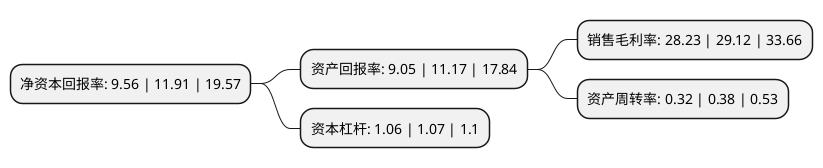

> 本页面由自动化程序生成于 2022年5月20日 01:39
> 内容可能存在错误，如有bug请提交issue至：https://github.com/Eroleice/doc-pi/issues
{.is-warning}

# 上市公司基本情况

## 基本资料

深圳市燕麦科技股份有限公司（以下简称“燕麦科技”）成立于2012年03月12日，深圳市。于2020年06月08日在上交所科创板上市。

燕麦科技注册资本14,409.182万元，公司主要专注于自动化，智能化测试设备的研发，设计，生产和销售;主要产品为测试治具，自动化测试设备，智能化视觉检测设备等。以下是详细信息：

- 公司名称: 深圳市燕麦科技股份有限公司
- 股票代码: 688312.SH
- 所在地: 广东 - 深圳市
- 成立日期: 2012年03月12日
- 注册资本: 14,409.182万元
- 法定代表人: 刘燕
- 主营业务: 公司主要专注于自动化，智能化测试设备的研发，设计，生产和销售;主要产品为测试治具，自动化测试设备，智能化视觉检测设备等
- 公司官网: www.yanmade.com
- 公司介绍: 公司是一家专注于自动化、智能化测试设备的研发、设计、生产和销售的高科技企业，以精密机械及电、光、声等领域多种测试技术为基础，结合自动控制、图像识别、深度学习算法等技术，开发出测试治具、自动化测试设备、智能化视觉检测设备等系列产品。主要应用终端领域覆盖手机、平板电脑、智能可穿戴设备等消费电子领域、汽车电子领域及通信等领域。公司是国内首家引入线针针模技术用于FPCA测试的企业，通过对线针应用的长期研究，在接触阻抗、接触弹力、安装使用等方面做了大量的改进，提升了针模的使用寿命及测试设备生产效率。

## 股东及高管情况

上市公司第一大股东为刘燕，持股66,528,000股，占比46.17%，为上市公司实际控制人。

截至2022年03月31日，上市公司的前十大股东中，共有3名自然人股东，5名机构股东，2个产品账户，其中5%以上大股东共有1名。上市公司前十大股东明细如下：

> 截至2022年03月31日，上市公司前十大股东信息如下：

| 股东名称 | 持股数量（股） | 持股比例 |
| --- | --- | --- |
| 刘燕 | 66,528,000 | 46.17% |
| 武喜燕 | 6,745,000 | 4.68% |
| 宁波素绚投资管理企业(有限合伙) | 3,823,913 | 2.65% |
| 范琦 | 3,730,889 | 2.59% |
| 北京君联慧诚股权投资合伙企业(有限合伙) | 3,443,320 | 2.39% |
| 华芯原创(青岛)投资管理有限公司-青岛华芯创原创业投资中心(有限合伙) | 3,228,261 | 2.24% |
| 宁波麦利粟投资管理合伙企业(有限合伙) | 2,780,000 | 1.93% |
| 广州市玄元投资管理有限公司-玄元元定5号私募证券投资基金 | 2,650,000 | 1.84% |
| 西藏中睿合银投资管理有限公司-中睿合银稳健7号私募证券投资基金 | 2,537,400 | 1.76% |
| 深圳市麦其芃投资企业(有限合伙) | 2,220,000 | 1.54% |

## 利润表分析

上市公司2021年总收入为4.27亿元，净利润为1.2亿元，实现盈利。

## 杜邦分析

> 数据列示周期：2021年 | 2020年 | 2019年
{.is-info}

上市公司的净资产收益率在近一年有所下降，下降幅度为-19.73%，其变化情况分解如下：
- 上市公司的销售毛利率在近一年下降了-3.06%，可能是生产效率的下降、商品原材料价格上涨或商品价格的下跌所致。
- 上市公司的资产周转率在近一年下降了-15.79%，可能是源自于更慢的销售回款或库存管理效果下降。
- 上市公司的财务杠杆比率在近一年下降了-0.93%，可能是减少负债降低财务费用。

