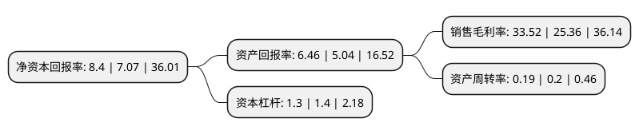

> 本页面由自动化程序生成于 2022年5月20日 01:39
> 内容可能存在错误，如有bug请提交issue至：https://github.com/Eroleice/doc-pi/issues
{.is-warning}

# 上市公司基本情况

## 基本资料

吉林奥来德光电材料股份有限公司（以下简称“奥来德”）成立于2005年06月10日，长春市。于2020年09月03日在上交所科创板上市。

奥来德注册资本7,313.67万元，主要从事OLED产业链上游环节中的有机发光材料的终端材料与蒸发源设备的研发，制造，销售及售后技术服务公司产品主要分为OLED中间体，OLED粗品，OLED升华品。以下是详细信息：

- 公司名称: 吉林奥来德光电材料股份有限公司
- 股票代码: 688378.SH
- 所在地: 吉林 - 长春市
- 成立日期: 2005年06月10日
- 注册资本: 7,313.67万元
- 法定代表人: 轩景泉
- 主营业务: 主要从事OLED产业链上游环节中的有机发光材料的终端材料与蒸发源设备的研发，制造，销售及售后技术服务公司产品主要分为OLED中间体，OLED粗品，OLED升华品
- 公司官网: www.jl-oled.com
- 公司介绍: 公司是国内领先的OLED有机发光材料和蒸发源设备制造企业，主要从事OLED产业链上游环节中的有机发光材料的终端材料与蒸发源设备的研发、制造、销售及售后技术服务，其中有机发光材料为OLED面板制造的核心材料，蒸发源为OLED面板制造的关键设备蒸镀机的核心组件，经过近15年的行业技术经验积累，公司已向维信诺集团、和辉光电、TCL华星集团、京东方、天马集团、信利集团等知名OLED面板生产企业提供有机发光材料，已向成都京东方、云谷(固安)、武汉华星、武汉天马提供蒸发源设备，并与合肥维信诺订立了蒸发源设备合同，其中成都京东方与云谷(固安)的蒸发源设备已完成验收，且产线已投产，运行状况良好。凭借稳定优质的产品质量，公司与上述客户建立了稳定的合作关系。未来公司还将通过持续研发投入，不断提升产品品质、丰富产品种类，致力于成为OLED材料与设备领域中国际知名的研发、制造企业。

## 股东及高管情况

上市公司第一大股东为轩景泉，持股15,925,800股，占比21.78%，**疑似为**上市公司实际控制人。

截至2022年04月21日，上市公司的前十大股东中，共有4名自然人股东，5名机构股东，1个产品账户，其中5%以上大股东共有5名。上市公司前十大股东明细如下：

> 未能通过持股比例判定出上市公司实际控制人（持股30%以上）
> 可能存在通过间接持股、联合持股、协议控制等方式拥有实际控制权的主体，具体请参考上市公司定期公告！
{.is-warning}

> 截至2022年04月21日，上市公司前十大股东信息如下：

| 股东名称 | 持股数量（股） | 持股比例 |
| --- | --- | --- |
| 轩景泉 | 15,925,800 | 21.78% |
| 轩景泉 | 15,925,800 | 21.78% |
| 轩菱忆 | 7,119,285 | 9.73% |
| 轩菱忆 | 7,119,285 | 9.73% |
| 深圳同创伟业资产管理股份有限公司-深圳南海成长同赢股权投资基金(有限合伙) | 3,915,150 | 5.3532% |
| 大阳日酸(中国)投资有限公司 | 3,180,650 | 4.35% |
| 深圳同创伟业资产管理股份有限公司-杭州南海成长投资合伙企业(有限合伙) | 2,925,624 | 4% |
| 甘肃国芳工贸(集团)股份有限公司 | 2,000,000 | 2.73% |
| 宁波绿河睿能投资合伙企业(有限合伙) | 1,670,000 | 2.28% |
| 长春巨海投资合伙企业(有限合伙) | 1,000,000 | 1.37% |

## 利润表分析

上市公司2021年总收入为4.05亿元，净利润为1.36亿元，实现盈利。

## 杜邦分析

> 数据列示周期：2021年 | 2020年 | 2019年
{.is-info}

上市公司的净资产收益率在近一年有所上升，上升幅度为18.81%，其变化情况分解如下：
- 上市公司的销售毛利率在近一年上升了32.18%，可能是生产效率的提升、商品原材料价格下跌或商品价格的上涨所致。
- 上市公司的资产周转率在近一年下降了-5%，可能是源自于更慢的销售回款或库存管理效果下降。
- 上市公司的财务杠杆比率在近一年下降了-7.14%，可能是减少负债降低财务费用。

