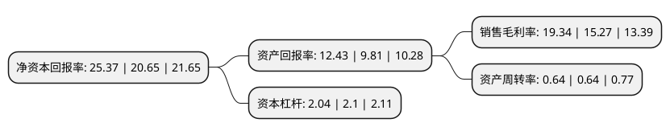

> 本页面由自动化程序生成于 2022年5月20日 01:39
> 内容可能存在错误，如有bug请提交issue至：https://github.com/Eroleice/doc-pi/issues
{.is-warning}

# 上市公司基本情况

## 基本资料

深圳新益昌科技股份有限公司（以下简称“新益昌”）成立于2006年06月28日，深圳市。于2021年04月28日在上交所科创板上市。

新益昌注册资本10,213.36万元，主要从事LED，电容器，半导体，锂电池等行业智能制造装备的研发，生产和销售，为客户实现智能制造提供先进，稳定的装备及解决方案。以下是详细信息：

- 公司名称: 深圳新益昌科技股份有限公司
- 股票代码: 688383.SH
- 所在地: 广东 - 深圳市
- 成立日期: 2006年06月28日
- 注册资本: 10,213.36万元
- 法定代表人: 胡新荣
- 主营业务: 主要从事LED，电容器，半导体，锂电池等行业智能制造装备的研发，生产和销售，为客户实现智能制造提供先进，稳定的装备及解决方案
- 公司官网: www.szhech.com
- 公司介绍: 公司凭借过硬的产品质量、技术创新能力和高效优质的配套服务能力，积累了丰富的优质客户资源和良好的品牌形象，成为国内外许多知名企业的优选合作伙伴。凭借深厚的研发实力和较高的品牌影响力，公司获得了中国照明学会半导体照明技术与应用专业委员会授予的“第四届中国LED首创奖金奖”，深圳市电子装备产业协会和深圳市智能装备产业协会于2019年授予的“深圳装备工业半导体行业细分领域龙头企业”，深圳市照明与显示工程行业协会2017年及2018年连续两年授予的“行业特别贡献奖”、2020年授予的“2019年度品牌效应企业”，深圳市半导体产业发展促进会授予的“2014年度深圳半导体照明产业设备优秀企业”、“2018年度深圳半导体照明产业设备类优秀企业”、“2019年度深圳半导体产业设备类优秀企业”、高工产业研究院(GGII)授予的“2018年度品牌企业”、“2018年度投资价值企业”、“2019年度投资价值非上市公司”、“2019年度品牌-设备”、2019年“年度创新技术与产品奖-封装设备”。

## 股东及高管情况

上市公司第一大股东为胡新荣，持股37,631,757股，占比36.85%，为上市公司实际控制人。

截至2022年04月28日，上市公司的前十大股东中，共有4名自然人股东，3名机构股东，3个产品账户，其中5%以上大股东共有2名。上市公司前十大股东明细如下：

> 截至2022年04月28日，上市公司前十大股东信息如下：

| 股东名称 | 持股数量（股） | 持股比例 |
| --- | --- | --- |
| 胡新荣 | 37,631,757 | 36.85% |
| 宋昌宁 | 30,789,619 | 30.15% |
| 深圳洲明时代伯乐投资管理合伙企业(有限合伙) | 3,637,500 | 3.56% |
| 深圳市春江投资合伙企业(有限合伙) | 2,249,999 | 2.2% |
| 李国军 | 1,600,000 | 1.57% |
| 中国工商银行股份有限公司-广发科技动力股票型证券投资基金 | 1,228,490 | 1.2% |
| 中泰创业投资(深圳)有限公司 | 1,198,380 | 1.17% |
| 平安安赢股票型养老金产品-中国银行股份有限公司 | 1,121,358 | 1.1% |
| 平安资产-工商银行-平安资产如意28号保险资产管理产品 | 825,134 | 0.81% |
| 颜耀凡 | 691,125 | 0.68% |

## 利润表分析

上市公司2021年总收入为11.96亿元，净利润为2.31亿元，实现盈利。

## 杜邦分析

> 数据列示周期：2021年 | 2020年 | 2019年
{.is-info}

上市公司的净资产收益率在近一年有所上升，上升幅度为22.86%，其变化情况分解如下：
- 上市公司的销售毛利率在近一年上升了26.65%，可能是生产效率的提升、商品原材料价格下跌或商品价格的上涨所致。
- 上市公司的资产周转率在近一年下降了0%，可能是源自于更慢的销售回款或库存管理效果下降。
- 上市公司的财务杠杆比率在近一年下降了-2.86%，可能是减少负债降低财务费用。

