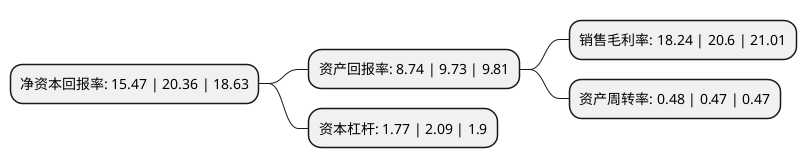

> 本页面由自动化程序生成于 2022年5月20日 01:39
> 内容可能存在错误，如有bug请提交issue至：https://github.com/Eroleice/doc-pi/issues
{.is-warning}

# 上市公司基本情况

## 基本资料

中国铁建重工集团股份有限公司（以下简称“铁建重工”）成立于2006年11月23日，长沙市。于2021年06月22日在上交所科创板上市。

铁建重工注册资本533,349.7万元，主要从事掘进机装备，轨道交通设备和特种专业装备的设计，研发，制造，销售，租赁和服务。以下是详细信息：

- 公司名称: 中国铁建重工集团股份有限公司
- 股票代码: 688425.SH
- 所在地: 湖南 - 长沙市
- 成立日期: 2006年11月23日
- 注册资本: 533,349.7万元
- 法定代表人: 刘飞香
- 主营业务: 主要从事掘进机装备，轨道交通设备和特种专业装备的设计，研发，制造，销售，租赁和服务
- 公司官网: www.crchi.com
- 公司介绍: 公司作为全球大型定制化高端工程装备行业的引领者之一，公司主要从事掘进机装备、轨道交通设备和特种专业装备的设计、研发、制造、销售、租赁和服务。公司成立以来专注于产品研发，结合自动化和智能化技术，不断丰富产品品类、优化升级产品性能，具备为终端用户提供适用于多种复杂应用场景下的定制化、专业化和智能化的高端装备和技术服务能力,铁建重工始终瞄准“世界一流、国内领先”的目标，通过“原始创新、集成创新、协同创新、持续创新”的自主创新模式，打造了以施工技术为先导，基础研究、产品研发、工艺开发、应用研究、工程实验相配套的特色研发体系,公司先后被评为“国家技术创新示范企业”、“国家级知识产权示范企业”、“国家服务型制造示范企业”、“国家重大技术装备首台套示范单位”、“中国最佳自主创新企业”、“国家级两化深度融合示范企业”、“装备中国创新榜样奖”等称号，并获得了“中国专利优秀奖”、“中国好设计金奖”、“中国工程机械年度产品TOP50”、“改革开放四十周年机械工业杰出产品”、“湖南省产业技术创新十大标志性成果”等诸多荣誉。

## 股东及高管情况

上市公司第一大股东为中金公司-招商银行-中金公司铁建重工1号员工参与科创板战略配售集合资产管理计划，持股124,990,776股，占比2.34%，**疑似为**上市公司实际控制人。

截至2022年03月31日，上市公司的前十大股东中，共有1名自然人股东，3名机构股东，6个产品账户。上市公司前十大股东明细如下：

> 未能通过持股比例判定出上市公司实际控制人（持股30%以上）
> 可能存在通过间接持股、联合持股、协议控制等方式拥有实际控制权的主体，具体请参考上市公司定期公告！
{.is-warning}

> 上市公司第一大股东持股不超过10%，请检查是否存在公司控制权风险！
{.is-danger}

> 截至2022年03月31日，上市公司前十大股东信息如下：

| 股东名称 | 持股数量（股） | 持股比例 |
| --- | --- | --- |
| 中金公司-招商银行-中金公司铁建重工1号员工参与科创板战略配售集合资产管理计划 | 124,990,776 | 2.34% |
| 中国中金财富证券有限公司 | 35,843,205 | 0.67% |
| 李博之 | 27,230,177 | 0.51% |
| 中国土木工程集团有限公司 | 19,277,700 | 0.36% |
| 先进制造产业投资基金(有限合伙) | 17,421,602 | 0.33% |
| 华菱津杉(天津)产业投资基金合伙企业(有限合伙) | 17,421,602 | 0.33% |
| 湖南省财信产业基金管理有限公司 | 17,421,602 | 0.33% |
| 国铁盛和(青岛)私募股权投资基金合伙企业(有限合伙) | 17,421,602 | 0.33% |
| 国家制造业转型升级基金股份有限公司 | 17,421,602 | 0.33% |
| 长沙经济技术开发集团有限公司 | 17,421,602 | 0.33% |

## 利润表分析

上市公司2021年总收入为95.17亿元，净利润为17.35亿元，实现盈利。

## 杜邦分析

> 数据列示周期：2021年 | 2020年 | 2019年
{.is-info}

上市公司的净资产收益率在近一年有所下降，下降幅度为-24.02%，其变化情况分解如下：
- 上市公司的销售毛利率在近一年下降了-11.46%，可能是生产效率的下降、商品原材料价格上涨或商品价格的下跌所致。
- 上市公司的资产周转率在近一年上升了2.13%，可能是源自于更快的销售回款或库存管理效果提升。
- 上市公司的财务杠杆比率在近一年下降了-15.31%，可能是减少负债降低财务费用。

