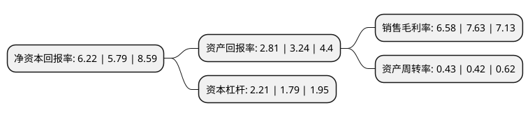

> 本页面由自动化程序生成于 2022年5月20日 01:39
> 内容可能存在错误，如有bug请提交issue至：https://github.com/Eroleice/doc-pi/issues
{.is-warning}

# 上市公司基本情况

## 基本资料

深圳市联赢激光股份有限公司（以下简称“联赢激光”）成立于2005年09月22日，深圳市。于2020年06月22日在上交所科创板上市。

联赢激光注册资本29,920万元，专业从事精密激光焊接机及激光焊接自动化成套设备的研发，生产，销售。以下是详细信息：

- 公司名称: 深圳市联赢激光股份有限公司
- 股票代码: 688518.SH
- 所在地: 广东 - 深圳市
- 成立日期: 2005年09月22日
- 注册资本: 29,920万元
- 法定代表人: 韩金龙
- 主营业务: 专业从事精密激光焊接机及激光焊接自动化成套设备的研发，生产，销售
- 公司官网: www.uwlaser.com
- 公司介绍: 公司是一家国内领先的精密激光焊接设备及自动化解决方案供应商，专业从事精密激光焊接机及激光焊接自动化成套设备的研发、生产、销售。公司产品广泛应用于动力电池、汽车制造、五金家电、消费电子、光通讯等制造业领域，客户群体覆盖包括宁德时代、国轩高科、比亚迪、格力智能、富士康、泰科电子、长盈精密、亿纬锂能、松下、三星、中航动力等行业知名企业。经过多年的经营发展与持续的技术创新，公司逐步形成了自身的核心技术体系，目前已经成长为国内激光焊接行业的领军企业。

## 股东及高管情况

上市公司第一大股东为韩金龙，持股28,474,356股，占比9.52%，**疑似为**上市公司实际控制人。

截至2022年03月31日，上市公司的前十大股东中，共有3名自然人股东，2名机构股东，5个产品账户，其中5%以上大股东共有1名。上市公司前十大股东明细如下：

> 未能通过持股比例判定出上市公司实际控制人（持股30%以上）
> 可能存在通过间接持股、联合持股、协议控制等方式拥有实际控制权的主体，具体请参考上市公司定期公告！
{.is-warning}

> 上市公司第一大股东持股不超过10%，请检查是否存在公司控制权风险！
{.is-danger}

> 截至2022年03月31日，上市公司前十大股东信息如下：

| 股东名称 | 持股数量（股） | 持股比例 |
| --- | --- | --- |
| 韩金龙 | 28,474,356 | 9.52% |
| 牛增强 | 12,676,646 | 4.24% |
| 中国建设银行股份有限公司-易方达国防军工混合型证券投资基金 | 11,701,829 | 3.91% |
| 深圳市南山创业投资有限公司 | 9,241,314 | 3.09% |
| 中国银行-易方达积极成长证券投资基金 | 7,884,162 | 2.64% |
| 李瑾 | 7,824,600 | 2.62% |
| 全国社保基金一一二组合 | 5,893,249 | 1.97% |
| 上海浦东发展银行股份有限公司-景顺长城新能源产业股票型证券投资基金 | 5,719,516 | 1.91% |
| 深圳市源政投资发展有限公司 | 5,236,782 | 1.75% |
| 全国社保基金一一一组合 | 4,407,436 | 1.47% |

## 利润表分析

上市公司2021年总收入为13.99亿元，净利润为0.92亿元，实现盈利。

## 杜邦分析

> 数据列示周期：2021年 | 2020年 | 2019年
{.is-info}

上市公司的净资产收益率在近一年有所上升，上升幅度为7.43%，其变化情况分解如下：
- 上市公司的销售毛利率在近一年下降了-13.76%，可能是生产效率的下降、商品原材料价格上涨或商品价格的下跌所致。
- 上市公司的资产周转率在近一年上升了2.38%，可能是源自于更快的销售回款或库存管理效果提升。
- 上市公司的财务杠杆比率在近一年上升了23.46%，可能是增加负债扩大生产规模。

