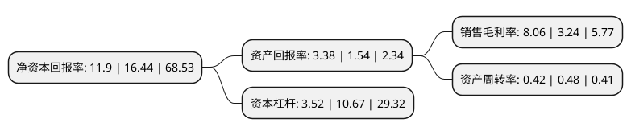

> 本页面由自动化程序生成于 2022年5月20日 01:39
> 内容可能存在错误，如有bug请提交issue至：https://github.com/Eroleice/doc-pi/issues
{.is-warning}

# 上市公司基本情况

## 基本资料

大连豪森设备制造股份有限公司（以下简称“豪森股份”）成立于2002年09月04日，大连市。于2020年11月09日在上交所科创板上市。

豪森股份注册资本12,800万元，产品主要包括发动机智能装配线，变速箱智能装配线和白车身焊装智能生产线;在新能源汽车领域，产品主要包括混合动力变速箱智能装配线，动力锂电池智能生产线，氢燃料电池智能生产线和新能源汽车驱动电机智能生产线等。主要从事智能生产线的规划，研发，设计，装配，调试集成，销售，服务和交钥匙工程等。以下是详细信息：

- 公司名称: 大连豪森设备制造股份有限公司
- 股票代码: 688529.SH
- 所在地: 辽宁 - 大连市
- 成立日期: 2002年09月04日
- 注册资本: 12,800万元
- 法定代表人: 董德熙
- 主营业务: 产品主要包括发动机智能装配线，变速箱智能装配线和白车身焊装智能生产线;在新能源汽车领域，产品主要包括混合动力变速箱智能装配线，动力锂电池智能生产线，氢燃料电池智能生产线和新能源汽车驱动电机智能生产线等主要从事智能生产线的规划，研发，设计，装配，调试集成，销售，服务和交钥匙工程等
- 公司官网: www.haosen.com.cn
- 公司介绍: 公司立足于国内领先的智能化装配技术和工艺，可为全球客户提供领先、可靠的智能化装备、装配技术及成套定制化产品的综合解决方案，满足全球制造业精益、高效和柔性作业需求，公司不断为客户提供高品质的自动化、柔性化、信息化和智能化的产品及服务。凭借多年积累的技术优势和品牌优势，公司获得了国内外一流客户的认可，公司的主要客户包括上汽通用、特斯拉、采埃孚、北京奔驰、长安福特、华晨宝马、标致雪铁龙、康明斯、格特拉克、卡特彼勒、上汽集团、一汽大众和盛瑞传动等国内外知名品牌企业。公司深耕于汽车智能生产线领域，在汽车发动机智能装配线和变速箱智能装配线等动力总成领域居于国内领先地位，并在服务传统燃油汽车的基础上逐步开拓在新能源汽车领域的市场，在混合动力变速箱智能装配线、动力锂电池智能生产线、氢燃料电池智能生产线以及新能源汽车驱动电机智能生产线等细分领域取得重大突破。公司在智能生产线领域的技术积累和沉淀结合下游客户的具体工艺需求，可以大大扩展公司产品应用领域和范围，可以广泛用于航空航天、OLED显示材料、3C电子、光伏、食品医疗等产业。

## 股东及高管情况

上市公司第一大股东为大连博通聚源实业有限公司，持股20,234,492股，占比15.81%，**疑似为**上市公司实际控制人。

截至2022年03月31日，上市公司的前十大股东中，共有3名自然人股东，7名机构股东，其中5%以上大股东共有4名。上市公司前十大股东明细如下：

> 未能通过持股比例判定出上市公司实际控制人（持股30%以上）
> 可能存在通过间接持股、联合持股、协议控制等方式拥有实际控制权的主体，具体请参考上市公司定期公告！
{.is-warning}

> 截至2022年03月31日，上市公司前十大股东信息如下：

| 股东名称 | 持股数量（股） | 持股比例 |
| --- | --- | --- |
| 大连博通聚源实业有限公司 | 20,234,492 | 15.81% |
| 大连科融实业有限公司 | 14,240,101 | 11.13% |
| 大连尚瑞实业有限公司 | 14,239,727 | 11.12% |
| 大连豪森投资发展有限公司 | 13,385,774 | 10.46% |
| 尚融创新(宁波)股权投资中心(有限合伙) | 4,687,500 | 3.66% |
| 董德熙 | 3,765,366 | 2.94% |
| 张继周 | 3,764,354 | 2.94% |
| 赵方灏 | 3,764,354 | 2.94% |
| 大连铭德聚贤企业管理咨询合伙企业(有限合伙) | 2,886,022 | 2.25% |
| 大连合心聚智企业管理咨询合伙企业(有限合伙) | 2,842,598 | 2.22% |

## 利润表分析

上市公司2021年总收入为11.93亿元，净利润为0.7亿元，实现盈利。

## 杜邦分析

> 数据列示周期：2020年 | 2019年 | 2018年
{.is-info}

上市公司的净资产收益率在近一年有所下降，下降幅度为-27.62%，其变化情况分解如下：
- 上市公司的销售毛利率在近一年上升了148.77%，可能是生产效率的提升、商品原材料价格下跌或商品价格的上涨所致。
- 上市公司的资产周转率在近一年下降了-12.5%，可能是源自于更慢的销售回款或库存管理效果下降。
- 上市公司的财务杠杆比率在近一年下降了-67.01%，可能是减少负债降低财务费用。

