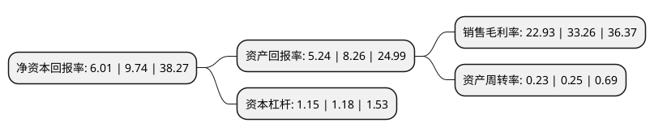

> 本页面由自动化程序生成于 2022年5月20日 01:39
> 内容可能存在错误，如有bug请提交issue至：https://github.com/Eroleice/doc-pi/issues
{.is-warning}

# 上市公司基本情况

## 基本资料

合肥科威尔电源系统股份有限公司（以下简称“科威尔”）成立于2011年06月03日，合肥市。于2020年09月10日在上交所科创板上市。

科威尔注册资本8,000万元，是一家专注于测试电源设备制造的高新技术企业，坚持自主创新，依托电力电子技术平台，融合软件仿真算法与测控技术，为众多行业提供专业，可靠，高性能测试电源和系统。以下是详细信息：

- 公司名称: 合肥科威尔电源系统股份有限公司
- 股票代码: 688551.SH
- 所在地: 安徽 - 合肥市
- 成立日期: 2011年06月03日
- 注册资本: 8,000万元
- 法定代表人: 傅仕涛
- 主营业务: 是一家专注于测试电源设备制造的高新技术企业，坚持自主创新，依托电力电子技术平台，融合软件仿真算法与测控技术，为众多行业提供专业，可靠，高性能测试电源和系统
- 公司官网: www.kewell.com.cn
- 公司介绍: 公司通过多年的市场深耕积累了大量的行业应用经验，实现了前沿理论技术与实际工业场景的融合，获得下游众多应用领域客户的认可。在新能源发电行业的用户有：阳光电源、华为、SMA、台达、锦浪科技、特变电工；电动车辆行业的用户有：比亚迪、吉利汽车、长城汽车、通用汽车、博世、ABB、法雷奥西门子、纳铁福传动、舍弗勒；燃料电池行业的用户有：上汽集团、宇通客车、北京亿华通、潍柴动力、重塑、广东国鸿等国内外知名企业。公司是为数不多跻身国际测试电源设备供应商体系的中国本土品牌，并已成长为一家国内领先、业界知名的测试电源及系统供应商。2018年2月，发行人的630kW光伏阵列I-V模拟器荣获2017年第二批安徽省首台(套)重大技术装备奖项；2018年10月，公司的KAC-1500-33交流模拟电网电源荣获2018年安徽省首台(套)重大技术装备奖项。公司荣获2019年度江苏省科学技术奖、2019年度中国电工技术学会科技进步二等奖、北京市2019年科学技术进步二等奖。

## 股东及高管情况

上市公司第一大股东为傅仕涛，持股22,437,272股，占比28.05%，**疑似为**上市公司实际控制人。

截至2022年03月31日，上市公司的前十大股东中，共有7名自然人股东，2名机构股东，1个产品账户，其中5%以上大股东共有4名。上市公司前十大股东明细如下：

> 未能通过持股比例判定出上市公司实际控制人（持股30%以上）
> 可能存在通过间接持股、联合持股、协议控制等方式拥有实际控制权的主体，具体请参考上市公司定期公告！
{.is-warning}

> 截至2022年03月31日，上市公司前十大股东信息如下：

| 股东名称 | 持股数量（股） | 持股比例 |
| --- | --- | --- |
| 傅仕涛 | 22,437,272 | 28.05% |
| 蒋佳平 | 11,659,091 | 14.57% |
| 任毅 | 6,295,909 | 7.87% |
| 唐德平 | 4,197,273 | 5.25% |
| 合肥合涂股权投资合伙企业(有限合伙) | 2,590,909 | 3.24% |
| 叶江德 | 2,565,000 | 3.21% |
| 夏亚平 | 2,565,000 | 3.21% |
| 邰坤 | 2,565,000 | 3.21% |
| 中小企业发展基金(江苏有限合伙) | 2,400,000 | 3% |
| 合肥京坤股权投资合伙企业(有限合伙) | 2,124,546 | 2.66% |

## 利润表分析

上市公司2021年总收入为2.47亿元，净利润为0.56亿元，实现盈利。

## 杜邦分析

> 数据列示周期：2021年 | 2020年 | 2019年
{.is-info}

上市公司的净资产收益率在近一年有所下降，下降幅度为-38.3%，其变化情况分解如下：
- 上市公司的销售毛利率在近一年下降了-31.06%，可能是生产效率的下降、商品原材料价格上涨或商品价格的下跌所致。
- 上市公司的资产周转率在近一年下降了-8%，可能是源自于更慢的销售回款或库存管理效果下降。
- 上市公司的财务杠杆比率在近一年下降了-2.54%，可能是减少负债降低财务费用。

