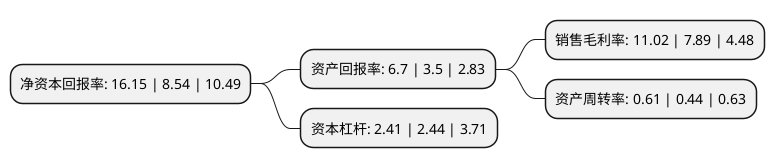

> 本页面由自动化程序生成于 2022年5月20日 01:39
> 内容可能存在错误，如有bug请提交issue至：https://github.com/Eroleice/doc-pi/issues
{.is-warning}

# 上市公司基本情况

## 基本资料

青岛高测科技股份有限公司（以下简称“高测股份”）成立于2006年10月20日，青岛市。于2020年08月07日在上交所科创板上市。

高测股份注册资本16,185.14万元，高硬脆材料切割设备，高硬脆材料切割耗材，轮胎检测设备及耗材的研发，生产，销售及其配套服务。以下是详细信息：

- 公司名称: 青岛高测科技股份有限公司
- 股票代码: 688556.SH
- 所在地: 山东 - 青岛市
- 成立日期: 2006年10月20日
- 注册资本: 16,185.14万元
- 法定代表人: 张顼
- 主营业务: 高硬脆材料切割设备，高硬脆材料切割耗材，轮胎检测设备及耗材的研发，生产，销售及其配套服务
- 公司官网: www.gaoce.cc
- 公司介绍: 公司产品主要应用于光伏行业硅片制造环节。基于自主研发的核心技术，公司正在持续研发新品，推进金刚线切割技术在光伏硅材料、半导体硅材料、蓝宝石材料、磁性材料等更多高硬脆材料加工领域的产业化应用。助力客户降低生产成本、提高生产效率、提升产品质量。公司依托持续的研发投入和技术创新，产品类型不断丰富、产品性能不断提升，产品质量及技术性能已居于行业先进水平。目前，公司在产品质量、专业技术及服务响应方面得到客户广泛认可，并已与隆基股份、中环股份、保利协鑫、晶科能源、晶澳集团、天合光能、阳光能源、环太集团、东方希望等光伏行业领先企业建立了长期稳定的合作关系。

## 股东及高管情况

上市公司第一大股东为张顼，持股41,485,950股，占比25.63%，**疑似为**上市公司实际控制人。

截至2022年05月19日，上市公司的前十大股东中，共有5名自然人股东，5个产品账户，其中5%以上大股东共有4名。上市公司前十大股东明细如下：

> 未能通过持股比例判定出上市公司实际控制人（持股30%以上）
> 可能存在通过间接持股、联合持股、协议控制等方式拥有实际控制权的主体，具体请参考上市公司定期公告！
{.is-warning}

> 截至2022年05月19日，上市公司前十大股东信息如下：

| 股东名称 | 持股数量（股） | 持股比例 |
| --- | --- | --- |
| 张顼 | 41,485,950 | 25.63% |
| 张顼 | 41,485,950 | 25.63% |
| 红线资本管理(深圳)有限公司-潍坊善美股权投资基金合伙企业(有限合伙) | 12,588,272 | 7.78% |
| 红线资本管理(深圳)有限公司-潍坊善美股权投资基金合伙企业(有限合伙) | 10,263,272 | 6.3412% |
| 胡振宇 | 4,594,014 | 2.84% |
| 尚华 | 4,304,236 | 2.66% |
| 中国建设银行股份有限公司-广发科技创新混合型证券投资基金 | 4,275,861 | 2.64% |
| 王东雪 | 4,159,971 | 2.57% |
| 中国建设银行股份有限公司-前海开源公用事业行业股票型证券投资基金 | 3,688,124 | 2.28% |
| 中国工商银行股份有限公司-前海开源新经济灵活配置混合型证券投资基金 | 3,678,947 | 2.27% |

## 杜邦分析

> 数据列示周期：2021年 | 2020年 | 2019年
{.is-info}

上市公司的净资产收益率在近一年有所上升，上升幅度为89.11%，其变化情况分解如下：
- 上市公司的销售毛利率在近一年上升了39.67%，可能是生产效率的提升、商品原材料价格下跌或商品价格的上涨所致。
- 上市公司的资产周转率在近一年上升了38.64%，可能是源自于更快的销售回款或库存管理效果提升。
- 上市公司的财务杠杆比率在近一年下降了-1.23%，可能是减少负债降低财务费用。

