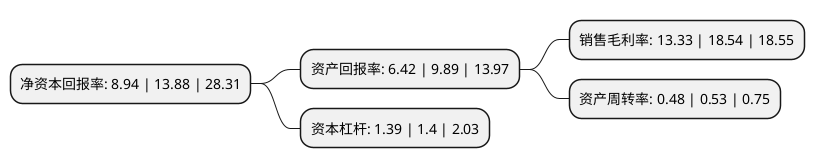

> 本页面由自动化程序生成于 2022年5月20日 01:39
> 内容可能存在错误，如有bug请提交issue至：https://github.com/Eroleice/doc-pi/issues
{.is-warning}

# 上市公司基本情况

## 基本资料

兰剑智能科技股份有限公司（以下简称“兰剑智能”）成立于2001年02月23日，济南市。于2020年12月02日在上交所科创板上市。

兰剑智能注册资本7,267万元，主要从事智能仓储物流自动化系统的研发，设计，生产，销售及服务以下是详细信息：

- 公司名称: 兰剑智能科技股份有限公司
- 股票代码: 688557.SH
- 所在地: 山东 - 济南市
- 成立日期: 2001年02月23日
- 注册资本: 7,267万元
- 法定代表人: 吴耀华
- 主营业务: 主要从事智能仓储物流自动化系统的研发，设计，生产，销售及服务
- 公司官网: www.blueswords.com
- 公司介绍: 公司是一家智能仓储物流自动化系统解决方案提供商，是国内仓储物流自动化拣选系统装备领域的优势企业,主要从事智能仓储物流自动化系统的研发、设计、生产、销售及服务，公司的主要产品是智能仓储物流自动化系统，并基于该产品提供自动化代运营、售后运营维护、技术咨询规划等服务。公司的智能仓储物流自动化系统是由托盘级密集仓储拣选一体化系统、料箱级密集仓储拣选(立体货到人)一体化系统和特定商品全自动化拣选系统中的一个或多个组合为一个整体，并与物流软件高度融合的自动化、智能化系统。公司作为一家智能仓储物流自动化系统解决方案提供商，基于对仓储物流自动化理论体系的理解和探索以及对仓储物流技术持续的研发投入和创新，不断满足不同行业客户的仓储作业需求，尤其在烟草、医药、电子商务、汽车、规模零售等行业，公司已为众多客户提供了智能仓储物流自动化系统解决方案。目前，公司产品已在众多领域可与国内外主要仓储物流自动化系统解决方案提供商进行竞争。公司以雄厚的研发实力承担了多项国家和省市级研发项目，公司产品已受到中国烟草、中国医药集团、美国宝洁(P&G)、唯品会、京东、国家电网等众多知名企业的广泛认可，公司的产品具有较高的市场地位。

## 股东及高管情况

上市公司第一大股东为吴耀华，持股26,057,910股，占比35.86%，为上市公司实际控制人。

截至2022年04月06日，上市公司的前十大股东中，共有4名自然人股东，4名机构股东，2个产品账户，其中5%以上大股东共有3名。上市公司前十大股东明细如下：

> 截至2022年04月06日，上市公司前十大股东信息如下：

| 股东名称 | 持股数量（股） | 持股比例 |
| --- | --- | --- |
| 吴耀华 | 26,057,910 | 35.86% |
| 济南科技创业投资集团有限公司 | 6,832,386 | 9.4019% |
| 深圳市达晨财智创业投资管理有限公司-深圳市达晨创通股权投资企业(有限合伙) | 4,166,190 | 5.73% |
| 段重行 | 2,450,260 | 3.37% |
| 英飞尼迪(珠海)创业投资管理有限公司-珠海中以英飞新兴产业投资基金(有限合伙) | 1,738,200 | 2.39% |
| 苏州和基投资有限公司 | 1,514,120 | 2.08% |
| 李彦彦 | 1,469,100 | 2.02% |
| 蒋霞 | 1,309,680 | 1.8% |
| 宁波梅山保税港区兰盈投资管理合伙企业(有限合伙) | 1,276,290 | 1.76% |
| 中国农业银行股份有限公司-大成睿享混合型证券投资基金 | 1,047,029 | 1.44% |

## 利润表分析

上市公司2021年总收入为6.03亿元，净利润为0.8亿元，实现盈利。

## 杜邦分析

> 数据列示周期：2021年 | 2020年 | 2019年
{.is-info}

上市公司的净资产收益率在近一年有所下降，下降幅度为-35.59%，其变化情况分解如下：
- 上市公司的销售毛利率在近一年下降了-28.1%，可能是生产效率的下降、商品原材料价格上涨或商品价格的下跌所致。
- 上市公司的资产周转率在近一年下降了-9.43%，可能是源自于更慢的销售回款或库存管理效果下降。
- 上市公司的财务杠杆比率在近一年下降了-0.71%，可能是减少负债降低财务费用。

