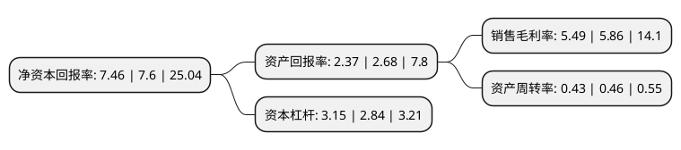

> 本页面由自动化程序生成于 2022年5月20日 01:39
> 内容可能存在错误，如有bug请提交issue至：https://github.com/Eroleice/doc-pi/issues
{.is-warning}

# 上市公司基本情况

## 基本资料

深圳市海目星激光智能装备股份有限公司（以下简称“海目星”）成立于2008年04月03日，深圳市。于2020年09月09日在上交所科创板上市。

海目星注册资本20,000万元，主要从事消费电子，动力电池，钣金加工等行业激光及自动化设备的研发，设计，生产及销售以下是详细信息：

- 公司名称: 深圳市海目星激光智能装备股份有限公司
- 股票代码: 688559.SH
- 所在地: 广东 - 深圳市
- 成立日期: 2008年04月03日
- 注册资本: 20,000万元
- 法定代表人: 赵盛宇
- 主营业务: 主要从事消费电子，动力电池，钣金加工等行业激光及自动化设备的研发，设计，生产及销售
- 公司官网: www.hymson.com
- 公司介绍: 公司是激光及自动化综合解决方案提供商,是国家高新技术企业，主要从事消费电子、动力电池、钣金加工等行业激光及自动化设备的研发、设计、生产及销售，在激光、自动化和智能化综合运用领域已形成较强的优势,公司专注于激光光学及控制技术、与激光系统相配套的自动化技术，并持续强化这两大核心能力,已具备面向多元化应用市场、多层级行业客户的综合产品和解决方案服务能力。凭借公司深厚的研发实力、持续的创新能力，在消费电子、新能源电池等应用领域，公司积累了如Apple、华为、富士康、伟创力、立讯精密、京东方、蓝思科技、特斯拉、CATL、长城汽车、蜂巢能源、中航锂电、亿纬锂能等行业龙头或知名企业客户，实施了多个标杆项目和批量化的交付，并打造出多个应用样板工程,公司现为广东省激光行业协会副会长单位、深圳市先进制造业促进会副会长单位，获得由国家科技部颁发的2014年国家重点新产品奖、2016年度高工锂电创新产品奖、2018年广东省激光行业协会颁发的年度中国杰出进步激光企业奖及中国激光加工系统创新贡献奖等荣誉。

## 股东及高管情况

上市公司第一大股东为鞍山市海康企业管理服务中心(有限合伙)，持股39,095,550股，占比19.55%，**疑似为**上市公司实际控制人。

截至2022年03月31日，上市公司的前十大股东中，共有1名自然人股东，6名机构股东，3个产品账户，其中5%以上大股东共有3名。上市公司前十大股东明细如下：

> 未能通过持股比例判定出上市公司实际控制人（持股30%以上）
> 可能存在通过间接持股、联合持股、协议控制等方式拥有实际控制权的主体，具体请参考上市公司定期公告！
{.is-warning}

> 截至2022年03月31日，上市公司前十大股东信息如下：

| 股东名称 | 持股数量（股） | 持股比例 |
| --- | --- | --- |
| 鞍山市海康企业管理服务中心(有限合伙) | 39,095,550 | 19.55% |
| 深圳市海目星投资管理中心(有限合伙) | 14,291,250 | 7.15% |
| 深圳市深海创投投资合伙企业(有限合伙) | 12,234,000 | 6.12% |
| 深圳市招银一号创新创业投资合伙企业(有限合伙) | 7,946,028 | 3.97% |
| 深圳市国信蓝思基金管理有限公司-深圳市国信蓝思壹号投资基金合伙企业(有限合伙) | 7,610,155 | 3.81% |
| 北京君联成业股权投资合伙企业(有限合伙) | 5,052,674 | 2.53% |
| 中国建设银行股份有限公司-易方达国防军工混合型证券投资基金 | 3,857,205 | 1.93% |
| 深圳市慧悦成长投资基金企业(有限合伙) | 3,852,750 | 1.93% |
| 诸暨科地优茂股权投资合伙企业(有限合伙) | 3,670,200 | 1.84% |
| 詹珊玉 | 3,366,040 | 1.68% |

## 利润表分析

上市公司2021年总收入为19.84亿元，净利润为1.08亿元，实现盈利。

## 杜邦分析

> 数据列示周期：2021年 | 2020年 | 2019年
{.is-info}

上市公司的净资产收益率在近一年有所下降，下降幅度为-1.84%，其变化情况分解如下：
- 上市公司的销售毛利率在近一年下降了-6.31%，可能是生产效率的下降、商品原材料价格上涨或商品价格的下跌所致。
- 上市公司的资产周转率在近一年下降了-6.52%，可能是源自于更慢的销售回款或库存管理效果下降。
- 上市公司的财务杠杆比率在近一年上升了10.92%，可能是增加负债扩大生产规模。

