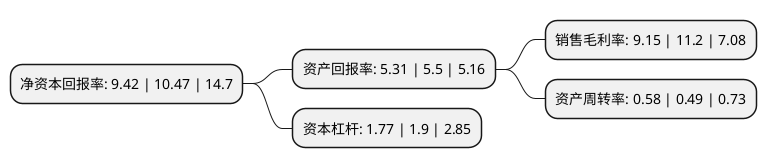

> 本页面由自动化程序生成于 2022年5月20日 01:40
> 内容可能存在错误，如有bug请提交issue至：https://github.com/Eroleice/doc-pi/issues
{.is-warning}

# 上市公司基本情况

## 基本资料

上海正帆科技股份有限公司（以下简称“正帆科技”）成立于2009年10月10日，上海市。于2020年08月20日在上交所科创板上市。

正帆科技注册资本25,650万元，致力于为泛半导体，光纤通信，医药制造等行业客户提供工艺介质和工艺环境综合解决方案，包括(1)气体化学品供应系统的设计，生产，安装及配套服务;(2)高纯特种气体的生产，销售;(3)洁净厂房配套系统的设计，施工。以下是详细信息：

- 公司名称: 上海正帆科技股份有限公司
- 股票代码: 688596.SH
- 所在地: 上海 - 上海市
- 成立日期: 2009年10月10日
- 注册资本: 25,650万元
- 法定代表人: YU DONG LEI
- 主营业务: 致力于为泛半导体，光纤通信，医药制造等行业客户提供工艺介质和工艺环境综合解决方案，包括(1)气体化学品供应系统的设计，生产，安装及配套服务;(2)高纯特种气体的生产，销售;(3)洁净厂房配套系统的设计，施工
- 公司官网: www.gentech-online.com
- 公司介绍: 公司是一家致力于为泛半导体、光纤通信、医药制造等行业客户提供工艺介质和工艺环境综合解决方案的高新技术企业，是国内较早开展工艺介质供应系统业务的企业之一。主营业务包括：(1)气体化学品供应系统的设计、生产、安装及配套服务；(2)高纯特种气体的生产、销售；(3)洁净厂房配套系统的设计、施工，公司累积为数百家客户提供产品与服务，掌握了介质供应系统微污染控制、流体系统设计与模拟仿真、高纯材料合成与分离提纯等关键技术，参与了多项国家和行业标准的编写，公司深耕工艺介质供应系统及高纯特种气体相关行业多年，曾获得上海市企业技术认定中心，第三届中国电子材料行业电子化工材料专业十强企业，上海市“专精特新”中小企业等多项荣誉资质。

## 股东及高管情况

上市公司第一大股东为風帆控股有限公司，持股53,288,760股，占比20.78%，**疑似为**上市公司实际控制人。

截至2022年03月31日，上市公司的前十大股东中，共有4名自然人股东，5名机构股东，1个产品账户，其中5%以上大股东共有3名。上市公司前十大股东明细如下：

> 未能通过持股比例判定出上市公司实际控制人（持股30%以上）
> 可能存在通过间接持股、联合持股、协议控制等方式拥有实际控制权的主体，具体请参考上市公司定期公告！
{.is-warning}

> 截至2022年03月31日，上市公司前十大股东信息如下：

| 股东名称 | 持股数量（股） | 持股比例 |
| --- | --- | --- |
| 風帆控股有限公司 | 53,288,760 | 20.78% |
| 周明峥 | 13,671,394 | 5.33% |
| 黄勇 | 13,671,394 | 5.33% |
| 扬州福翌聚能股权投资合伙企业(有限合伙) | 12,724,744 | 4.96% |
| 苏州建赢友财投资管理有限公司-无锡嘉赢友财投资中心(有限合伙) | 6,638,937 | 2.59% |
| 宁波九格股权投资管理合伙企业(有限合伙)-宁波九格山田股权投资合伙企业(有限合伙) | 4,689,332 | 1.83% |
| 李东升 | 4,634,520 | 1.81% |
| 上海聚源聚芯集成电路产业股权投资基金中心(有限合伙) | 4,220,664 | 1.65% |
| 同系(北京)资本管理有限公司-嘉兴同系恒奇投资合伙企业(有限合伙) | 4,111,210 | 1.6% |
| 周力 | 3,912,035 | 1.53% |

## 杜邦分析

> 数据列示周期：2021年 | 2020年 | 2019年
{.is-info}

上市公司的净资产收益率在近一年有所下降，下降幅度为-10.03%，其变化情况分解如下：
- 上市公司的销售毛利率在近一年下降了-18.3%，可能是生产效率的下降、商品原材料价格上涨或商品价格的下跌所致。
- 上市公司的资产周转率在近一年上升了18.37%，可能是源自于更快的销售回款或库存管理效果提升。
- 上市公司的财务杠杆比率在近一年下降了-6.84%，可能是减少负债降低财务费用。

