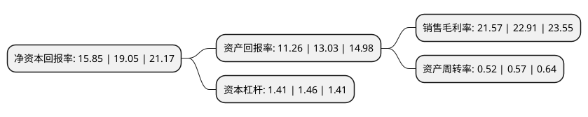

> 本页面由自动化程序生成于 2022年5月20日 01:40
> 内容可能存在错误，如有bug请提交issue至：https://github.com/Eroleice/doc-pi/issues
{.is-warning}

# 上市公司基本情况

## 基本资料

合肥芯碁微电子装备股份有限公司（以下简称“芯碁微装”）成立于2015年06月30日，合肥市。于2021年04月01日在上交所科创板上市。

芯碁微装注册资本12,080万元，主要产品及服务包括PCB直接成像设备及自动线系统，泛半导体直写光刻设备及自动线系统，其他激光直接成像设备以及上述产品的售后维保服务，产品功能涵盖微米到纳米的多领域光刻环节。专业从事以微纳直写光刻为技术核心的直接成像设备及直写光刻设备的研发，制造，销售以及相应的维保服务。以下是详细信息：

- 公司名称: 合肥芯碁微电子装备股份有限公司
- 股票代码: 688630.SH
- 所在地: 安徽 - 合肥市
- 成立日期: 2015年06月30日
- 注册资本: 12,080万元
- 法定代表人: 程卓
- 主营业务: 主要产品及服务包括PCB直接成像设备及自动线系统，泛半导体直写光刻设备及自动线系统，其他激光直接成像设备以及上述产品的售后维保服务，产品功能涵盖微米到纳米的多领域光刻环节专业从事以微纳直写光刻为技术核心的直接成像设备及直写光刻设备的研发，制造，销售以及相应的维保服务
- 公司官网: www.cfmee.cn
- 公司介绍: 公司为国内少数在光刻技术领域里拥有关键核心技术，并能积极参与全球竞争的PCB直接成像设备及泛半导体直写光刻设备的供应商。专业从事以微纳直写光刻为技术核心的直接成像设备及直写光刻设备的研发、制造、销售以及相应的维保服务，主要产品及服务包括PCB直接成像设备及自动线系统、泛半导体直写光刻设备及自动线系统、其他激光直接成像设备以及上述产品的售后维保服务，产品功能涵盖微米到纳米的多领域光刻环节。公司在微纳直写光刻核心技术领域具有丰富的技术积累，在系统集成技术、光刻紫外光学及光源技术、高精度高速实时自动对焦技术、高精度高速对准多层套刻技术、高精度多轴高速大行程精密驱动控制技术、高可靠高稳定性及ECC技术、高速实时高精度图形处理技术和智能生产平台制造技术等前沿科技领域不断投入研发力量，持续构筑和强化产品技术壁垒。公司承担了一系列国家级、省级重大科研项目，例如“6代及以上平板显示投影曝光技术”成功入选国家工信部2019年工业强基实施方案(第二批)，“8寸晶圆封装直写光刻设备研制项目”入选安徽省战略性新兴产业集聚发展基地项目，“130-90nm晶圆制版光刻设备研制及产业化项目”入选安徽省重大科技专项等。

## 股东及高管情况

上市公司第一大股东为程卓，持股36,787,490股，占比30.45%，为上市公司实际控制人。

截至2022年03月31日，上市公司的前十大股东中，共有1名自然人股东，5名机构股东，4个产品账户，其中5%以上大股东共有3名。上市公司前十大股东明细如下：

> 截至2022年03月31日，上市公司前十大股东信息如下：

| 股东名称 | 持股数量（股） | 持股比例 |
| --- | --- | --- |
| 程卓 | 36,787,490 | 30.45% |
| 合肥亚歌半导体科技合伙企业(有限合伙) | 12,600,000 | 10.43% |
| 景宁顶擎电子科技合伙企业(有限合伙) | 7,980,690 | 6.61% |
| 苏州中和春生三号投资中心(有限合伙) | 4,999,982 | 4.14% |
| 合肥康同股权投资合伙企业(有限合伙) | 4,612,891 | 3.82% |
| 上海聚源聚芯集成电路产业股权投资基金中心(有限合伙) | 3,643,749 | 3.02% |
| 海通资管汇享芯碁微装员工战略配售集合资产管理计划 | 3,020,244 | 2.5% |
| 合肥市创新科技风险投资有限公司 | 2,599,236 | 2.15% |
| 国投(宁波)科技成果转化创业投资基金合伙企业(有限合伙) | 2,363,414 | 1.96% |
| 深圳市启赋国隆中小微企业股权投资基金合伙企业(有限合伙) | 2,226,469 | 1.84% |

## 利润表分析

上市公司2021年总收入为4.92亿元，净利润为1.06亿元，实现盈利。

## 杜邦分析

> 数据列示周期：2021年 | 2020年 | 2019年
{.is-info}

上市公司的净资产收益率在近一年有所下降，下降幅度为-16.8%，其变化情况分解如下：
- 上市公司的销售毛利率在近一年下降了-5.85%，可能是生产效率的下降、商品原材料价格上涨或商品价格的下跌所致。
- 上市公司的资产周转率在近一年下降了-8.77%，可能是源自于更慢的销售回款或库存管理效果下降。
- 上市公司的财务杠杆比率在近一年下降了-3.42%，可能是减少负债降低财务费用。

