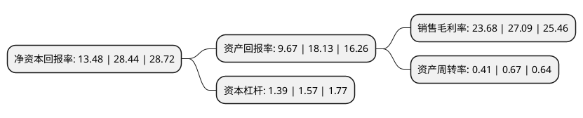

> 本页面由自动化程序生成于 2022年5月20日 01:40
> 内容可能存在错误，如有bug请提交issue至：https://github.com/Eroleice/doc-pi/issues
{.is-warning}

# 上市公司基本情况

## 基本资料

南通星球石墨股份有限公司（以下简称“星球石墨”）成立于2001年10月24日，南通市。于2021年03月24日在上交所科创板上市。

星球石墨注册资本7,273.333万元，主营业务为石墨设备的研发，生产，销售及维保服务，主要产品为石墨合成炉，石墨换热器，石墨塔器等各型号石墨设备及相关配件。以下是详细信息：

- 公司名称: 南通星球石墨股份有限公司
- 股票代码: 688633.SH
- 所在地: 江苏 - 南通市
- 成立日期: 2001年10月24日
- 注册资本: 7,273.333万元
- 法定代表人: 钱淑娟
- 主营业务: 主营业务为石墨设备的研发，生产，销售及维保服务，主要产品为石墨合成炉，石墨换热器，石墨塔器等各型号石墨设备及相关配件
- 公司官网: www.ntxingqiu.com
- 公司介绍: 公司是中国大型石墨化工设备研发生产基地，主营业务为石墨设备的研发、生产、销售及维保服务，主要产品为石墨合成炉、石墨换热器、石墨塔器等各型号石墨设备及相关配件，产品主要用途为化工生产中合成、换热等过程。公司产品主要原材料包括石墨方块、石墨圆块等石墨原材料，浸渍剂、五金件、密封件等辅件。公司在行业内的地位突出，先后被评为国家首批专精特新小巨人企业、国家知识产权示范企业、高新技术企业、国家火炬计划项目实施企业。此外，公司在多年的生产经营中积累了一批行业内的知名客户，包括中国中化集团有限公司、中国盐业集团有限公司及陕西北元化工集团股份有限公司等。

## 股东及高管情况

上市公司第一大股东为张艺，持股39,600,000股，占比54.45%，为上市公司实际控制人。

截至2022年03月31日，上市公司的前十大股东中，共有7名自然人股东，2名机构股东，1个产品账户，其中5%以上大股东共有2名。上市公司前十大股东明细如下：

> 截至2022年03月31日，上市公司前十大股东信息如下：

| 股东名称 | 持股数量（股） | 持股比例 |
| --- | --- | --- |
| 张艺 | 39,600,000 | 54.45% |
| 钱淑娟 | 9,200,000 | 12.65% |
| 何雪萍 | 3,414,026 | 4.69% |
| 南通北斗星管理咨询中心(有限合伙) | 2,000,000 | 2.75% |
| 夏斌 | 2,000,000 | 2.75% |
| 华泰创新投资有限公司 | 759,266 | 1.04% |
| 杨志城 | 600,000 | 0.82% |
| 孙建军 | 600,000 | 0.82% |
| 朱莉 | 550,000 | 0.76% |
| 广东正圆私募基金管理有限公司-正圆长兴1号私募证券投资基金 | 311,322 | 0.43% |

## 利润表分析

上市公司2021年总收入为5.14亿元，净利润为1.21亿元，实现盈利。

## 杜邦分析

> 数据列示周期：2021年 | 2020年 | 2019年
{.is-info}

上市公司的净资产收益率在近一年有所下降，下降幅度为-52.6%，其变化情况分解如下：
- 上市公司的销售毛利率在近一年下降了-12.59%，可能是生产效率的下降、商品原材料价格上涨或商品价格的下跌所致。
- 上市公司的资产周转率在近一年下降了-38.81%，可能是源自于更慢的销售回款或库存管理效果下降。
- 上市公司的财务杠杆比率在近一年下降了-11.46%，可能是减少负债降低财务费用。

