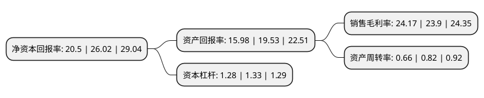

> 本页面由自动化程序生成于 2022年5月20日 01:40
> 内容可能存在错误，如有bug请提交issue至：https://github.com/Eroleice/doc-pi/issues
{.is-warning}

# 上市公司基本情况

## 基本资料

杭州宏华数码科技股份有限公司（以下简称“宏华数科”）成立于1992年10月10日，杭州市。于2021年07月08日在上交所科创板上市。

宏华数科注册资本7,600万元，通过为客户提供数码喷印一体化综合解决方案从而实现设备，耗材应用推广，主要产品为数码直喷印花机，数码喷墨转移印花机，超高速工业喷印机及墨水等。以下是详细信息：

- 公司名称: 杭州宏华数码科技股份有限公司
- 股票代码: 688789.SH
- 所在地: 浙江 - 杭州市
- 成立日期: 1992年10月10日
- 注册资本: 7,600万元
- 法定代表人: 金小团
- 主营业务: 通过为客户提供数码喷印一体化综合解决方案从而实现设备，耗材应用推广，主要产品为数码直喷印花机，数码喷墨转移印花机，超高速工业喷印机及墨水等
- 公司官网: www.atexco.com
- 公司介绍: 公司是一家以数码喷印技术为核心，聚焦纺织数码印花的工业应用，集售前咨询、售中调试、售后服务以及软件支持于一体的纺织数码印花综合解决方案提供商，公司通过为客户提供数码喷印一体化综合解决方案从而实现设备、耗材应用推广，主要产品为数码直喷印花机、数码喷墨转移印花机、超高速工业喷印机及墨水等,公司一直专注于数码喷印技术的研究、开发和应用，以国务院政府特殊津贴、国家技术发明二等奖获得者金小团为首的研发团队，专注于数码喷印行业近三十年，承担或参与了多项国家重大科研项目、主导或参与了多项行业标准的制定，坚持不懈的研发创新，铸就了公司在行业内的先发优势。公司于2000年成功研制了国内第一台数码喷射印花机，是国内首家将数码喷印技术应用于工业化生产的企业，奠定了我国纺织品数码喷印产业化的基础,公司设备的先进性和高效性受到国内外市场的广泛认可，在业内处于“全球一流、国内领先”的竞争地位。

## 股东及高管情况

上市公司第一大股东为浙江新湖智脑投资管理合伙企业(有限合伙)，持股14,250,000股，占比18.75%，**疑似为**上市公司实际控制人。

截至2022年03月31日，上市公司的前十大股东中，共有8名机构股东，2个产品账户，其中5%以上大股东共有5名。上市公司前十大股东明细如下：

> 未能通过持股比例判定出上市公司实际控制人（持股30%以上）
> 可能存在通过间接持股、联合持股、协议控制等方式拥有实际控制权的主体，具体请参考上市公司定期公告！
{.is-warning}

> 截至2022年03月31日，上市公司前十大股东信息如下：

| 股东名称 | 持股数量（股） | 持股比例 |
| --- | --- | --- |
| 浙江新湖智脑投资管理合伙企业(有限合伙) | 14,250,000 | 18.75% |
| 宁波维鑫企业管理合伙企业(有限合伙) | 11,896,903 | 15.65% |
| 宁波驰波企业管理有限公司 | 9,490,000 | 12.49% |
| 汉加发展有限公司 | 7,960,274 | 10.47% |
| 杭州宝鑫数码科技有限公司 | 4,804,717 | 6.32% |
| 舟山通华投资合伙企业(有限合伙) | 2,793,000 | 3.68% |
| 杭州乐互投资合伙企业(有限合伙) | 2,500,000 | 3.29% |
| 浙商证券资管-光大银行-浙商金惠科创板宏华数码1号战略配售集合资产管理计划 | 1,872,600 | 2.46% |
| 宁波穿越企业管理合伙企业(有限合伙) | 1,555,106 | 2.05% |
| 富达基金(香港)有限公司-客户资金 | 1,130,301 | 1.49% |

## 利润表分析

上市公司2021年总收入为9.43亿元，净利润为2.27亿元，实现盈利。

## 杜邦分析

> 数据列示周期：2021年 | 2020年 | 2019年
{.is-info}

上市公司的净资产收益率在近一年有所下降，下降幅度为-21.21%，其变化情况分解如下：
- 上市公司的销售毛利率在近一年上升了1.13%，可能是生产效率的提升、商品原材料价格下跌或商品价格的上涨所致。
- 上市公司的资产周转率在近一年下降了-19.51%，可能是源自于更慢的销售回款或库存管理效果下降。
- 上市公司的财务杠杆比率在近一年下降了-3.76%，可能是减少负债降低财务费用。

