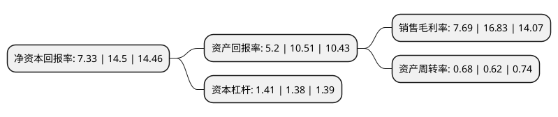

> 本页面由自动化程序生成于 2022年5月20日 01:02
> 内容可能存在错误，如有bug请提交issue至：https://github.com/Eroleice/doc-pi/issues
{.is-warning}

# 上市公司基本情况

## 基本资料

云南白药集团股份有限公司（以下简称“云南白药”）成立于1993年11月30日，昆明市。于1993年12月15日在深交所主板上市。

云南白药注册资本128,262.974万元，主要业务:药品(以中成药为主)的生产经营及外购药品的批发零售。以下是详细信息：

- 公司名称: 云南白药集团股份有限公司
- 股票代码: 000538.SZ
- 所在地: 云南 - 昆明市
- 成立日期: 1993年11月30日
- 注册资本: 128,262.974万元
- 法定代表人: 王明辉
- 主营业务: 药品(以中成药为主)的生产经营及外购药品的批发零售
- 公司官网: www.yunnanbaiyao.com.cn
- 公司介绍: 公司是我国知名中成药生产企业，公司现拥有全资、控股、参股企业18家，是云南大型工商医药企业，是中国中成药五十强之一，1997年被确定为云南省首批重点培育的四十家大企业大集团之一。公司主要经营化学原料药、化学药制剂、中成药、中药材、生物制品等，公司产品以云南白药系列、三七系列和云南民族特色药品系列为主，共17种剂型200余个产品，产品畅销国内市场及东南亚一带，并逐渐进入日本、欧美等发达国家市场。云南白药是我国云南省特有的老字号中成药，“云南白药”品牌是经过百年的发展的老品牌、中国驰名商标。

## 股东及高管情况

上市公司第一大股东为云南省国有股权运营管理有限公司，持股321,160,222股，占比25.03%，**疑似为**上市公司实际控制人。

截至2022年04月13日，上市公司的前十大股东中，共有7名机构股东，2个产品账户，1个海外主体，其中5%以上大股东共有5名。上市公司前十大股东明细如下：

> 未能通过持股比例判定出上市公司实际控制人（持股30%以上）
> 可能存在通过间接持股、联合持股、协议控制等方式拥有实际控制权的主体，具体请参考上市公司定期公告！
{.is-warning}

> 截至2022年04月13日，上市公司前十大股东信息如下：

| 股东名称 | 持股数量（股） | 持股比例 |
| --- | --- | --- |
| 云南省国有股权运营管理有限公司 | 321,160,222 | 25.03% |
| 新华都实业集团股份有限公司 | 311,244,460 | 24.26% |
| 云南合和(集团)股份有限公司 | 104,418,465 | 8.14% |
| 江苏鱼跃科技发展有限公司 | 71,368,938 | 5.56% |
| 香港中央结算有限公司(陆股通) | 66,748,351 | 5.2% |
| 中国证券金融股份有限公司 | 26,695,078 | 2.08% |
| 云南白药集团股份有限公司-2021年度员工持股计划 | 16,699,997 | 1.3% |
| 瑞银资产管理(新加坡)有限公司-瑞银卢森堡投资SICAV | 14,041,806 | 1.09% |
| 中央汇金资产管理有限责任公司 | 11,869,600 | 0.93% |
| 全国社保基金一一零组合 | 9,327,062 | 0.73% |

## 利润表分析

上市公司2021年总收入为363.73亿元，净利润为27.96亿元，实现盈利。

## 杜邦分析

> 数据列示周期：2021年 | 2020年 | 2019年
{.is-info}

上市公司的净资产收益率在近一年有所下降，下降幅度为-49.45%，其变化情况分解如下：
- 上市公司的销售毛利率在近一年下降了-54.31%，可能是生产效率的下降、商品原材料价格上涨或商品价格的下跌所致。
- 上市公司的资产周转率在近一年上升了9.68%，可能是源自于更快的销售回款或库存管理效果提升。
- 上市公司的财务杠杆比率在近一年上升了2.17%，可能是增加负债扩大生产规模。

