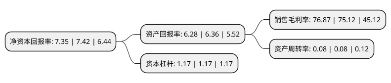

> 本页面由自动化程序生成于 2022年5月20日 01:02
> 内容可能存在错误，如有bug请提交issue至：https://github.com/Eroleice/doc-pi/issues
{.is-warning}

# 上市公司基本情况

## 基本资料

吉林敖东药业集团股份有限公司（以下简称“吉林敖东”）成立于1993年03月20日，延边朝鲜族自治州。于1996年10月28日在深交所主板上市。

吉林敖东注册资本116,304.62万元，主要产品:中成药。以下是详细信息：

- 公司名称: 吉林敖东药业集团股份有限公司
- 股票代码: 000623.SZ
- 所在地: 吉林 - 延边朝鲜族自治州
- 成立日期: 1993年03月20日
- 注册资本: 116,304.62万元
- 法定代表人: 李秀林
- 主营业务: 主要产品:中成药
- 公司官网: www.jlaod.com
- 公司介绍: 公司的前身是1957年成立的国营延边敦化鹿场，于1981年建立敖东制药厂，1993年3月经省体改委批准改制为吉林敖东药业集团股份有限公司。公司主要从事中成药、生物化学药研发、制造和销售，同时在保健食品、食品、养殖、种植等领域积极探索，成为立足医药业并建立了以“产业＋金融”双轮驱动模式快速发展的控股型集团上市公司。公司连续十余年位列中国制药工业百强和“中国最具价值500品牌”，并先后获得国家火炬计划重点高新技术企业、国家级高新技术企业、全国创新型企业、全国模范劳动关系和谐企业、全国五一劳动奖状、全国厂务公开民主管理先进单位、全国非公企业“双强百佳”党组织、第十六届、二十一届国家级企业管理现代化创新成果一等奖、连续多年被评为A级纳税人、AAA级“守合同重信用”单位等诸多荣誉。

## 股东及高管情况

上市公司第一大股东为敦化市金诚实业有限责任公司，持股327,080,749股，占比28.12%，**疑似为**上市公司实际控制人。

截至2022年04月29日，上市公司的前十大股东中，共有2名自然人股东，4名机构股东，3个产品账户，1个海外主体，其中5%以上大股东共有1名。上市公司前十大股东明细如下：

> 未能通过持股比例判定出上市公司实际控制人（持股30%以上）
> 可能存在通过间接持股、联合持股、协议控制等方式拥有实际控制权的主体，具体请参考上市公司定期公告！
{.is-warning}

> 截至2022年04月29日，上市公司前十大股东信息如下：

| 股东名称 | 持股数量（股） | 持股比例 |
| --- | --- | --- |
| 敦化市金诚实业有限责任公司 | 327,080,749 | 28.12% |
| 广发证券股份有限公司 | 43,495,282 | 3.74% |
| 吉林敖东药业集团股份有限公司-第1期员工持股计划 | 25,752,666 | 2.21% |
| 深圳市金华盛世咨询管理有限公司 | 9,842,719 | 0.85% |
| 香港中央结算有限公司(陆股通) | 9,591,329 | 0.82% |
| 刘鹏 | 7,625,984 | 0.66% |
| 延边国有资产经营总公司 | 6,079,910 | 0.52% |
| 中国建设银行股份有限公司-汇添富中证中药指数型发起式证券投资基金(LOF) | 5,191,500 | 0.45% |
| 中国农业银行股份有限公司-中证500交易型开放式指数证券投资基金 | 4,898,598 | 0.42% |
| 陈建钊 | 3,698,500 | 0.32% |

## 利润表分析

上市公司2021年总收入为23.03亿元，净利润为17.7亿元，实现盈利。

## 杜邦分析

> 数据列示周期：2021年 | 2020年 | 2019年
{.is-info}

上市公司的净资产收益率在近一年有所下降，下降幅度为-0.94%，其变化情况分解如下：
- 上市公司的销售毛利率在近一年上升了2.33%，可能是生产效率的提升、商品原材料价格下跌或商品价格的上涨所致。
- 上市公司的资产周转率在近一年下降了0%，可能是源自于更慢的销售回款或库存管理效果下降。
- 上市公司的财务杠杆比率在近一年下降了0%，可能是减少负债降低财务费用。

