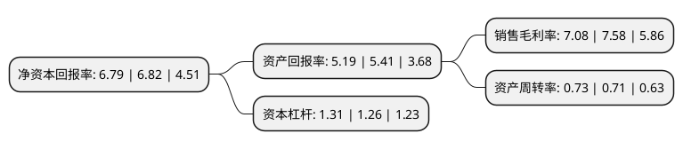

> 本页面由自动化程序生成于 2022年5月20日 01:04
> 内容可能存在错误，如有bug请提交issue至：https://github.com/Eroleice/doc-pi/issues
{.is-warning}

# 上市公司基本情况

## 基本资料

九芝堂股份有限公司（以下简称“九芝堂”）成立于1999年05月12日，长沙市。于2000年06月28日在深交所主板上市。

九芝堂注册资本86,935.424万元，主要产品:驴胶补血颗粒，斯奇康注射液。以下是详细信息：

- 公司名称: 九芝堂股份有限公司
- 股票代码: 000989.SZ
- 所在地: 湖南 - 长沙市
- 成立日期: 1999年05月12日
- 注册资本: 86,935.424万元
- 法定代表人: 李振国
- 主营业务: 主要产品:驴胶补血颗粒，斯奇康注射液
- 公司官网: www.hnjzt.com
- 公司介绍: 公司是国家重点中药企业、国家重点高新技术企业、国内A股上市公司、湖南省质量管理奖企业、国家博士后科研工作站。前身“劳九芝堂药铺”创建于1650年。九芝堂是国内为数不多的同时拥有“中国驰名商标”、“中华老字号”、“国家级非物质文化遗产”称号的企业，并连续四年入选中国最有价值品牌500强。目前公司已建立起以疏血通注射液、驴胶补血颗粒、六味地黄丸、阿胶、足光散、斯奇康、裸花紫珠片等为核心的第一梯队产品，逍遥丸、小金丸、补肾固齿丸、安宫牛黄丸、杞菊地黄丸等20多个第二梯队产品体系，拥有传统中药类“九芝堂”牌系列产品、现代中药类“友搏”牌系列产品、生物制剂产品“斯奇康”及大健康系列产品。其中疏血通注射液在同类心脑血管中成药品种医院终端销售额排名前列，以驴胶补血颗粒为代表的补血和以六味地黄丸为代表的补益两大品类在同行业中拥有强大的品牌优势，原研产品足光散位列同名产品全国零售市场第一位。

## 股东及高管情况

上市公司第一大股东为李振国，持股258,108,371股，占比29.69%，**疑似为**上市公司实际控制人。

截至2022年03月31日，上市公司的前十大股东中，共有5名自然人股东，1名机构股东，3个产品账户，1个海外主体，其中5%以上大股东共有3名。上市公司前十大股东明细如下：

> 未能通过持股比例判定出上市公司实际控制人（持股30%以上）
> 可能存在通过间接持股、联合持股、协议控制等方式拥有实际控制权的主体，具体请参考上市公司定期公告！
{.is-warning}

> 截至2022年03月31日，上市公司前十大股东信息如下：

| 股东名称 | 持股数量（股） | 持股比例 |
| --- | --- | --- |
| 李振国 | 258,108,371 | 29.69% |
| 黑龙江辰能工大创业投资有限公司 | 162,998,487 | 18.75% |
| 黑龙江省民营上市企业壹号发展基金合伙企业(有限合伙) | 47,814,483 | 5.5% |
| 香港中央结算有限公司(陆股通) | 9,215,579 | 1.06% |
| 九芝堂股份有限公司-第一期员工持股计划 | 8,000,000 | 0.92% |
| 中国工商银行股份有限公司-东方主题精选混合型证券投资基金 | 6,863,398 | 0.79% |
| 刘鹏俊 | 3,628,732 | 0.42% |
| 尚士铁 | 2,844,730 | 0.33% |
| 周经力 | 2,518,400 | 0.29% |
| 周予东 | 2,054,000 | 0.24% |

## 利润表分析

上市公司2021年总收入为37.84亿元，净利润为2.67亿元，实现盈利。

## 杜邦分析

> 数据列示周期：2021年 | 2020年 | 2019年
{.is-info}

上市公司的净资产收益率在近一年有所下降，下降幅度为-0.44%，其变化情况分解如下：
- 上市公司的销售毛利率在近一年下降了-6.6%，可能是生产效率的下降、商品原材料价格上涨或商品价格的下跌所致。
- 上市公司的资产周转率在近一年上升了2.82%，可能是源自于更快的销售回款或库存管理效果提升。
- 上市公司的财务杠杆比率在近一年上升了3.97%，可能是增加负债扩大生产规模。

