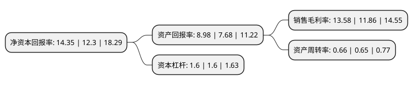

> 本页面由自动化程序生成于 2022年5月20日 01:05
> 内容可能存在错误，如有bug请提交issue至：https://github.com/Eroleice/doc-pi/issues
{.is-warning}

# 上市公司基本情况

## 基本资料

华润三九医药股份有限公司（以下简称“华润三九”）成立于1999年04月21日，深圳市。于2000年03月09日在深交所主板上市。

华润三九注册资本97,890万元，主要业务:药品，保健品，医疗器械的开发，生产，销售;相关技术开发，转让，服务;医疗保健服务。主要产品:皮炎平软膏，感冒灵。以下是详细信息：

- 公司名称: 华润三九医药股份有限公司
- 股票代码: 000999.SZ
- 所在地: 广东 - 深圳市
- 成立日期: 1999年04月21日
- 注册资本: 97,890万元
- 法定代表人: 赵炳祥
- 主营业务: 药品，保健品，医疗器械的开发，生产，销售;相关技术开发，转让，服务;医疗保健服务主要产品:皮炎平软膏，感冒灵
- 公司官网: www.999.com.cn
- 公司介绍: 公司是大型国有控股医药上市公司，主要从事医药产品的研发、生产、销售及相关健康服务,是中国主板上市公司“价值百强”企业。目前，公司主营核心业务定位于OTC和中药处方药，OTC核心产品在感冒、胃肠、皮肤、儿科、止咳和骨科用药占据了较高的市场份额；处方药产品在中药配方颗粒、心脑血管、抗肿瘤、抗感染等领域，位居国内市场前列。公司多次荣获中国上市公司“金牛百强”、“价值百强”、“最受投资者尊重的百强上市公司”、“最具成长性上市公司”、“中国最具竞争力医药上市公司20强”、“最具科技创新力中药企业”、“中国医药上市公司最具投资价值10强”、“深报指数最佳投资者关系上市公司”、“深报指数绩优上市公司”、“深报指数行业领军奖”、“鹏城减废卓越企业”等称号。

## 股东及高管情况

上市公司第一大股东为华润医药控股有限公司，持股622,569,632股，占比63.6%，为上市公司实际控制人。

截至2022年03月31日，上市公司的前十大股东中，共有3名机构股东，6个产品账户，1个海外主体，其中5%以上大股东共有2名。上市公司前十大股东明细如下：

> 截至2022年03月31日，上市公司前十大股东信息如下：

| 股东名称 | 持股数量（股） | 持股比例 |
| --- | --- | --- |
| 华润医药控股有限公司 | 622,569,632 | 63.6% |
| 香港中央结算有限公司(陆股通) | 53,460,953 | 5.46% |
| 上海高毅资产管理合伙企业(有限合伙)-高毅邻山1号远望基金 | 30,000,000 | 3.06% |
| 中国建设银行股份有限公司-工银瑞信前沿医疗股票型证券投资基金 | 14,999,910 | 1.53% |
| 不列颠哥伦比亚省投资管理公司-自有资金 | 6,693,771 | 0.68% |
| 太平人寿保险有限公司-分红-团险分红 | 5,149,959 | 0.53% |
| 中国银行股份有限公司-易方达医疗保健行业混合型证券投资基金 | 4,932,240 | 0.5% |
| 全国社保基金四一三组合 | 4,710,000 | 0.48% |
| 交通银行股份有限公司-工银瑞信养老产业股票型证券投资基金 | 3,988,649 | 0.41% |
| 中国建设银行股份有限公司-汇添富创新医药主题混合型证券投资基金 | 3,706,791 | 0.38% |

## 利润表分析

上市公司2021年总收入为153.19亿元，净利润为20.8亿元，实现盈利。

## 杜邦分析

> 数据列示周期：2021年 | 2020年 | 2019年
{.is-info}

上市公司的净资产收益率在近一年有所上升，上升幅度为16.67%，其变化情况分解如下：
- 上市公司的销售毛利率在近一年上升了14.5%，可能是生产效率的提升、商品原材料价格下跌或商品价格的上涨所致。
- 上市公司的资产周转率在近一年上升了1.54%，可能是源自于更快的销售回款或库存管理效果提升。
- 上市公司的财务杠杆比率在近一年下降了0%，可能是减少负债降低财务费用。

