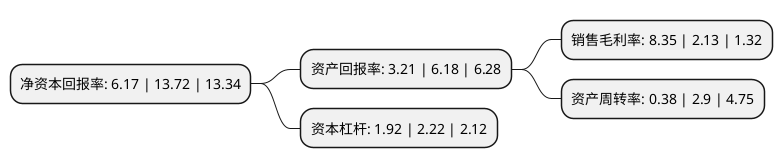

> 本页面由自动化程序生成于 2022年5月20日 01:06
> 内容可能存在错误，如有bug请提交issue至：https://github.com/Eroleice/doc-pi/issues
{.is-warning}

# 上市公司基本情况

## 基本资料

万邦德医药控股集团股份有限公司（以下简称“万邦德”）成立于1999年03月31日，湖州市。于2006年11月20日在深交所中小板上市。

万邦德注册资本61,822.283万元，主营业务:铝合金型材，板材产品的开发，生产和销售。以下是详细信息：

- 公司名称: 万邦德医药控股集团股份有限公司
- 股票代码: 002082.SZ
- 所在地: 浙江 - 湖州市
- 成立日期: 1999年03月31日
- 注册资本: 61,822.283万元
- 法定代表人: 赵守明
- 主营业务: 主营业务:铝合金型材，板材产品的开发，生产和销售
- 公司官网: www.wepon.com.cn
- 公司介绍: 公司是专业生产各种铝合金型材、铝装饰板及PS版铝基板的大型铝业集团公司。公司主要从事铝加工业务和医疗器械业务。拥有几十多条从日本、意大利、德国、美国、瑞典等国引进的具有国际先进水平的挤压、电泳、粉末喷涂、多色氧化、氟碳喷涂、木纹转印等生产流水线，同时具有较强的铝板钣金加工、铝门窗和铝塑复合节能门窗制作能力，专业生产铝型材行业，栋梁牌建筑铝合金型材被评为“中国名牌”产品。公司技术先进成熟，集研发、生产、服务于一体，凭借自身的优势，已在国内及南非市场拥有了一批稳定的客户及渠道。随着公司技术研发的不断提升，以及对国内和南非市场的稳定持续发展，医疗器械业务将成为公司一个新的战略性业绩增长点。

## 股东及高管情况

上市公司第一大股东为万邦德集团有限公司，持股194,466,282股，占比31.46%，为上市公司实际控制人。

截至2022年03月31日，上市公司的前十大股东中，共有2名自然人股东，7名机构股东，1个产品账户，其中5%以上大股东共有2名。上市公司前十大股东明细如下：

> 截至2022年03月31日，上市公司前十大股东信息如下：

| 股东名称 | 持股数量（股） | 持股比例 |
| --- | --- | --- |
| 万邦德集团有限公司 | 194,466,282 | 31.46% |
| 赵守明 | 42,646,878 | 6.9% |
| 庄惠 | 28,431,251 | 4.6% |
| 温岭惠邦投资咨询有限公司 | 22,445,725 | 3.63% |
| 嘉兴嘉昊九鼎投资中心(有限合伙) | 20,004,173 | 3.24% |
| 温岭富邦投资咨询有限公司 | 14,963,816 | 2.42% |
| 青岛同印信投资有限公司 | 11,406,685 | 1.85% |
| 湖州市织里镇资产经营有限公司 | 10,957,800 | 1.77% |
| 南京金茂中医药产业创业投资合伙企业(有限合伙) | 9,221,371 | 1.49% |
| 江苏中茂节能环保产业创业投资基金合伙企业(有限合伙) | 7,671,749 | 1.24% |

## 利润表分析

上市公司2021年总收入为19.3亿元，净利润为1.61亿元，实现盈利。

## 杜邦分析

> 数据列示周期：2021年 | 2020年 | 2019年
{.is-info}

上市公司的净资产收益率在近一年有所下降，下降幅度为-55.03%，其变化情况分解如下：
- 上市公司的销售毛利率在近一年上升了292.02%，可能是生产效率的提升、商品原材料价格下跌或商品价格的上涨所致。
- 上市公司的资产周转率在近一年下降了-86.9%，可能是源自于更慢的销售回款或库存管理效果下降。
- 上市公司的财务杠杆比率在近一年下降了-13.51%，可能是减少负债降低财务费用。

