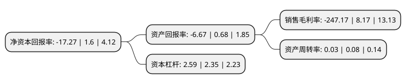

> 本页面由自动化程序生成于 2022年5月20日 01:06
> 内容可能存在错误，如有bug请提交issue至：https://github.com/Eroleice/doc-pi/issues
{.is-warning}

# 上市公司基本情况

## 基本资料

吉林紫鑫药业股份有限公司（以下简称“紫鑫药业”）成立于1998年05月25日，通化市。于2007年03月02日在深交所中小板上市。

紫鑫药业注册资本128,075.983万元，主要产品:活血通脉片，醒脑再造胶囊，复方益肝灵片，麝香接骨胶囊，四妙丸和补肾安神口服液等。主营业务:中成药的研发，生产，销售和中药材种植业务，以治疗心脑血管，消化系统疾病和骨伤类中成药为主导品种。以下是详细信息：

- 公司名称: 吉林紫鑫药业股份有限公司
- 股票代码: 002118.SZ
- 所在地: 吉林 - 通化市
- 成立日期: 1998年05月25日
- 注册资本: 128,075.983万元
- 法定代表人: 封有顺
- 主营业务: 主要产品:活血通脉片，醒脑再造胶囊，复方益肝灵片，麝香接骨胶囊，四妙丸和补肾安神口服液等主营业务:中成药的研发，生产，销售和中药材种植业务，以治疗心脑血管，消化系统疾病和骨伤类中成药为主导品种
- 公司官网: www.jilinzixin.com.cn
- 公司介绍: 公司是一家以中成药、人参、基因测序仪三大产业为支柱，集科研、生产、销售、药用动植物种养殖为一体的高科技股份制企业。公司始终秉承“以品树人，以德酿药”的企业宗旨，坚持“挚真质纯”的经营理念，以中药现代化为目标，以关爱人类健康为己任。2013年，公司开始布局基因测序仪产业。基因测序仪及配套试剂的研发、生产和销售是公司目前大力发展的业务。公司先后被评为“全国百强医药企业”、“国家级高新技术企业”、“国家级农业产业化重点龙头企业”、“国家级守合同重信用企业”等荣誉称号。“紫鑫”商标被评为中国驰名商标。

## 股东及高管情况

上市公司第一大股东为敦化市康平投资有限责任公司，持股252,130,026股，占比19.686%，**疑似为**上市公司实际控制人。

截至2021年10月19日，上市公司的前十大股东中，共有1名自然人股东，5名机构股东，4个产品账户，其中5%以上大股东共有9名。上市公司前十大股东明细如下：

> 未能通过持股比例判定出上市公司实际控制人（持股30%以上）
> 可能存在通过间接持股、联合持股、协议控制等方式拥有实际控制权的主体，具体请参考上市公司定期公告！
{.is-warning}

> 截至2021年10月19日，上市公司前十大股东信息如下：

| 股东名称 | 持股数量（股） | 持股比例 |
| --- | --- | --- |
| 敦化市康平投资有限责任公司 | 252,130,026 | 19.686% |
| 敦化市康平投资有限责任公司 | 230,378,726 | 17.9877% |
| 敦化市康平投资有限责任公司 | 210,378,726 | 16.4261% |
| 敦化市康平投资有限责任公司 | 168,598,488 | 13.16% |
| 海通资管-浦发银行7号定向资产管理计划 | 72,147,400 | 5.6332% |
| 海通资管-浦发银行7号定向资产管理计划 | 72,147,400 | 5.6332% |
| 海通资管-浦发银行7号定向资产管理计划 | 72,147,400 | 5.6332% |
| 海通资管-浦发银行7号定向资产管理计划 | 72,147,400 | 5.6332% |
| 万家共赢-浦发银行-上海浦东发展银行股份有限公司厦门分行 | 72,147,400 | 5.63% |
| 邹田德 | 3,215,000 | 0.25% |

## 杜邦分析

> 数据列示周期：2020年 | 2019年 | 2018年
{.is-info}

上市公司的净资产收益率在近一年有所下降，下降幅度为-1179.37%，其变化情况分解如下：
- 上市公司的销售毛利率在近一年下降了-3125.34%，可能是生产效率的下降、商品原材料价格上涨或商品价格的下跌所致。
- 上市公司的资产周转率在近一年下降了-62.5%，可能是源自于更慢的销售回款或库存管理效果下降。
- 上市公司的财务杠杆比率在近一年上升了10.21%，可能是增加负债扩大生产规模。

