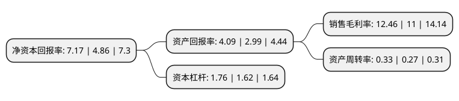

> 本页面由自动化程序生成于 2022年5月20日 01:06
> 内容可能存在错误，如有bug请提交issue至：https://github.com/Eroleice/doc-pi/issues
{.is-warning}

# 上市公司基本情况

## 基本资料

桂林莱茵生物科技股份有限公司（以下简称“莱茵生物”）成立于2000年11月28日，桂林市。于2007年09月13日在深交所中小板上市。

莱茵生物注册资本56,521.474万元，主要产品:罗汉果提取物，红景天提取物，越橘提取物，葡萄籽/皮提取物，枸杞果提取物。主营业务:植物功能成份的高纯度单体和标准化提取物的生产，销售。以下是详细信息：

- 公司名称: 桂林莱茵生物科技股份有限公司
- 股票代码: 002166.SZ
- 所在地: 广西 - 桂林市
- 成立日期: 2000年11月28日
- 注册资本: 56,521.474万元
- 法定代表人: 秦本军
- 主营业务: 主要产品:罗汉果提取物，红景天提取物，越橘提取物，葡萄籽/皮提取物，枸杞果提取物主营业务:植物功能成份的高纯度单体和标准化提取物的生产，销售
- 公司官网: www.layn.com.cn
- 公司介绍: 公司是一家专业从事天然健康产品研发、生产及销售的科技型、外向型民营企业。公司是全球植物提取行业的领军企业，也是国内植物提取行业的第一家上市公司。公司已通过GMP、HACCP、ISO等多项认证，多个产品拥有KOSHER、HALAL、ORGANIC、SC、FSSC22000等证书。公司产品广泛应用于食品饮料、保健品、化妆品、药品等行业，远销美国、欧洲、韩国、日本等全球60多个国家和地区。公司作为植物提取行业的先行者，拥有雄厚的技术研发实力。公司技术中心被认定为广西自治区级企业技术中心，并具有博士后科研工作站、广西院士工作站、广西自治区级工程技术中心、罗汉果工程研究院等研发平台。

## 股东及高管情况

上市公司第一大股东为秦本军，持股105,919,507股，占比18.74%，**疑似为**上市公司实际控制人。

截至2022年03月31日，上市公司的前十大股东中，共有10名自然人股东，其中5%以上大股东共有1名。上市公司前十大股东明细如下：

> 未能通过持股比例判定出上市公司实际控制人（持股30%以上）
> 可能存在通过间接持股、联合持股、协议控制等方式拥有实际控制权的主体，具体请参考上市公司定期公告！
{.is-warning}

> 截至2022年03月31日，上市公司前十大股东信息如下：

| 股东名称 | 持股数量（股） | 持股比例 |
| --- | --- | --- |
| 秦本军 | 105,919,507 | 18.74% |
| 梁定志 | 27,276,781 | 4.83% |
| 姚新德 | 25,780,657 | 4.56% |
| 蒋俊 | 19,500,000 | 3.45% |
| 蒋安明 | 19,500,000 | 3.45% |
| 蒋小三 | 19,500,000 | 3.45% |
| 易红石 | 9,154,870 | 1.62% |
| 薛春良 | 5,675,100 | 1% |
| 蒋新荣 | 5,445,383 | 0.96% |
| 黄娟 | 5,160,900 | 0.91% |

## 利润表分析

上市公司2021年总收入为10.53亿元，净利润为1.31亿元，实现盈利。

## 杜邦分析

> 数据列示周期：2021年 | 2020年 | 2019年
{.is-info}

上市公司的净资产收益率在近一年有所上升，上升幅度为47.53%，其变化情况分解如下：
- 上市公司的销售毛利率在近一年上升了13.27%，可能是生产效率的提升、商品原材料价格下跌或商品价格的上涨所致。
- 上市公司的资产周转率在近一年上升了22.22%，可能是源自于更快的销售回款或库存管理效果提升。
- 上市公司的财务杠杆比率在近一年上升了8.64%，可能是增加负债扩大生产规模。

