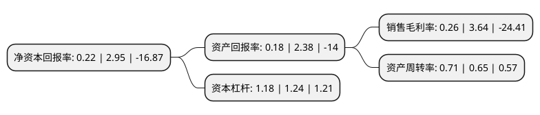

> 本页面由自动化程序生成于 2022年5月20日 01:07
> 内容可能存在错误，如有bug请提交issue至：https://github.com/Eroleice/doc-pi/issues
{.is-warning}

# 上市公司基本情况

## 基本资料

广东嘉应制药股份有限公司（以下简称“嘉应制药”）成立于2003年03月07日，梅州市。于2007年12月18日在深交所中小板上市。

嘉应制药注册资本50,750.985万元，主要产品:双料喉风散和重感灵片。主营业务:成药的研发，生产和销售，以治疗喉科，感冒类中成药为主导产品。以下是详细信息：

- 公司名称: 广东嘉应制药股份有限公司
- 股票代码: 002198.SZ
- 所在地: 广东 - 梅州市
- 成立日期: 2003年03月07日
- 注册资本: 50,750.985万元
- 法定代表人: 朱拉伊
- 主营业务: 主要产品:双料喉风散和重感灵片主营业务:成药的研发，生产和销售，以治疗喉科，感冒类中成药为主导产品
- 公司官网: gdjyzy.com.cn
- 公司介绍: 公司是一家集研发、生产、销售为一体的中成药制造企业，拥有5种剂型共70多个药品品种，主要涉及咽喉类、感冒类、骨科类、风湿类中成药。主导品种多为独家经营产品、国家中药保护品种、国家专利保护品种、国家基本用药目录品种，产品深受广大消费者青睐。公司共拥有5个剂型65种药品品种，主导产品双料喉风散、重感灵片均为国家中药保护品种，国家专利保护且均荣获“广东省名牌产品”称号，具有一定的品牌影响力。公司将凭借自身产品价廉物美、结构合理等优势，进一步加大对二、三级经销商、终端客户和农村、社区市场的开拓。

## 股东及高管情况

上市公司第一大股东为深圳市老虎汇资产管理有限公司，持股57,200,000股，占比11.27%，**疑似为**上市公司实际控制人。

截至2022年03月31日，上市公司的前十大股东中，共有9名自然人股东，1名机构股东，其中5%以上大股东共有3名。上市公司前十大股东明细如下：

> 未能通过持股比例判定出上市公司实际控制人（持股30%以上）
> 可能存在通过间接持股、联合持股、协议控制等方式拥有实际控制权的主体，具体请参考上市公司定期公告！
{.is-warning}

> 截至2022年03月31日，上市公司前十大股东信息如下：

| 股东名称 | 持股数量（股） | 持股比例 |
| --- | --- | --- |
| 深圳市老虎汇资产管理有限公司 | 57,200,000 | 11.27% |
| 陈少彬 | 50,778,600 | 10.01% |
| 刘理彪 | 25,505,096 | 5.03% |
| 林少贤 | 11,500,192 | 2.27% |
| 王庆新 | 4,828,193 | 0.95% |
| 黄锐伟 | 4,800,000 | 0.95% |
| 朱巧慧 | 4,436,500 | 0.87% |
| 林日志 | 2,978,300 | 0.59% |
| 唐海龙 | 2,156,946 | 0.43% |
| 黄俊民 | 2,000,043 | 0.39% |

## 利润表分析

上市公司2021年总收入为5.74亿元，净利润为0.01亿元，实现盈利。

## 杜邦分析

> 数据列示周期：2021年 | 2020年 | 2019年
{.is-info}

上市公司的净资产收益率在近一年有所下降，下降幅度为-92.54%，其变化情况分解如下：
- 上市公司的销售毛利率在近一年下降了-92.86%，可能是生产效率的下降、商品原材料价格上涨或商品价格的下跌所致。
- 上市公司的资产周转率在近一年上升了9.23%，可能是源自于更快的销售回款或库存管理效果提升。
- 上市公司的财务杠杆比率在近一年下降了-4.84%，可能是减少负债降低财务费用。

