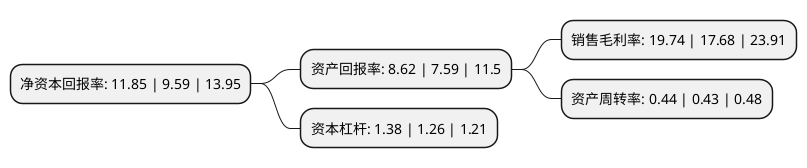

> 本页面由自动化程序生成于 2022年5月20日 01:07
> 内容可能存在错误，如有bug请提交issue至：https://github.com/Eroleice/doc-pi/issues
{.is-warning}

# 上市公司基本情况

## 基本资料

桂林三金药业股份有限公司（以下简称“桂林三金”）成立于1994年02月23日，桂林市。于2009年07月10日在深交所中小板上市。

桂林三金注册资本59,020万元，主要从事咽喉口腔用药系列，抗泌尿系感染用药系列及心脑血管用药系列中成药产品的研究，生产与销售，以及其他天然药物和生物制剂等的研究开发。主要产品为西瓜霜润喉片，桂林西瓜霜，西瓜霜清咽含片，三金片和脑脉泰胶囊等。以下是详细信息：

- 公司名称: 桂林三金药业股份有限公司
- 股票代码: 002275.SZ
- 所在地: 广西 - 桂林市
- 成立日期: 1994年02月23日
- 注册资本: 59,020万元
- 法定代表人: 邹洵
- 主营业务: 主要从事咽喉口腔用药系列，抗泌尿系感染用药系列及心脑血管用药系列中成药产品的研究，生产与销售，以及其他天然药物和生物制剂等的研究开发主要产品为西瓜霜润喉片，桂林西瓜霜，西瓜霜清咽含片，三金片和脑脉泰胶囊等
- 公司官网: www.sanjin.com.cn
- 公司介绍: 公司是一家专门从事中药、天然药物研究和生产的医药企业，也是中国最早生产现代中药制剂的厂家之一。公司拥有桂林西瓜霜、西瓜霜润喉片、三金片、脑脉泰胶囊等自己开发的独家特色品种几十个，代表产品桂林西瓜霜、西瓜霜润喉片、三金片为中国中药名牌产品，三金片等品种已通过澳大利亚等国药品注册；三金在咽喉、口腔用药和泌尿系统用药方面已形成较强的专业和市场优势，“三金”牌商标被国家工商行政管理局认定为“中国驰名商标”，“三金”牌产品已行销海内外，并享有良好声誉。

## 股东及高管情况

上市公司第一大股东为桂林三金集团股份有限公司，持股364,679,300股，占比61.79%，为上市公司实际控制人。

截至2022年03月31日，上市公司的前十大股东中，共有7名自然人股东，1名机构股东，2个产品账户，其中5%以上大股东共有2名。上市公司前十大股东明细如下：

> 截至2022年03月31日，上市公司前十大股东信息如下：

| 股东名称 | 持股数量（股） | 持股比例 |
| --- | --- | --- |
| 桂林三金集团股份有限公司 | 364,679,300 | 61.79% |
| 邹节明 | 53,394,648 | 9.05% |
| 桂林三金药业股份有限公司-第一期员工持股计划 | 12,295,951 | 2.08% |
| 谢元钢 | 7,613,319 | 1.29% |
| 王许飞 | 5,604,800 | 0.95% |
| 孙家琳 | 5,482,610 | 0.93% |
| 王淑霖 | 5,206,367 | 0.88% |
| 翁毓玲 | 5,205,474 | 0.88% |
| 招商银行股份有限公司-安信医药健康主题股票型发起式证券投资基金 | 4,757,662 | 0.81% |
| 李荣群 | 3,735,409 | 0.63% |

## 利润表分析

上市公司2021年总收入为17.41亿元，净利润为3.43亿元，实现盈利。

## 杜邦分析

> 数据列示周期：2021年 | 2020年 | 2019年
{.is-info}

上市公司的净资产收益率在近一年有所上升，上升幅度为23.57%，其变化情况分解如下：
- 上市公司的销售毛利率在近一年上升了11.65%，可能是生产效率的提升、商品原材料价格下跌或商品价格的上涨所致。
- 上市公司的资产周转率在近一年上升了2.33%，可能是源自于更快的销售回款或库存管理效果提升。
- 上市公司的财务杠杆比率在近一年上升了9.52%，可能是增加负债扩大生产规模。

