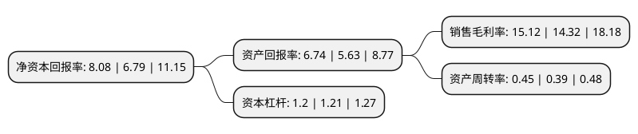

> 本页面由自动化程序生成于 2022年5月20日 01:09
> 内容可能存在错误，如有bug请提交issue至：https://github.com/Eroleice/doc-pi/issues
{.is-warning}

# 上市公司基本情况

## 基本资料

湖南汉森制药股份有限公司（以下简称“汉森制药”）成立于1998年01月21日，益阳市。于2010年05月25日在深交所中小板上市。

汉森制药注册资本50,320万元，主营业务:胃肠疾病，骨伤科疾病及心脑血管疾病中药制剂的研发，生产与销售。主要产品有四磨汤口服液，愈伤灵胶囊，银杏叶胶囊，缩泉胶囊等。以下是详细信息：

- 公司名称: 湖南汉森制药股份有限公司
- 股票代码: 002412.SZ
- 所在地: 湖南 - 益阳市
- 成立日期: 1998年01月21日
- 注册资本: 50,320万元
- 法定代表人: 刘正清
- 主营业务: 主营业务:胃肠疾病，骨伤科疾病及心脑血管疾病中药制剂的研发，生产与销售主要产品有四磨汤口服液，愈伤灵胶囊，银杏叶胶囊，缩泉胶囊等
- 公司官网: www.hansenzy.com
- 公司介绍: 公司是一家集科研、生产与销售于一体的药品生产企业，湖南省高新技术企业和湖南省重点医药工业企业。主营业务为传统中成药制剂、化学药、医用制剂的研发、生产和销售，正在逐步涉足大健康产业、医疗保健等领域。公司主要生产中西药制剂，拥有大容量注射剂、小容量注射剂、口服液、片剂、胶囊剂、颗粒剂、糖浆剂、煎膏剂、酊剂、丸剂等10个剂型，已全部通过GMP认证。四磨汤口服液是一种快速排除胃肠积滞，全面增强、调理消化机能的特效验方，为独家发明专利产品，并荣获“湖南省高新技术产品”、“湖南名牌产品”和“湖南省产品质量奖”称号；银杏叶胶囊为国家发改委颁发的“优质优价”产品；缩泉胶囊为国家中药保护品种。

## 股东及高管情况

上市公司第一大股东为海南汉森控股(有限合伙)，持股212,006,189股，占比42.13%，为上市公司实际控制人。

截至2022年03月31日，上市公司的前十大股东中，共有8名自然人股东，2名机构股东，其中5%以上大股东共有1名。上市公司前十大股东明细如下：

> 截至2022年03月31日，上市公司前十大股东信息如下：

| 股东名称 | 持股数量（股） | 持股比例 |
| --- | --- | --- |
| 海南汉森控股(有限合伙) | 212,006,189 | 42.13% |
| 上海复星医药产业发展有限公司 | 24,263,820 | 4.82% |
| 刘正清 | 7,140,000 | 1.42% |
| 姜爱福 | 6,232,600 | 1.24% |
| 何三星 | 5,610,000 | 1.11% |
| 许雄葵 | 4,472,490 | 0.89% |
| 刘厚尧 | 4,080,000 | 0.81% |
| 王博渊 | 3,006,400 | 0.6% |
| 何锡华 | 2,660,153 | 0.53% |
| 李伟泉 | 2,357,000 | 0.47% |

## 利润表分析

上市公司2021年总收入为8.91亿元，净利润为1.34亿元，实现盈利。

## 杜邦分析

> 数据列示周期：2021年 | 2020年 | 2019年
{.is-info}

上市公司的净资产收益率在近一年有所上升，上升幅度为19%，其变化情况分解如下：
- 上市公司的销售毛利率在近一年上升了5.59%，可能是生产效率的提升、商品原材料价格下跌或商品价格的上涨所致。
- 上市公司的资产周转率在近一年上升了15.38%，可能是源自于更快的销售回款或库存管理效果提升。
- 上市公司的财务杠杆比率在近一年下降了-0.83%，可能是减少负债降低财务费用。

