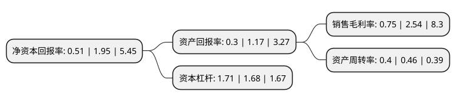

> 本页面由自动化程序生成于 2022年5月20日 01:09
> 内容可能存在错误，如有bug请提交issue至：https://github.com/Eroleice/doc-pi/issues
{.is-warning}

# 上市公司基本情况

## 基本资料

广东太安堂药业股份有限公司（以下简称“太安堂”）成立于2000年03月25日，汕头市。于2010年06月18日在深交所中小板上市。

太安堂注册资本76,677.32万元，主要产品:消炎癣湿药膏，肤特灵霜，克痒敏醑，解毒烧伤膏，皮宝霜，麒麟丸，心宝丸，丹田降脂丸，心灵丸，通窍益心丸，参七脑康胶囊，滋肾宁神丸。以下是详细信息：

- 公司名称: 广东太安堂药业股份有限公司
- 股票代码: 002433.SZ
- 所在地: 广东 - 汕头市
- 成立日期: 2000年03月25日
- 注册资本: 76,677.32万元
- 法定代表人: 柯少彬
- 主营业务: 主要产品:消炎癣湿药膏，肤特灵霜，克痒敏醑，解毒烧伤膏，皮宝霜，麒麟丸，心宝丸，丹田降脂丸，心灵丸，通窍益心丸，参七脑康胶囊，滋肾宁神丸
- 公司官网: www.tatonline.net
- 公司介绍: 公司创业于1995年，目前已发展成为上海市百强企业，成为集中医药研发、生产、销售于一体的国家高新技术上市公司。公司形成了太安堂企业品牌主导下的铍宝、麒麟、宏兴、康爱多四大子品牌体系，传承研创的不孕不育药、心脑血管药、皮肤外用药、极品野山参、特效中成药成为公司五大类绝技产品。公司与时偕进，顺势崛起，快速向现代高科技企业转型发展，升级中医药智能高科技，从自动化到智能化再到无人化，建成72条全自动生产线、智能提取车间、无人生产车间，引领行业先锋，进入“智能制造”新时代；实施“+互联网”发展战略，积极布局大数据、云计算、量子技术、VR、区块链等前沿技术领域，旗下康爱多傲立国内互联网医药电商第一品牌；公司专注现代生物医药新技术，旗下美国基安思基因公司致力于基因检测、基因治疗等高端技术研发。

## 股东及高管情况

上市公司第一大股东为太安堂集团有限公司，持股170,980,090股，占比22.3%，**疑似为**上市公司实际控制人。

截至2021年09月30日，上市公司的前十大股东中，共有4名自然人股东，4名机构股东，1个海外主体，1名其他股东，其中5%以上大股东共有4名。上市公司前十大股东明细如下：

> 未能通过持股比例判定出上市公司实际控制人（持股30%以上）
> 可能存在通过间接持股、联合持股、协议控制等方式拥有实际控制权的主体，具体请参考上市公司定期公告！
{.is-warning}

> 截至2021年09月30日，上市公司前十大股东信息如下：

| 股东名称 | 持股数量（股） | 持股比例 |
| --- | --- | --- |
| 太安堂集团有限公司 | 170,980,090 | 22.3% |
| 太安堂集团有限公司 | 166,745,493 | 21.7464% |
| 太安堂集团有限公司 | 158,289,132 | 20.6435% |
| 太安堂集团有限公司 | 153,989,132 | 20.0827% |
| 欧明媚 | 31,161,100 | 4.06% |
| 柯少芳 | 29,850,000 | 3.89% |
| 高华-汇丰-GOLDMAN, SACHS & CO.LLC | 4,000,000 | 0.52% |
| 法国兴业银行 | 3,470,000 | 0.45% |
| 张延 | 3,100,000 | 0.4% |
| 周雄飞 | 3,090,000 | 0.4% |

## 杜邦分析

> 数据列示周期：2020年 | 2019年 | 2018年
{.is-info}

上市公司的净资产收益率在近一年有所下降，下降幅度为-73.85%，其变化情况分解如下：
- 上市公司的销售毛利率在近一年下降了-70.47%，可能是生产效率的下降、商品原材料价格上涨或商品价格的下跌所致。
- 上市公司的资产周转率在近一年下降了-13.04%，可能是源自于更慢的销售回款或库存管理效果下降。
- 上市公司的财务杠杆比率在近一年上升了1.79%，可能是增加负债扩大生产规模。

