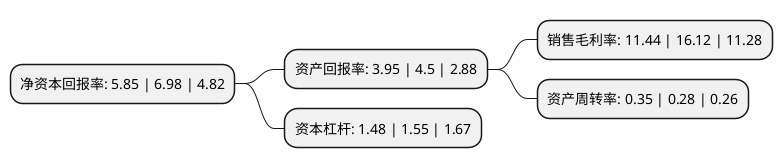

> 本页面由自动化程序生成于 2022年5月20日 01:10
> 内容可能存在错误，如有bug请提交issue至：https://github.com/Eroleice/doc-pi/issues
{.is-warning}

# 上市公司基本情况

## 基本资料

兰州佛慈制药股份有限公司（以下简称“佛慈制药”）成立于2000年06月28日，兰州市。于2011年12月22日在深交所中小板上市。

佛慈制药注册资本51,065.7万元，主营业务为中成药的研发，制造和销售，主要产品为六味地黄丸，逍遥丸，桂附地黄丸，知柏地黄丸，香砂养胃丸，杞菊地黄丸，补中益气丸，参茸固本还少丸，归脾丸，天王补心丸，明目地黄丸，耳聋左慈丸，保和丸，藿香正气丸，安神补心丸，当归丸，健脾丸等系列中成药。以下是详细信息：

- 公司名称: 兰州佛慈制药股份有限公司
- 股票代码: 002644.SZ
- 所在地: 甘肃 - 兰州市
- 成立日期: 2000年06月28日
- 注册资本: 51,065.7万元
- 法定代表人: 石爱国
- 主营业务: 主营业务为中成药的研发，制造和销售，主要产品为六味地黄丸，逍遥丸，桂附地黄丸，知柏地黄丸，香砂养胃丸，杞菊地黄丸，补中益气丸，参茸固本还少丸，归脾丸，天王补心丸，明目地黄丸，耳聋左慈丸，保和丸，藿香正气丸，安神补心丸，当归丸，健脾丸等系列中成药
- 公司官网: www.fczy.com
- 公司介绍: 公司是一家具有近百年制药历史的市属国有控股上市公司和“中华老字号”企业。公司的主营业务为中成药及大健康产品的研发、制造和销售，中药材种植、加工及销售，常年生产丸剂、片剂、颗粒剂、胶囊剂、胶剂等11种剂型的110多种产品。公司已获得中药配方颗粒的制备与鉴别技术，在中药配方颗粒方面进行了必要的技术储备，为未来配方颗粒的试制和生产打下基础。公司所有生产基地全部通过国家GMP认证，同时，丸剂、颗粒剂、片剂、胶囊剂的生产现场还通过澳大利亚TGA组织、日本厚生省和乌克兰产品认证局的认证，是目前接受他国产品现场认证最多的企业。目前，公司已发展成为集中药材种植与加工、天然药物与保健品研发、中药现代剂型及保健食品生产销售为一体的西北地区中医药行业的骨干企业。

## 股东及高管情况

上市公司第一大股东为兰州佛慈医药产业发展集团有限公司，持股314,713,676股，占比61.63%，为上市公司实际控制人。

截至2022年03月31日，上市公司的前十大股东中，共有8名自然人股东，1名机构股东，1个产品账户，其中5%以上大股东共有1名。上市公司前十大股东明细如下：

> 截至2022年03月31日，上市公司前十大股东信息如下：

| 股东名称 | 持股数量（股） | 持股比例 |
| --- | --- | --- |
| 兰州佛慈医药产业发展集团有限公司 | 314,713,676 | 61.63% |
| 邓守宽 | 9,346,198 | 1.83% |
| 周坤 | 3,458,310 | 0.68% |
| 高建民 | 2,400,000 | 0.47% |
| 郑木平 | 2,350,000 | 0.46% |
| 耿文涵 | 2,044,800 | 0.4% |
| 徐鹏云 | 1,941,800 | 0.38% |
| 左素琴 | 1,710,639 | 0.33% |
| 中国建设银行股份有限公司-万家健康产业混合型证券投资基金 | 1,155,400 | 0.23% |
| 张学松 | 1,092,600 | 0.21% |

## 利润表分析

上市公司2021年总收入为8.17亿元，净利润为0.93亿元，实现盈利。

## 杜邦分析

> 数据列示周期：2021年 | 2020年 | 2019年
{.is-info}

上市公司的净资产收益率在近一年有所下降，下降幅度为-16.19%，其变化情况分解如下：
- 上市公司的销售毛利率在近一年下降了-29.03%，可能是生产效率的下降、商品原材料价格上涨或商品价格的下跌所致。
- 上市公司的资产周转率在近一年上升了25%，可能是源自于更快的销售回款或库存管理效果提升。
- 上市公司的财务杠杆比率在近一年下降了-4.52%，可能是减少负债降低财务费用。

