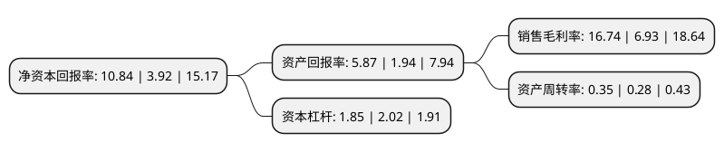

> 本页面由自动化程序生成于 2022年5月20日 01:11
> 内容可能存在错误，如有bug请提交issue至：https://github.com/Eroleice/doc-pi/issues
{.is-warning}

# 上市公司基本情况

## 基本资料

特一药业集团股份有限公司（以下简称“特一药业”）成立于2002年05月23日，江门市。于2014年07月31日在深交所中小板上市。

特一药业注册资本22,164.393万元，主营业务:主要从事中成药和化学制剂药的研发，生产和销售。主要产品包括止咳宝片，金匮肾气片，红霉素肠溶片，依托红霉素片，制霉素片和阿咖酚散等多个优质品种。以下是详细信息：

- 公司名称: 特一药业集团股份有限公司
- 股票代码: 002728.SZ
- 所在地: 广东 - 江门市
- 成立日期: 2002年05月23日
- 注册资本: 22,164.393万元
- 法定代表人: 许丹青
- 主营业务: 主营业务:主要从事中成药和化学制剂药的研发，生产和销售主要产品包括止咳宝片，金匮肾气片，红霉素肠溶片，依托红霉素片，制霉素片和阿咖酚散等多个优质品种
- 公司官网: www.tczy.com.cn
- 公司介绍: 公司是集医药研发、制药工业、医药商业为一体的医药上市公司。公司及全资子公司海南海力制药有限公司均为国家高新技术企业。公司医药工业包括台山生产基地(原广东台城制药)、海口生产基地(海南海力制药有限公司)及台山市新宁制药有限公司。包含中成药、化学制剂药、化学原料药和化工产品。公司于2018年8月8日全资收购了现代化高科技中药制药企业——广东国医堂制药股份有限公司，其所有品种的药品注册证书均归公司所有，公司同时也是广东第一批MAH制度试点企业。公司先后被评为“广东省医药行业杰出贡献企业”、“广东省民营科技企业”、“广东省创新型企业”、“守合同重信用企业”、“A级纳税人”、“AAA级信用等级客户”、“海南省工业行业龙头企业(中成药制造行业)”、“全国质量、服务、信誉AAA级企业”及“A级纳税人”等。

## 股东及高管情况

上市公司第一大股东为许丹青，持股71,415,000股，占比32.22%，为上市公司实际控制人。

截至2022年04月20日，上市公司的前十大股东中，共有8名自然人股东，2个产品账户，其中5%以上大股东共有4名。上市公司前十大股东明细如下：

> 截至2022年04月20日，上市公司前十大股东信息如下：

| 股东名称 | 持股数量（股） | 持股比例 |
| --- | --- | --- |
| 许丹青 | 71,415,000 | 32.22% |
| 许松青 | 20,700,000 | 9.34% |
| 许松青 | 20,700,000 | 9.34% |
| 许丽芳 | 15,275,000 | 6.89% |
| 许丽芳 | 5,960,000 | 2.69% |
| 许恒青 | 3,364,784 | 1.52% |
| 夏同山 | 1,923,076 | 0.87% |
| 中国工商银行股份有限公司-兴全恒益债券型证券投资基金 | 1,831,502 | 0.83% |
| 招商银行股份有限公司-兴全中证800六个月持有期指数增强型证券投资基金 | 1,831,501 | 0.83% |
| 黄童 | 1,465,201 | 0.66% |

## 利润表分析

上市公司2021年总收入为7.58亿元，净利润为1.26亿元，实现盈利。

## 杜邦分析

> 数据列示周期：2021年 | 2020年 | 2019年
{.is-info}

上市公司的净资产收益率在近一年有所上升，上升幅度为176.53%，其变化情况分解如下：
- 上市公司的销售毛利率在近一年上升了141.56%，可能是生产效率的提升、商品原材料价格下跌或商品价格的上涨所致。
- 上市公司的资产周转率在近一年上升了25%，可能是源自于更快的销售回款或库存管理效果提升。
- 上市公司的财务杠杆比率在近一年下降了-8.42%，可能是减少负债降低财务费用。

